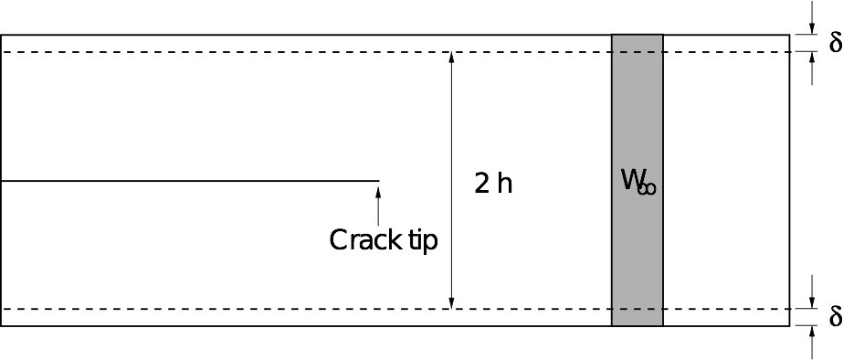

Theoretical background
======================

.. _theory1:

Introduction to Atomic-scale Modelling of Fracture
--------------------------------------------------

Fracture is the main lifetime limiting failure mode of many materials, from
metals to ceramics and glasses. There are two broad classes of
fracture: *brittle* and *ductile*. 

.. figure:: brittle-vs-ductile.png
   :align: center
   :width: 600

   Brittle and ductile failure of steel, at low and high temperature
   respectively. Image credit: `Internet Electron Microscopy website, UMIST
   <http://pwatlas.mt.umist.ac.uk/internetmicroscope/micrographs/failure/ductile-steel.html>`_

In brittle fracture, there is no plastic deformation, and failure occurs along
particular low-energy cleavage planes. In contrast, ductile materials such as
steel tend to fail with a large amount of plastic deformation (or 'necking'),
pulling apart to leave rough fracture surfaces. The same patterns are evident
upon closer examination: brittle cracks are found to be atomically sharp,
proceeding bond by bond, while ductile cracks remain rough at the microscale,
driven by the formation and coalescence of microscopic voids.

.. figure:: brittle-vs-ductile-microscale.png
   :align: center
   :width: 600

   Brittle and ductile failure mechanisms, for silica and aluminium respectively.
   Image credits: C. Marlière and A. Weck.

Silicon is known to be an ideally brittle material, as shown by the image below.
Below the brittle to ductile transition, at around :math:`500^\circ~\mathrm{C}`, silicon
cleaves atomically smooth fracture surfaces (left and centre panel; sample in
central panel is tilted to show the crack front). At higher temperatures,
fracture is ductile, with the emission of multiple dislocations from the tip
(right panel).

.. _si_tem_images:

.. figure:: lawn-fracture-silicon.png
   :align: center
   :width: 600

   Transmission electron microscopy (TEM) images of a crack in silicon.
   Image reproduced from [Lawn1993]_.

.. _theory_griffith:

Fracture Mechanics
^^^^^^^^^^^^^^^^^^

The study of fracture mechanics dates back around 100 years, to
Griffith, who first proposed a thermodynamic energy balance criteria
to understand when cracks will propagate [Griffith1921]_. The key idea
is that stress concentrates at pre-existing flaws: this was motivated
by the observation that materials break at much lower loads than the
theoretical stress needed to break their chemical bonds For example,
in glass, the theoretical strength is given by

.. math:: 

   \sigma_{theoretical} = \sqrt{\frac{E\gamma}{a}} \sim 10,000\;\mathrm{MPa}

where :math:`E`, :math:`\gamma` and :math:`a` are the Young's modulus, surface
energy and bond length, respectively.

For a slowly-moving crack of length `c` in an infinite plane, the
well-known Griffith criterion for fracture propagation is based on thermodynamic
energy balance between the release of elastic energy in an area
proportional to `c`\ :superscript:`2` and the cost of creating new surfaces,
which is proportional to `c`, as illustrated below.

.. image:: griffith-criterion.png
   :align: center
   :width: 600

This leads to a Griffith fracture strength for glass of

.. math::

   \sigma_{fracture} = \sqrt{\frac{E\gamma\rho}{4ac}} \sim 100 \;\mathrm{MPa}

which is much lower than the theoretical strength. Here the additional
parameters are :math:`\rho`, the radius of curvature and the crack
length `c`. The effect of stress concentration increases for sharper and
longer cracks.

The Griffith criterion leads to a critical length :math:`c_0` below which it is
not energetically favourable for cracks to grow, since the elastic energy
released does not exceed the surface energy cost. Below :math:`c_0`, cracks
prefer to close up, meaning that not all flaws are unstable. This explains why
it makes sense to measure the length of cracks e.g. on aeroplanes, so that small
flaws can be identified and treated before they become critical.

In fracture mechanics it is common to use the energy release rate :math:`G` to
describe the flow of energy to a crack tip. :math:`G` is the driving force for
crack propagation. It is defined by

.. math::

   G = - \frac{\partial U_E}{\partial c}

where :math:`U_E` is the total strain energy and `c` is the crack length.
The Griffith criterion can be reformulated in terms of :math:`G` to show that
crack propagation becomes favourable when

.. math::
   
   G > 2\gamma

where :math:`\gamma` is the surface energy density, i.e. when the energy flow to
the crack tip exceeds the cost of creating two new surfaces.

.. _theory_atomic_fracture:

Atomic scale modelling of fracture
^^^^^^^^^^^^^^^^^^^^^^^^^^^^^^^^^^

Much work has been done to understand fracture at the continuum level
(see, e.g.  [Freund1998]_ and [Lawn1993]_), but here we would like to
simulate fracture at the atomic level, to examine the combined effects
of stress and chemistry ('chemomechanics'). A first approach would be
to use classical interatomic potentials to carry out molecular
dynamics (MD). However, as we will see in :ref:`step2`, most classical
potentials fail to accurately reproduce brittle fracture. This is due
to stress concentration which has been shown to diverge as
:math:`\sigma \sim 1/\sqrt{r}` near a crack tip [Irwin1948]_, leading
to anharmonic stretching and rupture of bonds, which is typically not
well captured by simple interatomic potentials.

.. _irwin_sig_yy:

.. figure:: irwin-sig-yy.png
   :width: 300
   :align: center

   Irwin near-field solution for :math:`\sigma_{yy}` for a singular crack.
   Black is zero stress and yellow very high stress; note the divergence at the
   crack tip.

Most potentials overestimate what is called the *lattice trapping
barrier*, the energy barrier to bond breaking at a crack tip that
arises from the periodicity of the crystalline lattice (in contrast to
continuum methods where the crack tip advances continuously). This
means that when fracture eventually does occur, there is too much
energy available, which is then dissipated by a variety of plasticity
mechanisms such as dislocation emission. This leads to results in
contrast with the expected brittle behaviour.

Interestingly, however, continuum theories and simple potentials agree
with one another until surprisingly close to the crack tip (~1nm),
where non-linear effects become important, as illustrated in the
figure below.

.. figure:: atomistic-vs-continuum.png
   :width: 400
   :align: center

   Atomic and continuum calculations for the stress along the line ahead of a
   crack tip in silicon. Agreement is excellent beyond ~ 2 nm from the tip. 
   Reproduced from G. Singh, J.R. Kermode, A. De Vita, R.W. Zimmerman, 
   *in prep.* (2013).

The region where atomistic and continuum theories disagree is the
non-linear *process zone*, where chemically interesting things are happening.
Here, we would like to treat this region at a quantum mechanical (QM) level.

.. _theory_multiscale:

Coupled multiscale approach
^^^^^^^^^^^^^^^^^^^^^^^^^^^

QM approaches such as density functional theory (DFT) do correctly
describe bond-breaking in silicon. However, the strong bidirectional
coupling between bond-breaking at the crack tip and the long-range
stress field driving fracture necessitates a multiscale approach. The
reason a fully DFT approach is not practical is that the boundaries of
the model system must be placed far enough away from the crack tip not
to affect the results, which means that large cells containing tens to
hundreds of thousands of atoms are needed. This exceeds the current
capabilities of most QM approaches. Fracture is perhaps the
archetypical coupled multiscale problem, with thousands of atoms
contributing to the elastic relaxation of the near-tip region. We will
describe how classical and QM descriptions can be coupled to study
problems in fracture using the 'Learn on the Fly' (LOTF) approach in
:ref:`more detail <theory3>` later in this tutorial.

.. figure:: multiscale-coupling.png
   :width: 500
   :align: center

   Hierarchy of materials modelling techniques, showing simultaneous coupling
   of QM methods and empirical interatomic potentials. Image source: G. Csányi.

.. _thin_strip:

Thin strip loading geometry and elasticity theory
^^^^^^^^^^^^^^^^^^^^^^^^^^^^^^^^^^^^^^^^^^^^^^^^^

We will use the thin strip fracture loading geometry illustrated below for our
fracture simulations, where the load is applied by displacing the top and bottom
surfaces.

The advantage of this setup is that the energy release rate `G` does not depend
on the crack length, and can be found analytically by considering the energetics
of an advancing crack.
 
The horizontal edges of the strip are given a uniform normal
displacement :math:`\delta`, so the applied strain is
:math:`\epsilon_0 = \delta / h`.  Far ahead of the crack, the strip is
in uniaxial tension: :math:`\epsilon_{yy} \to \epsilon_0` as :math:`x
\to \infty`.
 
The stress far ahead of the crack is given by :math:`\sigma_{0} = E'
\epsilon_{0}`, and therefore the elastic energy per unit length and
per unit thickness far ahead of the crack tip is
 
.. math::
   W_\infty = \frac{1}{2}E'\epsilon_0^2\cdot 2h = \frac{\delta^2 E'}{h}

where :math:`E'` is the effective Young's modulus.
 
Far behind the tip, the energy density is zero. Since no energy
disappears through the clamped edges, if the crack is to advance by
unit distance, a vertical strip of material with energy density
:math:`W_\infty` is effectively replaced by a strip with energy
density zero.
 
The energy supplied to the crack tip is therefore equal to :math:`W_\infty`,
so the energy release rate is simply
 
.. math::
  G = W_\infty = \frac{\delta^2 E'}{h}

In our simulations we will use periodic boundary conditions in the :math:`z`
direction, so we have plane strain loading (:math:`\epsilon_{zz} = 0`), which
means that the effective Young's modulus :math:`E'` is given by
:math:`E/(1-\nu^2)`, where :math:`E` is the Young's modulus in the :math:`y` relevant
direction and :math:`\nu` is the Poisson ratio, so finally we have
 
.. _thin_strip_equation:

.. math::
  G = \frac{E \delta^2}{(1- \nu^2)h} = \frac{E \epsilon_0^2 h}{1 - \nu^2}

We can see that, in order to relate the strain we apply to the system
with the energy release rate, we will need to calculate the Young's
modulus and Poisson ratio for our model material. We will see how to
do this from the elastic constant matrix :math:`C_{ij}` :ref:`below
<youngs_modulus_and_poisson_ratio>`.

Classical interatomic potentials for silicon
--------------------------------------------

The Stillinger-Weber [Stillinger1985]_ interatomic potential provides a fairly good
description of many properties of crystalline and amorphous silicon. Its
functional form is a two- and three-body expansion suitable for the
representation of highly directional covalent bonds between Si atoms:

.. math::
    V = \sum_{ij} V_2(r_{ij}) + \sum_{ijk} V_3(r_{ij}, r_{ik},
    \theta_{jik}) \\
    V_2(r_{ij}) = A\left(\frac{B}{r_{ij}^4} - 1\right) \exp
    \frac{1}{r-a}, \; r < a \\
    V_3(r_{ij},r_{jk},\theta_{jik}) = \lambda \exp \left[
    \frac{\gamma}{r_{ij} - a} + \frac{\gamma}{r_{jk} - a} \right] \left(\cos
    \theta_{jik} + \frac{1}{3}\right)

In particular, the three-body term stabilises the ideal tetrahedral
structure with respect to all the other possible structures. The
parameters of the SW potential were determined by fitting experimental
data with the constraint that the diamond-like structure must be the
most stable periodic arrangement of particles al low pressures.

Although this potential has not been fitted to the Si elastic
constants, it gives a reasonable description of all of them. As we
will see during this step, however, the SW potential fails to describe
the brittle fracture of silicon.  A number of interatomic potentials
have been developed to go beyond the basic description of Si provided
by the SW potential (e.g. [Swadener2002]_, [Vink2001]_ [Buehler2006]_,
[Pizzagalli2013]_), however, they are usually not sufficiently
transferable to provide a general description of the inherently
quantum-mechanical processes occurring at the tip of a crack. As a
consequence, treating the tip at the QM level using hybrid QM/MM
methods is necessary to perform accurate MD simulations of brittle
fracture in Si. Here, we will use the SW potential because its simple
functional form and its speed make it a suitable choice for a
multiscale QM/MM approach, where only an accurate description of the
Si crystal far from the crack tip is required.

In this step, we will use the SW potential to perform a classical MD
simulation of the crack propagation in the NVE ensemble. The velocity
Verlet scheme [FrenkelSmit2001]_ will be used to integrate Newton's
equations of motion.

.. _theory3:

QM/MM Force Mixing and the 'Learn on the Fly' scheme
----------------------------------------------------

In this last part of the tutorial, we will perform an accurate MD simulation of
Si fracture using the "Learn on the fly" (LOTF) hybrid QM/MM technique
[DeVita1998]_, [Csanyi2004]_. In the present case, all atoms that are not suitably described by
the [Stillinger1985]_ potential (our MM scheme) will be treated
quantum-mechanically with the DFTB method [Elstner1998]_. These atoms are
those in the vicinity of the crack tip, where highly strained Si-Si bonds are
present, and where formation and rupture of chemical bonds occurs during
crack propagation.

Standard QM/MM techniques, usually developed for biological systems, adopt 
energy-based approaches. The total energy of the system is written as a combination  
of the QM energy, the MM energy and a QM/MM term, often specifically devised
for a particular system, that takes care of the interaction between the two regions.
While this approach allows the definition of a total energy which is 
conserved during the dynamics, the forces used to propagate the MD are not accurate
enough because of the spurious effects due to the presence of the boundary
between the QM and the MM regions. Moreover, the necessity to suitably "terminate"
the QM region, does not allow the QM region to move during the simulation, which
is, however, required if we want to follow the motion of a crack tip.

The LOTF scheme adopts a force-based scheme instead, which allows the
QM region to move during the MD simulation and accurate forces to be
calculated even at the boundaries of the two regions. While the
details of the scheme have been thoroughly presented in a number of
articles [DeVita1998]_, [Csanyi2004]_, [Csanyi2005]_, [Moras2010]_,
[Kermode2008a]_, [Bernstein2009]_, we will here briefly explain the
basic concepts that will allow us to perform the crack simulation.

.. _buffer:

Calculation of the forces: buffered force mixing
^^^^^^^^^^^^^^^^^^^^^^^^^^^^^^^^^^^^^^^^^^^^^^^^

The first problem we have to face, when performing a QM/MM MD simulation is to
calculate accurate forces. While the calculation of the MM forces, using a
short-ranged potential (e.g. the SW potential) is trivially solved by
inexpensively computing the MM forces on the whole system, the problem of
calculating accurate QM forces is more complicated. The ultimate goal of any QM/MM
approach is to perform a simulation where all the system behaves instantaneously
as if it were fully QM. In a standard QM/MM approach, however, the QM forces
would be calculated by carving the QM region out of the system and chemically
terminating the resulting Si dangling bonds, for instance with H atoms. Even by
using more complex termination strategies, it is generally not possible to
mimic the presence of the surrounding MM system, and the forces on the atoms
close to the artificially created "QM surface" are not accurate.

To solve this problem, at the expense of an increased computational
cost, we increase the size of the QM region by adding a "buffer
region", as illustrated below. The calculation of the QM forces is
carried out on a cluster made from the QM + buffer regions, after
suitable termination with H atoms.

.. figure:: buffer-region.png
   :width: 600
   :align: center

   The finite buffer termination strategy. Force on the atoms in the buffer
   region (dark grey) are discarded to give accurate QM or MM forces on all atoms
   (right hand panel). Reproduced from [Bernstein2009]_.

The buffer region must be large enough to minimize the errors on the QM forces
due to the presence of the outer artificial surface. The size of the buffer
region can be determined through some tests (see :ref:`this extension task
<buffer_region_size>`) , and is typically around 8 A, or 4 neighbour hops, for
Si. This near-sightedness of quantum mechanics is ultimately due to the locality
of the density matrix in covalent materials.

Once accurate QM forces have been obtained, only the QM forces on the atoms
belonging to the original QM region are used in the MD. The QM forces on the
atoms in the buffer region, which are strongly affected by the presence of the
outer QM surface, are discarded and replaced by the MM forces (as illustrated
above). In this way, we can obtain good forces on all atoms in the
system. These forces can be used in the MD simulation, provided that the
conservation of the total momentum is restored. This can be enforced by
subtracting the (typically small) mean force, so that the final
QM/MM forces sum to zero.

It is important to have good elastic matching between the QM and MM models, so
that there is no discontinuity at the boundary. For simple materials, this can
usually be achieved by scaling the classical model in space and energy to match
the lattice constant and bulk modulus of the QM model (for simplicity we omit
this step in this tutorial, but the mismatch here is not too big).

.. _hysteretic:

Hysteretic selection of the QM active and buffer regions
^^^^^^^^^^^^^^^^^^^^^^^^^^^^^^^^^^^^^^^^^^^^^^^^^^^^^^^^

A key advantage of the buffered force mixing approach is that the QM region can
be redefined during a simulation. This works because new atoms first enter the
QM calculation at the outer boundary of the buffer region, where they do not
have a large effect on the forces at the centre, and therefore changing the QM
region does not introduce large inconsistencies.

In this tutorial, the QM region will be updated during the MD simulation in
order to follow the motion of the crack tip. When selecting the atoms that
belong to the buffered QM region, it is important to minimise fluctuations in
the set of QM atoms. This should be done in order to minimise the spurious heat
generation due to atoms whose description changes from MM to QM, or vice-versa
[Bernstein2009]_. This change of description is inevitable when the QM region
moves with the crack tip. However, solutions have to be found to minimise
fluctuations due to oscillation.

A robust way to minimise fluctuations is to employ a "hysteretic" algorithm for
the QM selection process [Bernstein2009]_. In the context of a fracture
simulation, atoms have to come within a certain *inner
radius* :math:`r_\mathrm{-}` from the crack tip to become selected as QM active
atoms (see the picture below). In our case, atoms have to come within 8 A from
the crack tip to become part of the QM region. However, using the hysteretic
algorithm, these atoms will remain QM until they move further than the 
*outer radius* :math:`r_\mathrm{+}` (where :math:`r_\mathrm{+} > r_\mathrm{-}`)
away from the crack tip. In our simulation, this outer radius will be 10 A. We
refer to the current set of QM atoms in as the *QM active region*.

.. figure:: hysteresis.png
   :height: 200
   :align: center

   Hysteretic QM selection algorithm. For fracture simulations the black *active region*
   can be reduced to a single point at the crack tip. Reproduced from [Bernstein2009]_.

As well as using hysteresis to select the QM active atoms for which QM
forces will be used, we can also use the hysteretic selection
algorithm to minimise fluctuations in the buffer region. These radii
apply to the distance from any of the QM active atoms, so the buffer
takes the form of a shell of constant width around the QM atoms. Here
we will use inner and outer buffer radii of 7 A and 9 A, respectively.
This leads to overall QM active + buffer clusters with a radius of
around 15 A, containing around 150 atoms, including terminating
hydrogens (see the :ref:`example cluster <cluster>` below).

Further tricks which can be used to stabilise the QM and buffer region include
growing the regions using bond hopping rather than distance criteria, and using
time-averaged positions [Bernstein2009]_. For simplicity, in this tutorial we
will use only the hysteretic selection technique.

.. _lotf:

LOTF adjustable potential and predictor-corrector scheme
^^^^^^^^^^^^^^^^^^^^^^^^^^^^^^^^^^^^^^^^^^^^^^^^^^^^^^^^

The QM/MM forces calculated as just explained, using a buffered QM region, can
be directly used to perform an MD simulation, provided that the total sum of the
forces is constrained to be zero, as explained above. However, in many cases,
and in particular in this Si crack case, we can use yet another "trick" to speed
up our MD simulation, by at least a factor 10.

We first introduce a new Hamiltonian, which is the sum of the MM potential (the
SW potential here) and of a so called *adjustable potential*. This potential has
a general analytical expression and a set of parameters that can be adjusted. In
this case, we will use a simple two-body linear 'spring' potential with the form

.. math:: 
   V_\mathrm{adj} = \sum_{\mathrm{pairs}\; ij} \alpha_{ij} r_{ij}

where :math:`i` and :math:`j` indicate a pair of atoms which are closer than an
arbitrary spring length (typically around 3 neighbour hops),
and :math:`\{\alpha_{ij}\}` are the set of adjustable parameters. We then define
a *fitting region*, typically slightly larger than the buffered QM region. 

Our adjustable potential is then used to fit the difference between the QM and
the MM forces for each atom in this fitting region. (The functional form above is
particularly suitable as it can be optimised using linear algebra). Of course,
this difference will be zero for atoms in the fitting region that do not belong
to the QM region. In this way, after a successful force matching, the gradient
of our sum potential :math:`-\nabla (V_{SW}(\mathbf{r})+
V_{adj}(\mathbf{r},\{\alpha\}))` gives us the MM forces on the MM atoms and the QM
forces on the QM atoms. Of course a very small error on these forces
(typically :math:`\sim 10^{-3}` eV/A) is caused by requiring our forces to be
the gradient of a single Hamiltonian. This is however of the same order as the
error introduced by forcing the total sum of the forces to zero, and less than
the error associated with computing QM forces using clusters with a finite
buffer radius (which can be as much as :math:`\sim 0.1` eV/A compared to a
reference QM calculation in the full system with PBC). The figure below
illustrates the force fitting process.

.. image:: lotf-overview.png
   :width: 500
   :align: center

The definition of this new adjustable potential is very beneficial to
our simulation because it allows us to employ a predictor-corrector
algorithm that, as mentioned before, significantly speeds up our
simulation. This scheme is based on the possibility of varying the
values of the adjustable potential parameters :math:`\{\alpha_{ij}\}`
in both time and in space (i.e. each two-body term of the potential
has an independent parameter :math:`\alpha_{ij}`). Once these
parameters are adjusted to match the QM/MM forces in the fitting
region, we do not necessarily need to perform this fitting procedure
at the next time step. In many cases, in fact, the parameters would
change very slowly with respect to the changing atomic positions. This
means that the same parameters can be used for a small number of steps
(e.g. 10 in our case), after which the expensive QM forces are
recomputed, and then used to retune the parameters. This is the
philosophy behind the 'Learn on the Fly' approach.

The predictor-corrector scheme works as follows, with reference to the illustration below:

   1. **Initialisation.** The QM region is selected, the buffered QM/MM forces are
   calculated and the parameters of the adjustable potential are adjusted to
   reproduce the difference between QM and MM forces in the fitting region.

   2. **MD predictor: Extrapolation.** The
   classical :math:`V_\mathrm{SW}+V_\mathrm{adj}` is used
   with the fixed set of adjusted parameters :math:`\alpha_0` to evolve the
   dynamics of the whole system starting from the positions :math:`R_0` for a small
   number :math:`N` of steps of size :math:`\Delta t` for a total time
   of :math:`\Delta T = N\Delta t`.

   3. **QM/MM forces.** The buffered QM region method is used to compute the QM/MM
   forces on the new configuration :math:`R_1'`.

   4. **Force matching.** The parameters of the adjustable potential are tuned to
   reproduce the difference between the new QM forces and the new MM forces to give a
   new set of adjustable potential parameters :math:`\alpha_1`.
   
   5. **MD corrector: Interpolation.** The formerly predicted MD steps are now
   corrected by returning the system to :math:`R_0`, and
   re-running the dynamics with the adjustable potential
   parameters linear interpolated between :math:`\alpha_0` and :math:`\alpha_1`.

We then return to step 2. and iterate.

.. image:: lotf-pred-corr.png
   :width: 500
   :align: center

The number of extrapolation steps that can be made before the potential
parameters change too much can be checked by keeping an eye on the force errors
made by the LOTF scheme in comparison with doing a QM force evaluation at each
time step: there is an :ref:`extension task <pred_corr_error>` at the end of
this tutorial to do exactly that.
   
