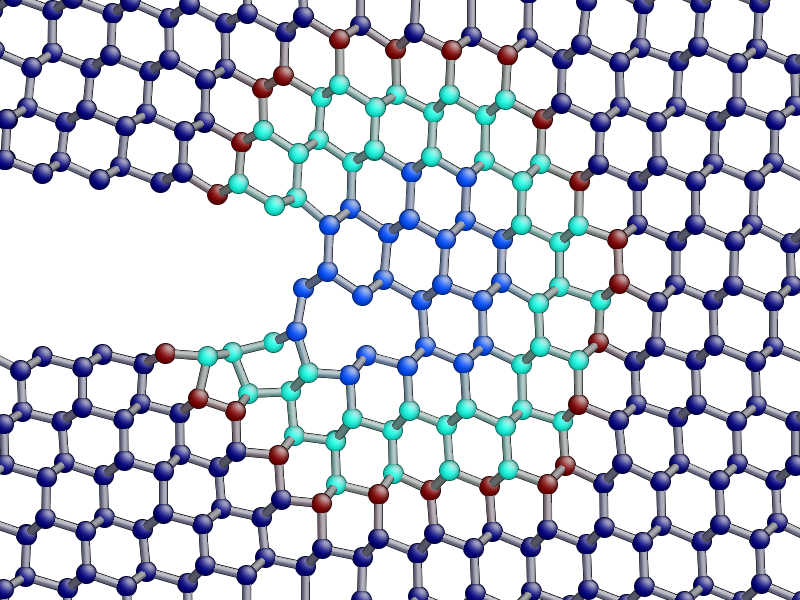
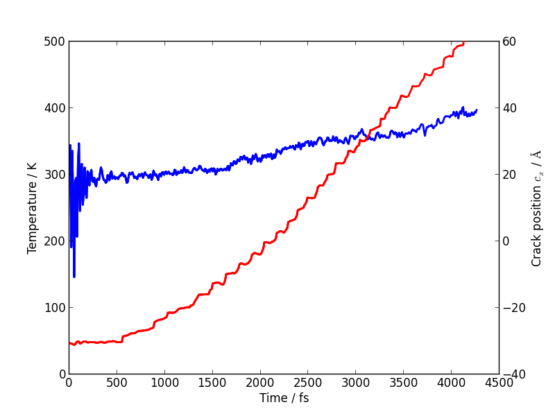

.. _step3:

Step 3: LOTF hybrid MD simulation of fracture in Si
===================================================

In the final part of this tutorial, we will be extending our previous script for
classical molecular dynamics to carry out an adaptive QM/MM simulation of
fracture using the 'Learn on the Fly' (LOTF) scheme.

You will need the ``run_crack_classical.py`` script from :ref:`step2`. If you
don't have it, you can :download:`download it here <run_crack_classical.py>`,
and the ``crack.xyz`` input file from :ref:`step1`, which you
can :download:`also download here <crack.xyz>`.

.. contents::

Theoretical background
----------------------

In this last part of the tutorial, we will perform an accurate MD simulation of
Si fracture using the "Learn on the fly" (LOTF) hybrid QM/MM technique [Csanyi2004]_
In the present case, all atoms that are not suitably described by the [SW]_
potential (our MM scheme) will have be treated quantum-mechanically with the
DFTB method [DFTB]_. These atoms are those in the vicinity of the crack tip, where
highly strained Si-Si bonds are present, and where formation and rupture of
chemical bonds occurs during the crack propagation.

Standard QM/MM techniques, usually developed for biological systems, adopt 
energy-based approaches. The total energy of the system is written as the sum 
of the QM energy, the MM energy and a QM/MM term, often specifically devised
for any particular system, that takes care of the interaction between the two regions.
While this approaches allows the definition of a total energy, which is 
conserved during the dynamics, the forces used to propagate the MD are not accurate
enough because of the spurious effects due to the presence of the boundary
between the QM and the MM regions. Moreover, the necessity to suitably "terminate"
the QM region, does not allow the QM region to move during the simulation, which
is however reqired if we want to follow the motion of the crack tip.

The LOTF scheme adopts a force-based scheme instead, which allows the QM region
to move during the MD simulation and accurate forces to be calculated even at
the boundaries of the two regions. While the details of the scheme are
thoroughly presented in a number of articles [Csanyi2004]_, [Csanyi2005]_,
[Moras2010]_, [Kermode2008a]_, [Bernstein2009]_, we will here briefly explain
the basic concepts that will allow us to perform the crack simulation.

Calculation of the forces: buffered force mixing
^^^^^^^^^^^^^^^^^^^^^^^^^^^^^^^^^^^^^^^^^^^^^^^^

The first problem we have to face, when performing a QM/MM MD simulation 
is to calculate accurate forces. While the calculation of the MM forces, 
using a short-ranged potential (e.g. the SW potential) is trivially solved 
by inexpensively computing the MM forces on the whole system, the problem 
of calculating the QM forces is more complicated. 
The ultimate goal of any QM/MM approach is to perform a simulation where
all the system behaves instantaneously as if it were fully QM.
In a standard QM/MM approach, however, the QM forces would be calculated
by carving the QM region out of the system and chemically terminating 
the resulting Si dangling bonds, for instance with H atoms. Even by using more
complex termination strategies, it would generally not be possible to mimic 
the presence of the surrounding MM system, and the forces on the atoms close to the
artificially created "QM surface" would not be accurate.

To solve this problem, at the expense of an increased computational cost, we 
increase the size of the QM region by adding a "buffer region" **Picture**.
The calculation of the QM forces is carried out on this QM+buffer region,
which is suitably terminated by H atoms. 
The buffer region must be large enough to minimize the errors on the QM forces
due to the presence of the outer artificial surface. The size of the buffer
region can be determined through some tests **(see extension)**, and is 
typically XX Angstrom, or YY hops, for Si.
Once the accurate QM forces have been obtained, only the QM forces on the
atoms belonging to the original QM region are used in the MD. The QM forces
on the atoms in the buffer region, which are affected by the presence of 
the outer QM surface, are discared and replaced by the MM forces.
In this way, we can obtain the desired forces on al atoms of the system. These
can be used in the MD simulation, provided that the conservation of the
total momentum is restored. This is simply done by dividing the total force
by the number of MM+buffr atoms, and subtracting this quantity from all
the MM forces **This is not very clear but it is pretty late...**.     

Hysteretic selection of the QM region
^^^^^^^^^^^^^^^^^^^^^^^^^^^^^^^^^^^^^

LOTF adjustable potential and predictor-corrector scheme
^^^^^^^^^^^^^^^^^^^^^^^^^^^^^^^^^^^^^^^^^^^^^^^^^^^^^^^^

3.1 Initialisation of atomic system (20 minutes)
---------------------------------------------------

Import the relevant modules
^^^^^^^^^^^^^^^^^^^^^^^^^^^

Make a copy of your ``run_crack_classical.py`` script and name it
``run_crack_lotf.py``. Add the following extra import statements after those
that are already there::

    from quippy.potential import ForceMixingPotential
    from quippy.lotf import LOTFDynamics, update_hysteretic_qm_region

Definition of the simulation parameters
^^^^^^^^^^^^^^^^^^^^^^^^^^^^^^^^^^^^^^^

.. _parameters3:

Next, we need to add some additional parameters specifically for the
QM/MM simulation. Again, insert them in ``run_crack_lotf.py``, below the
existing parameters ::

    qm_init_args = 'TB DFTB'         # Initialisation arguments for QM potential
    qm_inner_radius = 7.0*units.Ang  # Inner hysteretic radius for QM region
    qm_outer_radius = 9.0*units.Ang  # Inner hysteretic radius for QM region
    extrapolate_steps = 10           # Number of steps for predictor-corrector
                                     # interpolation and extrapolation

The setup of the atomic structure and of the constraints is exactly the same as
before, so leave these sections of your script unchanged.

Setup of the QM and QM/MM potentials
~~~~~~~~~~~~~~~~~~~~~~~~~~~~~~~~~~~~

For the QM/MM simulation, we first need to initialise the classical SW potential
(`mm_pot`) and the quantum-mechanical one (`qm_pot`). The two Hamiltonians then need
to be combined into a hybrid QM/MM potential (`qmmm_pot`), which mixes the QM 
and MM forces. 

Leave the initialisiton of the SW classical potential as it is. After this, we
want to add some lines of code to setup the QM potential. Using the same
:class:`~quippy.potential.Potential` class, we initialise now the Density
functional tight binding (DFTB) potential. This is done by passing the new QM
`qm_init_args` as the `init_args` parameter and the same XML file as before for
the `param_filename` to the Potential constructor (note that the single file
``params.xml`` contains parameters for both the SW and DFTB potentials)::

    qm_pot = ...  # Initialise DFTB potential

The QM/MM potential is constructed using quippy's
:class:`quippy.potential.ForceMixingPotential` class. Here, `pot1` is the low
precision, i.e. MM potential, and `pot2` is the high precision, i.e. QM
potential, and `qm_args_str` are the parameters defined above. `fit_hops` is the
number of hops used to define the fitting region, `lotf_spring_hops` defines the
length of the springs in the LOTF *adjustable potential*, while `buffer_hops` is
the number of hops used to define the buffer region used for the embedded QM
force calculation.::

qmmm_pot = ForceMixingPotential(pot1=mm_pot,
                                pot2=qm_pot,
                                qm_args_str='single_cluster cluster_periodic_z carve_cluster '+
                                            'terminate cluster_hopping=F randomise_buffer=F',
                                fit_hops=4,
                                lotf_spring_hops=3,
                                hysteretic_buffer=True,
                                hysteretic_buffer_inner_radius=7.0,
                                hysteretic_buffer_outer_radius=9.0,
                                cluster_hopping_nneighb_only=False,
                                min_images_only=True)

The `qm_args_str` argument defines some parameters which control how
the QM calculation is carried out: we use a single cluster, periodic
in the `z` direction and terminated with hydrogen atoms. The positions
of the outer layer of buffer atoms are not randomised.

Change the line which sets the Atoms calculator to use the new
`qmmm_pot` Potential::

    atoms. ...  # Set the calculator

Set up the initial QM region
^^^^^^^^^^^^^^^^^^^^^^^^^^^^

Now, we can set up the list of atoms in the initial QM region using
the :func:`~quippy.lotf.update_hysteretic_qm_region` function, defined in
quippy. Here we need to provide the Atoms' system, the centre of the QM region
(i.e. the position of the crack tip), as well as the inner and outer radius of
the hysteretic QM region. Note that the `old_qm_list` attribute must be an empty
list (``[]``) in this initial case::

    qm_list = ...             # Define the list of atoms in the QM region

The list needs to be attached to the `qmmm_pot` using the
:meth:`~quippy.potential.ForceMixingPotential.set_qm_atoms` method::

    qmmm_pot. ...             # Attach QM list to calculator

Milestone 3.1
^^^^^^^^^^^^^

Your ``run_crack_lotf.py`` script should look something
like :download:`run_crack_lotf_1.py`.

At this point you should run your script and check the initial QM region. For
testing, you should add a couple of temporary lines to force the script to
finish after setting the QM region and before repeating the classical MD::

  import sys
  sys.exit(0)

To visualise the initial QM region, you can type the following directly into
your `ipython` session (remember to do a ``from qlab import *`` first if you
haven't already)::

   view(atoms)
   aux_property_colouring(qmmm_pot.get_qm_atoms())

.. image:: crack-initial-qm-region.png
   :align: center
   :width: 600

In the image above, the red atoms are QM and the blue atom classical.
Internally, this list is actually saved as a :attr:`property
<~quippy.atoms.Atoms.properties>` inside the Atoms object named ``"hybrid"``,
which can also be displayed with ``aux_property_colouring("hybrid")``

3.2 Setup and run the adaptive QM/MM MD (20 minutes)
----------------------------------------------------

Initialising the Dynamics
^^^^^^^^^^^^^^^^^^^^^^^^^

The definition of the initial temperature of the system shold be left as
in :ref:`step2`. Don't forget to remove the temporary lines added above which
quit the script after setting up the initial QM region!

Instead of a traditional dynamics in the NVE ensemble, let's change the code to
use LOTF-type predictor-corrector dynamics, using
the :class:`quippy.lotf.LOTFDynamics` class instead of
the :class:`~md.verlet.VelocityVerlet` class. Now we only need to pass the
following parameters: `atoms`, `timestep`, `extrapolate_steps`
(see :ref:`Parameters section <parameters3>`)::

    dynamics = ...            # Initialise the dynamical system

The logger and crack tip movement detection functions can be left almost exactly
as before for now: we just need to make a small change to
the :func:`printstatus` function so to distinguish between extrapolation and
interpolation:

Change the line::

    atoms.info['label'] = 'D'                   # Label for the status line

to::

    atoms.info['label'] = dynamics.state_label  # Label for the status line

This uses the :attr:`~quippy.lotf.LOTFDynamica.state_label` attribute to print
an ``"E"`` at the beginning of the logger lines for extrapolation and an ``"I"``
for interpolation.

Updating the QM region
^^^^^^^^^^^^^^^^^^^^^^

We need to define a function that updates the QM region at the
beginning of each extrapolation cycle. As before, we need to find the
position of the crack tip and then update the hysteretic QM
region. Note that now a previous QM region exists and its atoms should
be passed to the :func:`~quippy.lotf.update_hysteretic_qm_region`
function. The current QM atom list can be obtained with the
:meth:`quippy.potential.ForceMixingPotential.get_qm_atoms` method. To
find the crack position, use
:func:`~quippy.crack.find_crack_tip_stress_field` as before, but pass
the MM potential as the calculator used to calculated the stresses
(force mixing potentials can only calculate forces, not per-atom
stresses; the classical stress is sufficiently accurate for locating
the crack tip)::

    def update_qm_region(atoms):
        crack_pos = ...          # Find crack tip position
        qm_list = ...            # Get current QM atoms
        qm_list = ...            # Update hysteretic QM region
        qmmm_pot. ...            # Set QM atoms

   dynamics.set_qm_update_func(update_qm_region)

Writing the trajectory
^^^^^^^^^^^^^^^^^^^^^^

Finally, we want to save frames to the trajectory every `traj_interval` time
steps but, this time, only during the interpolation phase of the
predictor-corrector cycle. To do this, we first initialise the trajectory file
(see :func:`~quippy.io.AtomsWriter`), and then define a function, that only
writes to the trajectory file if the state of the dynamical systems is
`Interpolation`::

    trajectory = ... # Initialise trajectory using traj_file
    
    def traj_writer(dynamics):
        if dynamics.state == LOTFDynamics.Interpolation:
            trajectory.write(dynamics.atoms) 

As before, we attach this function to the dynamical system, passing
`traj_interval` and and extra argument of `atoms` which gets passed along to the
`traj_writer` function (see the :meth:`~quippy.lotf.LOTFDynamics.attach`
method)::

    dynamics. ...    # Attach traj_writer to dynamics

Now, we can simply run the dynamics for `nsteps` steps:: 

    dynamics. ...    # Run dynamics for nsteps
 
If you are interested in seeing how the LOTF predictor-corrector cycle is
implemented, look at the the documentation and `source code
<_modules/quippy/lotf.html#LOTFDynamics.step>`_ for the
:meth:`quippy.lotf.LOTFDynamics.step` routine.

Milestone 3.2
^^^^^^^^^^^^^

The finished version of the ``run_crack_lotf.py`` script should look something
like :download:`this one <run_crack_lotf_2.py>`. To clearly show the differences
with respect to the classical MD script, here is a :download:`patch
<run_crack_classical_lotf.patch>` which can be used to convert the classical
script into the LOTF one.

3.3 Visualisation and Analysis (as time permits)
------------------------------------------------

Predictor/corrector dynamics output file
^^^^^^^^^^^^^^^^^^^^^^^^^^^^^^^^^^^^^^^^

Let's first take a moment to look at the output of the script for the first
predictor/corrector cycle. Here we go through some example output, yours should
be similar. First there are a few lines about the initialisation of the system,
and then we get the results of the initial LOTF adjustable potential
optimisation::

    Loading atoms from file crack.xyz
    Fixed 240 atoms

    25 atoms selected for quantum treatment
    update_qm_region: QM region with 25 atoms centred on [-30.60517303   0.08401087   0.        ]
    Adding default springs
    Got 1484 springs
    Number of force components: 297
    Number of parameters:       1484
    Optimising 1484 adjustable parameters
    RMS force component error before optimisation : .05630875465645784
    Max force component error before optimisation : .34841292159055509
    Using SVD for least squares fit, eigenvalue threshold = .00000000010000000
    RMS force component error after  optimisation :   0.27E-02
    Max force component error after  optimisation :   0.61E-02
    Max abs spring constant   after  optimisation :   0.45E-01

You can see that before adjusting the parameters, the QM and classical potentials
differed by a maximum of 0.35 eV/A, with an RMS difference of 0.06 eV/A - in
this case the SW potential is actually doing a rather respectable job. After the
fit, which is this case involved 1484 spring parameters to fit 297 force
component, the force differences are of course much smaller.

Next we start the first predictor/corrector cycle. First we update the QM
region, and remap the adjustable potential to take account of any changes
since last time::

    25 atoms selected for quantum treatment
    update_qm_region: QM region with 25 atoms centred on [-30.6048418    0.08377744   0.        ]
    Adding default springs
    Got 1484 springs
    Number of force components: 297
    Number of parameters:       1484

As this is the first step, there were no changes, so no re-optimisation is
required. Next we carry out 10 steps of extrapolation, with constant LOTF
adjustable parameters. During this time the strain is incremented as normal::

    State      Time/fs    Temp/K     Strain      G/(J/m^2)  CrackPos/A D(CrackPos)/A 
    ---------------------------------------------------------------------------------
    E            1.0  553.716406     0.08427      5.0012      -30.61    (-0.00)
    E            2.0  547.749233     0.08428      5.0024      -30.61    (-0.01)
    E            3.0  535.952151     0.08429      5.0036      -30.62    (-0.01)
    E            4.0  518.731103     0.08430      5.0047      -30.63    (-0.02)
    E            5.0  496.675925     0.08431      5.0059      -30.63    (-0.03)
    E            6.0  470.538607     0.08432      5.0071      -30.64    (-0.04)
    E            7.0  441.205418     0.08433      5.0083      -30.65    (-0.05)
    E            8.0  409.663780     0.08434      5.0095      -30.66    (-0.06)
    E            9.0  376.965040     0.08435      5.0107      -30.67    (-0.07)
    E           10.0  344.184506     0.08436      5.0119      -30.69    (-0.08)

At the end of the extrapolation, it's time for a QM forcer evaluation and
another fit. Now the force errors are a little larger, but the fit is still very good::

    Optimising 1484 adjustable parameters
    RMS force component error before optimisation : .10494977522791650
    Max force component error before optimisation : .48515966905523733
    Using SVD for least squares fit, eigenvalue threshold = .00000000010000000
    RMS force component error after  optimisation :   0.37E-02
    Max force component error after  optimisation :   0.96E-02
    Max abs spring constant   after  optimisation :   0.83E-01

We next return to the initial dynamical state and re-run the dynamics,
interpolating between the optimised parameters at the two ends of the cycle.
Note that the strain is also returned to the initial value at :math:`t = 0`, and
that the temperature after one step exactly matches the interpolation phase
(since the forces and velocities at :math:`t = 0` are identical for
extrapolation and interpolation)::

    State      Time/fs    Temp/K     Strain      G/(J/m^2)  CrackPos/A D(CrackPos)/A 
    ---------------------------------------------------------------------------------
    I            1.0  553.716406     0.08427      5.0012      -30.65    (-0.04)
    I            2.0  547.759567     0.08428      5.0024      -30.65    (-0.05)
    I            3.0  535.982832     0.08429      5.0036      -30.66    (-0.05)
    I            4.0  518.791314     0.08430      5.0047      -30.66    (-0.06)
    I            5.0  496.773542     0.08431      5.0059      -30.67    (-0.07)
    I            6.0  470.679783     0.08432      5.0071      -30.68    (-0.08)
    I            7.0  441.394231     0.08433      5.0083      -30.69    (-0.09)
    I            8.0  409.901969     0.08434      5.0095      -30.70    (-0.10)
    I            9.0  377.251837     0.08435      5.0107      -30.71    (-0.11)
    I           10.0  344.516566     0.08436      5.0119      -30.73    (-0.12)

To continue from here, we simply go back to the extrapolation phase and then
repeat the entire cycle.

QM core and buffer regions
^^^^^^^^^^^^^^^^^^^^^^^^^^^

The ``"hybrid_mark"`` property is used internally to identify which atoms are
used for the core QM region and buffer regions:

Evolution of Crack Position and Temperature
^^^^^^^^^^^^^^^^^^^^^^^^^^^^^^^^^^^^^^^^^^^

The crack length now increases monotonically, with a constant crack velocity of
around 2700 m/s

The temperature still goes up, but more gently than in the classical case, since
the flow of energy to the crack tip is closer to the energy consumed by creating
the new surfaces. Some heat is generated at the QM/MM border; usually this would
be controlled with a gentle Langevin thermostat, which we have omitted here in
the interests of simplicity.

Comparison with classical dynamics
^^^^^^^^^^^^^^^^^^^^^^^^^^^^^^^^^^

**TODO: make a movie comparing classical and LOTF dynamics**

3.4 Extension tasks
-------------------

Checking the predictor/corrector force errors
^^^^^^^^^^^^^^^^^^^^^^^^^^^^^^^^^^^^^^^^^^^^^

Add `check_force_error=True` to the :class:`~quippy.lotf.LOTFDynamics`
constructor. This causes the LOTF routines to do a reference QM force evaluation
at every timestep (**NB**: these QM forces are not used in the fitting).

When checking the predictor/corrector errors, you need to disable the updating of
the QM region by commenting out the line::

   dynamics.set_qm_update_func(update_qm_region)

Let's create a logfile to save the force errors at each step during the
interpolation and extrapolation::
  
    logfile = open('pred-corr-error.txt', 'w')

To save these results, add the following code before the :meth:`dynamics.run()` call::

    def log_pred_corr_errors(dynamics):
	logfile.write('%s err %10.1f%12.6f%12.6f\n' % (dynamics.state_label,
						       dynamics.get_time()/units.fs,
						       dynamics.rms_force_error,
						       dynamics.max_force_error))
    dynamics.attach(log_pred_corr_errors, 1, dynamics)

Once the dynamics have run for a few LOTF cycles, you can plot the results with
a shell script called ``plot_pred_corr_errors.py``::

   plot_pred_corr_errors.py -e 10 lotf_check_force_error.out

The ``-e 10`` argument is used to specify the number of extrapolate steps. This
produces a set of four plots giving the RMS and maximum force errors during
extrapolation and interpolation:

.. image::  lotf_check_force_error.png
   :align: center
   :width: 600

Note that the scale is different on the extrapolation and interpolation plots!
Try varying the `extrapolate_steps` parameter and seeing what the effect on
force errors is. You could also try changing the `lotf_spring_hops` and
`fit_hops` parameters, which control the maximum length of the corrective
springs added to the potential and the size of the fit region, respectively.

QM region size
^^^^^^^^^^^^^^

Investigate the effect of increasing the QM region size, controlled by the
`qm_inner_radius` and `qm_outer_radius` parameters. When does the behaviour
converge qualitatively? What does this say about the size of the 'process zone'
in silicon?

Buffer region size
^^^^^^^^^^^^^^^^^^

We have used a fixed buffer region size of 4 bond hops. How would you check if
this is sufficient? What criteria needs to be satisfied for our results to be
converged with respect to buffer region size?

Crack energy-speed relationship
^^^^^^^^^^^^^^^^^^^^^^^^^^^^^^^

Try varying the flow of energy to the crack tip by changing the `initial_G`
parameter used when making the crack system in :ref:`step1`. How does this
affect the speed of the crack?

Other crack orientations
^^^^^^^^^^^^^^^^^^^^^^^^

Return to the beginning of :ref:`step1` and try classical and/or LOTF dynamics
(which will actually probably be faster!) on the :math:`(110)` surface. Do you
see any major differences? Can you find any dynamic fracture instabilities?

System size effects
^^^^^^^^^^^^^^^^^^^

What is the effect of changing the system size on the critical stress intensity
factor required for fracture? How would you converge with respect to this
parameter? Do you think experimental length scales can be reached? If not, does
it matter? Think about how the choice of loading geometry helps here.

Strain rate effects
^^^^^^^^^^^^^^^^^^^

As well as finite size effects, and perhaps more severely, we are limited in
the time scales that can be accessed by our fracture simulations, especially
when using a QM method to describe the crack tip processes. Are there any
scaling relations that can help us out here? How would you estimate the effect
of the artificially high strain rate we have been forced to impose here.

References
----------

.. [SW] Stillinger, F. H., & Weber, T. A. Computer simulation
   of local order in condensed phases of silicon. Physical Review B,
   31(8),
   5262–5271. (1985). http://link.aps.org/doi/10.1103/PhysRevB.31.5262

.. [DFTB] Elsterner, M., Porezag, D., Jungnickel, G., Elsner, J.,
   Haugk, M., Frauenheim, T., Suhai, S., et
   al. Self-consistent-charge density-functional tight-binding
   method for simulations of complex materials
   properties. Phys. Rev. B. 58 7260 (1998).
   http://prola.aps.org/abstract/PRB/v58/i11/p7260_1

.. [Csanyi2004] Csányi, G., Albaret, T., Payne, M., & De Vita,
   A. 'Learn on the Fly': A Hybrid Classical and Quantum-Mechanical
   Molecular Dynamics Simulation. Physical Review Letters,
   93(17), 175503. (2004)
   http://prl.aps.org/abstract/PRL/v93/i17/e175503>

.. [Csanyi2005] Csányi, G., Albaret, T., Moras, G., Payne, M. C., & De Vita, A. 
   Multiscale hybrid simulation methods for material systems. J. Phys.: Cond
   Mat. 17 R691-R703 (2005).
   http://stacks.iop.org/0953-8984/17/i=27/a=R02?key=crossref.f572d9a616845900307c923f5f385044

.. [Kermode2008a] Kermode, J. R. Multiscale Hybrid Simulation of Brittle
   Fracture. PhD Thesis, University of Cambridge (2008).
   http://www.jrkermode.co.uk/Publications

.. [Bernstein2009] Bernstein, N., Kermode, J. R., & Csányi,
   G. Hybrid atomistic simulation methods for materials
   systems. Reports on Progress in Physics,
   72(2), 026501 (2009). http://dx.doi.org/10.1088/0034-4885/72/2/026501

.. [Moras2010] Moras, G., Choudhury, R., Kermode, J. R., Csányi, G.,
   Payne, M. C., & De Vita, A. Hybrid Quantum/Classical Modeling of
   Material Systems: The Learn on the Fly Molecular Dynamics
   Scheme. In T. Dumitrica (Ed.), Trends in Computational
   Nanomechanics: Transcending Length and Time Scales
   (pp. 1–23). Springer (2010)
   http:///dx.doi.org/10.1007/978-1-4020-9785-0_1
