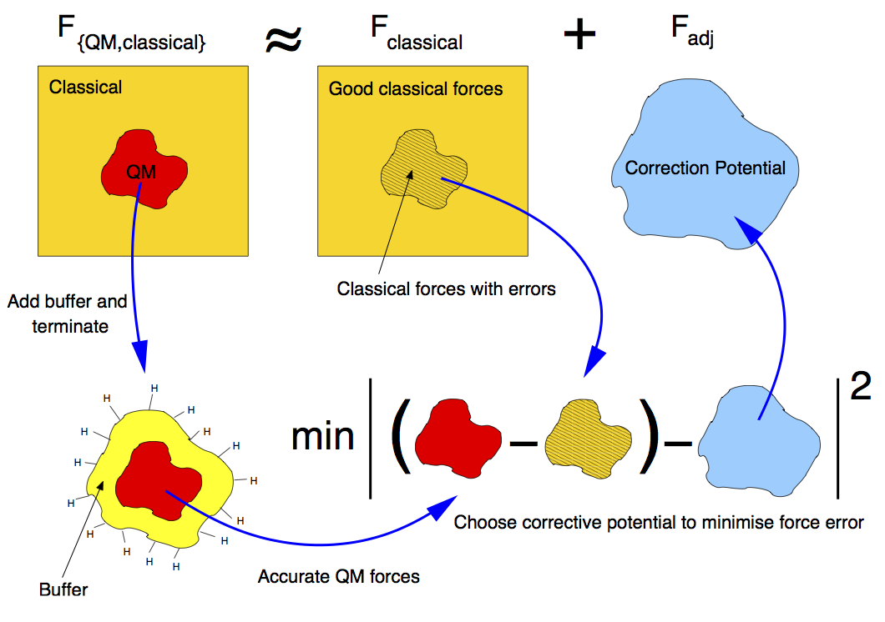
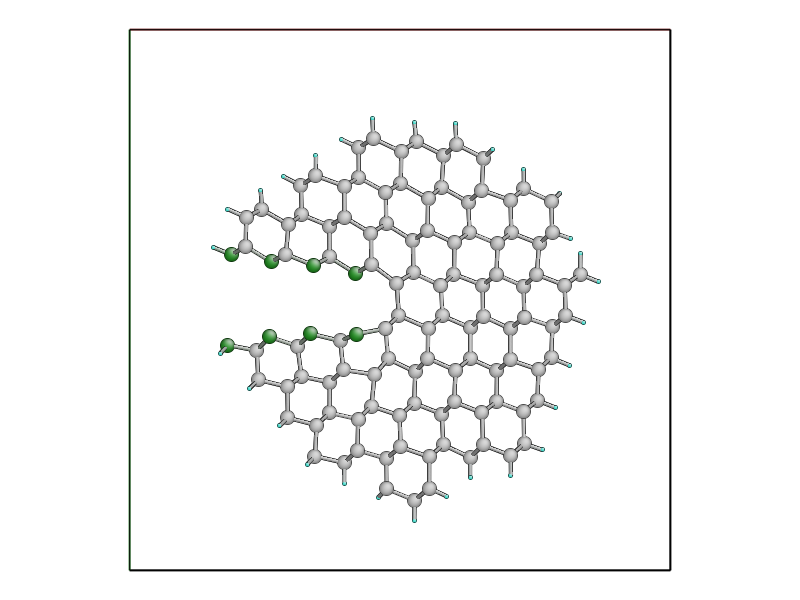

.. _step3:

Step 3: LOTF hybrid MD simulation of fracture in Si
===================================================

In the final part of this tutorial, we will be extending our previous script for
classical molecular dynamics to carry out an adaptive QM/MM simulation of
fracture using the 'Learn on the Fly' (LOTF) scheme.

You will need the ``run_crack_classical.py`` script from :ref:`step2`. If you
don't have it, you can :download:`download it here <run_crack_classical.py>`,
and the ``crack.xyz`` input file from :ref:`step1`, which you
can :download:`also download here <crack.xyz>`.

.. _theory3:

Theoretical background
----------------------

In this last part of the tutorial, we will perform an accurate MD simulation of
Si fracture using the "Learn on the fly" (LOTF) hybrid QM/MM technique
[Csanyi2004]_ In the present case, all atoms that are not suitably described by
the [Stillinger1985]_ potential (our MM scheme) will have be treated
quantum-mechanically with the DFTB method [Elsterner1998]_. These atoms are
those in the vicinity of the crack tip, where highly strained Si-Si bonds are
present, and where formation and rupture of chemical bonds occurs during the
crack propagation.

Standard QM/MM techniques, usually developed for biological systems, adopt 
energy-based approaches. The total energy of the system is written as a combination  
of the QM energy, the MM energy and a QM/MM term, often specifically devised
for a particular system, that takes care of the interaction between the two regions.
While this approach allows the definition of a total energy, which is 
conserved during the dynamics, the forces used to propagate the MD are not accurate
enough because of the spurious effects due to the presence of the boundary
between the QM and the MM regions. Moreover, the necessity to suitably "terminate"
the QM region, does not allow the QM region to move during the simulation, which
is however required if we want to follow the motion of the crack tip.

The LOTF scheme adopts a force-based scheme instead, which allows the QM region
to move during the MD simulation and accurate forces to be calculated even at
the boundaries of the two regions. While the details of the scheme are
thoroughly presented in a number of articles [Csanyi2004]_, [Csanyi2005]_,
[Moras2010]_, [Kermode2008a]_, [Bernstein2009]_, we will here briefly explain
the basic concepts that will allow us to perform the crack simulation.

.. _buffer:

Calculation of the forces: buffered force mixing
^^^^^^^^^^^^^^^^^^^^^^^^^^^^^^^^^^^^^^^^^^^^^^^^

The first problem we have to face, when performing a QM/MM MD simulation is to
calculate accurate forces. While the calculation of the MM forces, using a
short-ranged potential (e.g. the SW potential) is trivially solved by
inexpensively computing the MM forces on the whole system, the problem of
calculating the QM forces is more complicated. The ultimate goal of any QM/MM
approach is to perform a simulation where all the system behaves instantaneously
as if it were fully QM. In a standard QM/MM approach, however, the QM forces
would be calculated by carving the QM region out of the system and chemically
terminating the resulting Si dangling bonds, for instance with H atoms. Even by
using more complex termination strategies, it is generally not possible to
mimic the presence of the surrounding MM system, and the forces on the atoms
close to the artificially created "QM surface" would not be accurate.

To solve this problem, at the expense of an increased computational cost, we
increase the size of the QM region by adding a "buffer region", as illustrated
below. The calculation of the QM forces is carried out on this QM + buffer
region, after suitable termination with H atoms.

.. figure:: buffer-region.png
   :width: 600
   :align: center

   The finite buffer termination strategy. Force on the atoms in the buffer
   region (dark grey) are discarded to give accurate QM or MM forces on all atoms
   (right hand panel). Reproduced from [Bernstein2009]_.

The buffer region must be large enough to minimize the errors on the QM forces
due to the presence of the outer artificial surface. The size of the buffer
region can be determined through some tests (see :ref:`this extension task
<buffer_region_size>`) , and is typically around 8 A, or 4 neighbour hops, for
Si. This near-sightedness of quantum mechanics is ultimately due to the locality
of the density matrix in covalent materials.

Once accurate QM forces have been obtained, only the QM forces on the atoms
belonging to the original QM region are used in the MD. The QM forces on the
atoms in the buffer region, which are strongly affected by the presence of the
outer QM surface, are discarded and replaced by the MM forces (as illustrated
above). In this way, we can obtain the desired forces on all atoms in the
system. These forces can be used in the MD simulation, provided that the
conservation of the total momentum is restored. This can be enforces by
distributing subtracting the (typically small) mean force, so that the final
QM/MM forces sum to zero.

It is important to have good elastic matching between the QM and MM models, so
that there is no discontinuity at the boundary. For simple materials, this can
usually be achieved by scaling the classical model in space and energy to match
the lattice constant and bulk modulus of the QM model (for simplicity we omit
this step in this tutorial, but the mismatch here is not too big).

.. _hysteretic_selection:

Hysteretic selection of the QM active and buffer regions
^^^^^^^^^^^^^^^^^^^^^^^^^^^^^^^^^^^^^^^^^^^^^^^^^^^^^^^^

A key advantage of the buffered force mixing approach is that the QM region can
be redefined during a simulation. This works because new atoms first enter the
QM calculation at the outer boundary of the buffer region, where they do not
have a large effect on the forces at the centre, and therefore changing the QM
region does not introduce large inconsistencies.

In this tutorial, the QM region will be updated during the MD simulation in
order to follow the motion of the crack tip. When selecting the atoms that
belong to the buffered QM region, it is important to minimise fluctuations in
the set of QM atoms. This should be done in order to minimise the spurious heat
generation due to atoms whose description changes from MM to QM, or vice-versa
[Bernstein2009]_. This change of description is inevitable when the QM region
moves with the crack tip. However, solutions have to be found to minimise
fluctuations due to oscillation.

A robust way to minimise fluctuations is to employ a "hysteretic" algorithm for
the QM selection process [Bernstein2009]_. In the context of a fracture
simulation, atoms have to come within a certain *inner
radius* :math:`r_\mathrm{-}` from the crack tip to become selected as QM active
atoms (see the picture below). In our case, atoms have to come within 7 A from
the crack tip to become part of the QM region. However, using the hysteretic
algorithm, these atoms will remain QM until they move further than the 
*outer radius* :math:`r_\mathrm{+}` (where :math:`r_\mathrm{+} > r_\mathrm{-}`)
away from the crack tip. In our simulation, this outer radius will be 10 A. We
refer to the current set of QM atoms in as the *QM active region*.

.. figure:: hysteresis.png
   :height: 200
   :align: center

   Hysteretic QM selection algorithm. For fracture simulations the black *active region*
   can be reduced to a single point at the crack tip. Reproduced from [Bernstein2009]_.

As well as using hysteresis to select the QM active atoms for which QM forces
will be used, we can also use the hysteretic selection algorithm to minimise
fluctuations in the buffer region. These radii apply to the distance from any of the
QM active atoms, so the buffer takes the form of a shell of constant width
around the QM atoms. 

Here we will use inner and outer buffer radii of 7 A and 9 A, respectively. This
leads to overall QM active + buffer clusters with a radius of 15--19 A,
containing around 150 atom including terminating hydrogens (see
the :ref:`example cluster <cluster>` below).

Further tricks which can be used to stabilise the QM and buffer region include
growing the regions using bond hopping rather than distance criteria, and use
time-averaged positions [Bernstein2009]_. For simplicity, in this tutorial we
will use only the hysteretic selection technique.

.. _lotf:

LOTF adjustable potential and predictor-corrector scheme
^^^^^^^^^^^^^^^^^^^^^^^^^^^^^^^^^^^^^^^^^^^^^^^^^^^^^^^^

The QM/MM forces calculated as just explained, using a buffered QM region, can
be directly used to perform an MD simulation, provided that the total sum of the
forces is constrained to be zero, as explained above. However, in many cases,
and in particular in this Si crack case, we can use yet another "trick" to speed
up our MD simulation, by at least a factor 10.

We first introduce a new Hamiltonian, which is the sum of the MM potential (the
SW potential here) and of a so called *adjustable potential*. This potential has
a general analytical expression and a set of parameters that can be adjusted. In
this case, we will use a simple two-body linear 'spring' potential with the form

.. math:: 
   V_\mathrm{adj} = \sum_{\mathrm{pairs}\; ij} \alpha_{ij} r_{ij}

where :math:`i` and :math:`j` indicate a pair of atoms which are closer than an
arbitrary spring length (typically around 3 neighbour hops),
and :math:`\{\alpha_{ij}\}` are the set of adjustable parameters. We then define
a *fitting region*, typically slightly larger than the buffered QM region. 

Our adjustable potential is then used to fit the difference between the QM and
the MM forces for each atom in this fitting region. (The functional form above is
particularly suitable as it can be optimised using linear algebra). Of course,
this difference will be zero for atoms in the fitting region that do not belong
to the QM region. In this way, after a successful force matching, the gradient
of our sum potential :math:`-\nabla (V_{SW}(\mathbf{r})+
V_{adj}(\mathbf{r},\{\alpha\}))` gives us the MM forces on the MM atoms and the QM
forces on the QM atoms. Of course a very small error on these forces
(typically :math:`\sim 10^{-3}` eV/A) is caused by requiring our forces to be
the gradient of a single Hamiltonian. This is however of the same order as the
error introduced by forcing the total sum of the forces to zero, and less than
the error associated with computing QM forces with using cluster with a finite
buffer radius (which can be as much as :math:`\sim 0.1` eV/A compared to a
reference QM calculation in the full system with PBC). The figure below
illustrates the force fitting process.

The definition of this new adjustable potential is very beneficial to our
simulation because it allows us to employ a predictor-corrector algorithm that,
as mentioned before, significantly speeds up our simulation. This scheme is
based on the possibility of varying the values of the adjustable potential
parameters :math:`\{\alpha_{ij}\}` in both time and in space (i.e. each two-body
term of the potential has an independent parameter :math:`\alpha_{ij}`). Once
these parameters are adjusted to match the QM/MM forces in the fitting region,
we do not necessarily need to perform this fitting procedure at the next time
step. In many cases, in fact, the parameters would change very slowly with
respect to the changing atomic positions. This means that the same parameters
can be used for a small number of steps (e.g. 10 in our case), after which the
expensive QM forces are recomputed, and then used to retune the parameters. 
This is the philosophical idea behind the 'Learn on the Fly' approach.

The predictor-corrector scheme works as follows, with reference to the illustration below:

   1. **Initialisation.** The QM region is selected, the buffered QM/MM forces are
   calculated and the parameters of the adjustable potential are adjusted to
   reproduce the difference between Qm and MM forces in the fitting region.

   2. **MD predictor: Extrapolation.** The
   classical :math:`V_\mathrm{SW}+V_\mathrm{adj}` is used
   with the fixed set of adjusted parameters :math:`\alpha_0` to evolve the
   dynamics of the whole system starting from the positions :math:`R_0` for a small
   number :math:`N` of steps of size :math:`\Delta t` for a total time
   of :math:`\Delta T = N\Delta t`.

   3. **QM/MM forces.** The buffered QM region method is used to compute the QM/MM
   forces on the new configuration :math:`R_1'`.

   4. **Force matching.** The parameters of the adjustable potential are tuned to
   reproduce the difference between the new QM forces and the new MM forces to give a
   new set of adjustable potential parameters :math:`\alpha_1`.
   
   5. **MD corrector: Interpolation.** The formerly predicted MD steps are now
   corrected by returning the state of the system to that at :math:`R_0`, and
   re-running the dynamics with the adjustable potential
   parameters linear interpolated between :math:`\alpha_0` and :math:`\alpha_1`.

We then return to step 2. and iterate.

.. image:: lotf-pred-corr.png
   :width: 500
   :align: center

The number of extrapolation steps that can be made before the potential
parameters change too much can be found by keeping an eye on the force errors
made by the LOTF scheme in comparison with doing a QM force evaluation at each
time step: there is an :ref:`extension task <pred_corr_error>` at the end of
this tutorial to do exactly that.
   

3.1 Initialisation of atomic system (20 minutes)
------------------------------------------------

Import the relevant modules
^^^^^^^^^^^^^^^^^^^^^^^^^^^

Make a copy of your ``run_crack_classical.py`` script and name it
``run_crack_lotf.py``. Add the following extra import statements after those
that are already there::

    from quippy.potential import ForceMixingPotential
    from quippy.lotf import LOTFDynamics, update_hysteretic_qm_region

Definition of the simulation parameters
^^^^^^^^^^^^^^^^^^^^^^^^^^^^^^^^^^^^^^^

.. _parameters3:

Next, we need to add some additional parameters specifically for the
QM/MM simulation. Again, insert them in ``run_crack_lotf.py``, below the
existing parameters ::

    qm_init_args = 'TB DFTB'         # Initialisation arguments for QM potential
    qm_inner_radius = 8.0*units.Ang  # Inner hysteretic radius for QM region
    qm_outer_radius = 10.0*units.Ang # Inner hysteretic radius for QM region
    extrapolate_steps = 10           # Number of steps for predictor-corrector
                                     # interpolation and extrapolation

The setup of the atomic structure and of the constraints is exactly the same as
before, so leave these sections of your script unchanged.

Setup of the QM and QM/MM potentials
~~~~~~~~~~~~~~~~~~~~~~~~~~~~~~~~~~~~

For the QM/MM simulation, we first need to initialise the classical SW potential
(`mm_pot`) and the quantum-mechanical one (`qm_pot`). The two Hamiltonians then need
to be combined into a hybrid QM/MM potential (`qmmm_pot`), which mixes the QM 
and MM forces. 

Leave the initialisiton of the SW classical potential as it is. After this, we
want to add some lines of code to setup the QM potential. Using the same
:class:`~quippy.potential.Potential` class, we initialise now the Density
functional tight binding (DFTB) potential. This is done by passing the new QM
`qm_init_args` as the `init_args` parameter and the same XML file as before for
the `param_filename` to the Potential constructor (note that the single file
``params.xml`` contains parameters for both the SW and DFTB potentials)::

    qm_pot = ...  # Initialise DFTB potential

The QM/MM potential is constructed using quippy's
:class:`quippy.potential.ForceMixingPotential` class. Here, `pot1` is the low
precision, i.e. MM potential, and `pot2` is the high precision, i.e. QM
potential. `fit_hops` is the number of hops used to define the fitting region,
`lotf_spring_hops` defines the length of the springs in the LOTF *adjustable
potential*, while the hysteretic buffer options control the size of
the :ref:`hysteretic <hysteretic_selection>` :ref:`buffer region <buffer>` region
used for the embedded QM force calculation. ::

  qmmm_pot = ForceMixingPotential(pot1=mm_pot,
				  pot2=qm_pot,
				  qm_args_str='single_cluster cluster_periodic_z carve_cluster '+
					      'terminate cluster_hopping=F randomise_buffer=F',
				  fit_hops=4,
				  lotf_spring_hops=3,
				  hysteretic_buffer=True,
				  hysteretic_buffer_inner_radius=7.0,
				  hysteretic_buffer_outer_radius=9.0,
				  cluster_hopping_nneighb_only=False,
				  min_images_only=True)

The `qm_args_str` argument defines some parameters which control how
the QM calculation is carried out: we use a single cluster, periodic
in the `z` direction and terminated with hydrogen atoms. The positions
of the outer layer of buffer atoms are not randomised.

Change the line which sets the Atoms calculator to use the new
`qmmm_pot` Potential::

    atoms. ...  # Set the calculator

Set up the initial QM region
^^^^^^^^^^^^^^^^^^^^^^^^^^^^

Now, we can set up the list of atoms in the initial QM region using
the :func:`~quippy.lotf.update_hysteretic_qm_region` function, defined in
quippy. Here we need to provide the Atoms' system, the centre of the QM region
(i.e. the position of the crack tip), as well as the inner and outer radius of
the hysteretic QM region. Note that the `old_qm_list` attribute must be an empty
list (``[]``) in this initial case::

    qm_list = ...             # Define the list of atoms in the QM region

The list needs to be attached to the `qmmm_pot` using the
:meth:`~quippy.potential.ForceMixingPotential.set_qm_atoms` method::

    qmmm_pot. ...             # Attach QM list to calculator

Milestone 3.1
^^^^^^^^^^^^^

Your ``run_crack_lotf.py`` script should look something
like :download:`run_crack_lotf_1.py`.

At this point you should run your script and check the initial QM region. For
testing, you should add a couple of temporary lines to force the script to
finish after setting the QM region and before repeating the classical MD::

  import sys
  sys.exit(0)

To visualise the initial QM region, you can type the following directly into
your `ipython` session (remember to do a ``from qlab import *`` first if you
haven't already)::

   view(atoms)
   aux_property_colouring(qmmm_pot.get_qm_atoms())

.. image:: crack-initial-qm-region.png
   :align: center
   :width: 600

In the image above, the red atoms are QM and the blue atom classical.
Internally, this list is actually saved as a :attr:`property
<~quippy.atoms.Atoms.properties>` inside the Atoms object named ``"hybrid"``,
which can also be displayed with ``aux_property_colouring("hybrid")``

3.2 Setup and run the adaptive QM/MM MD (20 minutes)
----------------------------------------------------

Initialising the Dynamics
^^^^^^^^^^^^^^^^^^^^^^^^^

The definition of the initial temperature of the system should be left as
in :ref:`Step 2 <step2>`. Don't forget to remove the temporary lines added above which
quit the script after setting up the initial QM region!

Instead of a traditional dynamics in the NVE ensemble, let's change the code to
use :ref:`LOTF predictor-corrector dynamics <lotf>`, using
the :class:`quippy.lotf.LOTFDynamics` class instead of
the :class:`~md.verlet.VelocityVerlet` class. We need to pass the following
arguments: `atoms`, `timestep`, `extrapolate_steps` (see :ref:`Parameters
section <parameters3>`)::

    dynamics = ...            # Initialise the dynamical system

The logger and crack tip movement detection functions can be left almost exactly
as before for now: we just need to make a small change to
the :func:`printstatus` function so to distinguish between extrapolation and
interpolation:

Change the line::

    atoms.info['label'] = 'D'                   # Label for the status line

to::

    atoms.info['label'] = dynamics.state_label  # Label for the status line

This uses the :attr:`~quippy.lotf.LOTFDynamica.state_label` attribute to print
an ``"E"`` at the beginning of the logger lines for extrapolation and an ``"I"``
for interpolation.

Updating the QM region
^^^^^^^^^^^^^^^^^^^^^^

We need to define a function that updates the QM region at the
beginning of each extrapolation cycle. As before, we need to find the
position of the crack tip and then update the hysteretic QM
region. Note that now a previous QM region exists and its atoms should
be passed to the :func:`~quippy.lotf.update_hysteretic_qm_region`
function. The current QM atom list can be obtained with the
:meth:`quippy.potential.ForceMixingPotential.get_qm_atoms` method. To
find the crack position, use
:func:`~quippy.crack.find_crack_tip_stress_field` as before, but pass
the MM potential as the calculator used to calculated the stresses
(force mixing potentials can only calculate forces, not per-atom
stresses; the classical stress is sufficiently accurate for locating
the crack tip)::

    def update_qm_region(atoms):
        crack_pos = ...          # Find crack tip position
        qm_list = ...            # Get current QM atoms
        qm_list = ...            # Update hysteretic QM region
        qmmm_pot. ...            # Set QM atoms

   dynamics.set_qm_update_func(update_qm_region)

Writing the trajectory
^^^^^^^^^^^^^^^^^^^^^^

Finally, we want to save frames to the trajectory every `traj_interval` time
steps but, this time, only during the interpolation phase of the
predictor-corrector cycle. To do this, we first initialise the trajectory file
(see :func:`~quippy.io.AtomsWriter`), and then define a function, that only
writes to the trajectory file if the state of the dynamical systems is
`Interpolation`::

    trajectory = ... # Initialise trajectory using traj_file
    
    def traj_writer(dynamics):
        if dynamics.state == LOTFDynamics.Interpolation:
            trajectory.write(dynamics.atoms) 

As before, we attach this function to the dynamical system, passing
`traj_interval` and and extra argument of `atoms` which gets passed along to the
`traj_writer` function (see the :meth:`~quippy.lotf.LOTFDynamics.attach`
method)::

    dynamics. ...    # Attach traj_writer to dynamics

Now, we can simply run the dynamics for `nsteps` steps:: 

    dynamics. ...    # Run dynamics for nsteps
 
If you are interested in seeing how the LOTF predictor-corrector cycle is
implemented, look at the the documentation and `source code
<_modules/quippy/lotf.html#LOTFDynamics.step>`_ for the
:meth:`quippy.lotf.LOTFDynamics.step` routine.

Milestone 3.2
^^^^^^^^^^^^^

The finished version of the ``run_crack_lotf.py`` script should look something
like :ref:`run_crack_lotf`. To clearly show the differences with respect to the
classical MD script, here is a :download:`patch
<run_crack_classical_lotf.patch>` which could be used to convert the classical
script into the LOTF one.

3.3 Visualisation and Analysis (as time permits)
------------------------------------------------

Predictor/corrector dynamics output file
^^^^^^^^^^^^^^^^^^^^^^^^^^^^^^^^^^^^^^^^

Let's first take a moment to look at the output of the script for the first
predictor/corrector cycle. Here we go through some example output, yours should
be similar. First there are a few lines about the initialisation of the system,
and then we get the results of the initial LOTF adjustable potential
optimisation::

    Loading atoms from file crack.xyz
    Fixed 240 atoms

    25 atoms selected for quantum treatment
    update_qm_region: QM region with 25 atoms centred on [-30.60517303   0.08401087   0.        ]
    Adding default springs
    Got 1484 springs
    Number of force components: 297
    Number of parameters:       1484
    Optimising 1484 adjustable parameters
    RMS force component error before optimisation : .05630875465645784
    Max force component error before optimisation : .34841292159055509
    Using SVD for least squares fit, eigenvalue threshold = .00000000010000000
    RMS force component error after  optimisation :   0.27E-02
    Max force component error after  optimisation :   0.61E-02
    Max abs spring constant   after  optimisation :   0.45E-01

You can see that before adjusting the parameters, the QM and classical potentials
differed by a maximum of 0.35 eV/A, with an RMS difference of 0.06 eV/A - in
this case the SW potential is actually doing a rather respectable job. After the
fit, which is this case involved 1484 spring parameters to fit 297 force
component, the force differences are of course much smaller.

Next we start the first predictor/corrector cycle. First we update the QM
region, and remap the adjustable potential to take account of any changes
since last time::

    25 atoms selected for quantum treatment
    update_qm_region: QM region with 25 atoms centred on [-30.6048418    0.08377744   0.        ]
    Adding default springs
    Got 1484 springs
    Number of force components: 297
    Number of parameters:       1484

As this is the first step, there were no changes, so no re-optimisation is
required. Next we carry out 10 steps of extrapolation, with constant LOTF
adjustable parameters. During this time the strain is incremented as normal::

    State      Time/fs    Temp/K     Strain      G/(J/m^2)  CrackPos/A D(CrackPos)/A 
    ---------------------------------------------------------------------------------
    E            1.0  553.716406     0.08427      5.0012      -30.61    (-0.00)
    E            2.0  547.749233     0.08428      5.0024      -30.61    (-0.01)
    E            3.0  535.952151     0.08429      5.0036      -30.62    (-0.01)
    E            4.0  518.731103     0.08430      5.0047      -30.63    (-0.02)
    E            5.0  496.675925     0.08431      5.0059      -30.63    (-0.03)
    E            6.0  470.538607     0.08432      5.0071      -30.64    (-0.04)
    E            7.0  441.205418     0.08433      5.0083      -30.65    (-0.05)
    E            8.0  409.663780     0.08434      5.0095      -30.66    (-0.06)
    E            9.0  376.965040     0.08435      5.0107      -30.67    (-0.07)
    E           10.0  344.184506     0.08436      5.0119      -30.69    (-0.08)

At the end of the extrapolation, it's time for a QM forcer evaluation and
another fit. Now the force errors are a little larger, but the fit is still very good::

    Optimising 1484 adjustable parameters
    RMS force component error before optimisation : .10494977522791650
    Max force component error before optimisation : .48515966905523733
    Using SVD for least squares fit, eigenvalue threshold = .00000000010000000
    RMS force component error after  optimisation :   0.37E-02
    Max force component error after  optimisation :   0.96E-02
    Max abs spring constant   after  optimisation :   0.83E-01

We next return to the initial dynamical state and re-run the dynamics,
interpolating between the optimised parameters at the two ends of the cycle.
Note that the strain is also returned to the initial value at :math:`t = 0`, and
that the temperature after one step exactly matches the interpolation phase
(since the forces and velocities at :math:`t = 0` are identical for
extrapolation and interpolation)::

    State      Time/fs    Temp/K     Strain      G/(J/m^2)  CrackPos/A D(CrackPos)/A 
    ---------------------------------------------------------------------------------
    I            1.0  553.716406     0.08427      5.0012      -30.65    (-0.04)
    I            2.0  547.759567     0.08428      5.0024      -30.65    (-0.05)
    I            3.0  535.982832     0.08429      5.0036      -30.66    (-0.05)
    I            4.0  518.791314     0.08430      5.0047      -30.66    (-0.06)
    I            5.0  496.773542     0.08431      5.0059      -30.67    (-0.07)
    I            6.0  470.679783     0.08432      5.0071      -30.68    (-0.08)
    I            7.0  441.394231     0.08433      5.0083      -30.69    (-0.09)
    I            8.0  409.901969     0.08434      5.0095      -30.70    (-0.10)
    I            9.0  377.251837     0.08435      5.0107      -30.71    (-0.11)
    I           10.0  344.516566     0.08436      5.0119      -30.73    (-0.12)

To continue from here, we simply go back to the extrapolation phase and then
repeat the entire cycle.

QM active and buffer regions
^^^^^^^^^^^^^^^^^^^^^^^^^^^^

Trajectory analysis
^^^^^^^^^^^^^^^^^^^

Open your new trajectory :ref:`as before <visualisation2>`, using
the :func:`~qlab.view` function from within `ipython`, and visualise the QM
region by colouring the atoms using the ``hybrid_mark`` :attr:`property
<~quippy.atoms.Atoms.properties>`::

   aux_property_coloring("hybrid_mark")

This property is used internally to identify which atoms are used for the QM
active and buffer regions:

.. image:: crack-hybrid-mark.png
   :align: center
   :width: 600

The central green atoms have ``hybrid_mark == HYBRID_ACTIVE_MARK``, and they are
the atoms for which QM forces are used to propagate the dynamics. Classical
forces are used for all other atoms, including the red buffer region, where
``hybrid_mark == HYBRID_BUFFER_MARK``. As explained :ref:`above <buffer>`, the
purpose of the buffer region is to give accurate QM forces on the active atoms.

.. _cluster:

If you want to see the actual cluster used for carrying out the embedded DFTB
calculation, you could use the :func:`~quippy.clusters.create_cluster_simple`
function together with the same `args_str` cluster options defined above::

   cluster = create_cluster_simple(gcat(), 
                  args_str=("single_cluster cluster_periodic_z carve_cluster "
                            "terminate cluster_hopping=F randomise_buffer=F"))
   view(cluster)

Colouring the cluster by coordination (press `k`) can be useful to check that
all cut bonds have been correctly passivated by hydrogen atoms:

Comparison between classical and LOTF dynamics
^^^^^^^^^^^^^^^^^^^^^^^^^^^^^^^^^^^^^^^^^^^^^^

Step through your trajectory with the `Insert` and `Delete` keys to see what
happens in the LOTF dynamics. As before, you can jump to the end with
`Ctrl+Delete`. You should find that the dynamics is very different to the
classical case.

Check if the QM region is following the moving crack properly by looking at the
``hybrid_mark`` property. If you repeat the analysis of the :ref:`stress field
<stress_analysis>` carried out in :ref:`Step 2 <step2>`, you should find that
the :ref:`time averaged stress field <time_avg_stress>` is strongly concentrated
on the sharp crack tip. It is this stress field which is used
by :func:`~quippy.crack.find_crack_tip_stress_field` to follow the crack tip,
and hence to update the set of atoms in the QM region.

Here is a movie of a typical LOTF simulation on the :math:`(111)` cleavage
plane. To colour the QM atoms dark blue, we passed
the :func:`~qlab.highlight_qm_region` function as the `hook` argument
to :func:`~qlab.render_movie`:

.. raw:: html

    

    <video width="640" height="360"  controls="controls" poster="_movies/lotf-111-poster.jpg">
      <source src="_movies/lotf-111.out.mp4" type='video/mp4' />
      <source src="_movies/lotf-111.out.ogv" type='video/ogg; codecs="theora, vorbis"'' />
      <source src="_movies/lotf-111.out.webm" type='video/webm; codecs="vp8.0, vorbis"' />
      
<b>Your browser does not support HTML5 video.
	<a href="_movies/lotf-111.out.mp4">Download</a> the video instead.
      </b>

    </video>
    

During the LOTF dynamics, the time-averaged stress field smoothly tracks the
crack tip, as can be seen in this movie, where atoms are coloured by
their :math:`\sigma_{yy}` component:

.. raw:: html

    

    <video width="640" height="360"  controls="controls" poster="_movies/elastic-poster.jpg">
      <source src="_movies/elastic.mp4" type='video/mp4' />
      <source src="_movies/elastic.ogv" type='video/ogg; codecs="theora, vorbis"'' />
      <source src="_movies/elastic.webm" type='video/webm; codecs="vp8.0, vorbis"' />
      
<b>Your browser does not support HTML5 video.
	<a href="_movies/elastic.out.mp4">Download</a> the video instead.
      </b>

    </video>
    

And here is a head-to-head comparison of SW and LOTF dynamics:

.. raw:: html

    

    <video width="640" height="720"  controls="controls" poster="_movies/classical-vs-lotf-poster.jpg">
      <source src="_movies/classical-vs-lotf.out.mp4" type='video/mp4' />
      <source src="_movies/classical-vs-lotf.out.ogv" type='video/ogg; codecs="theora, vorbis"'' />
      <source src="_movies/classical-vs-lotf.out.webm" type='video/webm; codecs="vp8.0, vorbis"' />
      
<b>Your browser does not support HTML5 video.
	<a href="_movies/classical-vs-lotf.out.mp4">Download</a> the video instead.
      </b>

    </video>
    

Fracture initiates much earlier in the LOTF case, i.e. at a much reduced energy
release rate, and is much more brittle, with none of the artificial plasticity
seen with the classical potential alone.

Note that if we continue the LOTF dynamics, however, we do see some defects in
the frature surface after the crack has propagated for a few nm. These are
associated with the relatively small system and high strain rate we are using
here, which leads to fracture at high energies and possibly to high speed
fracture instabilities [Fineberg1991]_. If you have time you can investigate
this in the :ref:`extension task on size and strain rate effects
<system_size_and_strain_rate>`.

.. raw:: html

    

    <video width="640" height="720"  controls="controls" poster="_movies/clas-vs-lotf-poster.jpg">
      <source src="_movies/clas-vs-lotf.mp4" type='video/mp4' />
      <source src="_movies/clas-vs-lotf.ogv" type='video/ogg; codecs="theora, vorbis"'' />
      <source src="_movies/clas-vs-lotf.webm" type='video/webm; codecs="vp8.0, vorbis"' />
      
<b>Your browser does not support HTML5 video.
	<a href="_movies/clas-vs-lotf.mp4">Download</a> the video instead.
      </b>

    </video>
    

Although it is beyond the scope of this tutorial, you might be interested to
know that using an overall larger system, bigger QM region, lower strain rate,
as well as changing the Hamiltonian from DFTB to DFT-GGA, removes all of these
defects, recovering perfectly brittle fracture propagation. The DFT model also
gives an improved description of the fracture surfaces, which reconstruct to
form a Pandey :math:`\pi`\ -bonded chain, with it's characteristic alternating
pentagons and heptagons:

.. raw:: html

    

    <video width="640" height="360"  controls="controls" poster="_movies/silicon-111-dft-1400-poster.jpg">
      <source src="_movies/silicon-111-dft-1400.mp4" type='video/mp4' />
      <source src="_movies/silicon-111-dft-1400.ogv" type='video/ogg; codecs="theora, vorbis"'' />
      <source src="_movies/silicon-111-dft-1400.webm" type='video/webm; codecs="vp8.0, vorbis"' />
      
<b>Your browser does not support HTML5 video.
	<a href="_movies/silicon-111-dft-1400.mp4">Download</a> the video instead.
      </b>

    </video>
    

.. _plot_G_and_crack_pos_x_lotf:

Evolution of energy release rate and crack position
^^^^^^^^^^^^^^^^^^^^^^^^^^^^^^^^^^^^^^^^^^^^^^^^^^^

If you follow the :ref:`previous approach <plot_G_and_crack_pos_x>` to plot the
energy release rate `G` and crack position `crack_pos_x` variables during your
LOTF simulation, you should find that the crack now advances monotonically, with
a constant crack velocity of around 2500 m/s, and at about half the energy
release rate of the classical case (6 J/m\
:superscript:`2` vs 12 J/m\ :superscript:`2`).

.. image:: lotf-energy-release-rate-crack-position.png
   :align: center
   :width: 600

You should find that the :ref:`temperature <plot_temperature>` still goes up,
but more gently than in the classical case, since the flow of energy to the
crack tip is closer to the energy consumed by creating the new surfaces. Some
heat is generated at the QM/MM border; usually this would be controlled with a
gentle Langevin thermostat, which we have omitted here in the interests of
simplicity.

.. _low_speed_instability:

Low speed instability on the (111) cleavage plane
^^^^^^^^^^^^^^^^^^^^^^^^^^^^^^^^^^^^^^^^^^^^^^^^^

If you are lucky, you may see the formation of a crack tip reconstruction
consisting of a 5 and a 7 membered ring on the lower fracture surface, and
related to the Pandey surface reconstruction. 

.. image:: lotf-crack-step-1.png
   :width: 400
   :align: center

This reconstruction can cause cracks to take a step down by one atomic layer,
which over time can build up via positive feedback mechanism into an
experimentally observable phenomena [Kermode2008]_.

.. image:: lotf-crack-step-2.png
   :width: 400
   :align: center

.. _extension_tasks:

.. _pred_corr_error:

3.4 Checking the predictor/corrector force errors (optional)
------------------------------------------------------------

Add `check_force_error=True` to the :class:`~quippy.lotf.LOTFDynamics`
constructor. This causes the LOTF routines to do a reference QM force evaluation
at every timestep (note that these extra QM forces are not used in the fitting,
so the dynamical trajectory followed is the same as before).

When checking the predictor/corrector errors, you need to disable the updating of
the QM region by commenting out the line::

   dynamics.set_qm_update_func(update_qm_region)

Let's create a logfile to save the force errors at each step during
the interpolation and extrapolation. Add the following code before the
:meth:`dynamics.run()` call::

    def log_pred_corr_errors(dynamics, logfile):
	logfile.write('%s err %10.1f%12.6f%12.6f\n' % (dynamics.state_label,
						       dynamics.get_time()/units.fs,
						       dynamics.rms_force_error,
						       dynamics.max_force_error))
    logfile = open('pred-corr-error.txt', 'w')
    dynamics.attach(log_pred_corr_errors, 1, dynamics, logfile)

Finally, change the total number of steps (via the `nsteps` parameter) to a much
smaller number (e.g. 200 steps), close the logfile after the ``dynamics.run()``
line::

    logfile.close()

Once the dynamics have run for a few LOTF cycles, you can plot the results with
a shell script called ``plot_pred_corr_errors.py``::

   plot_pred_corr_errors.py -e 10 pred-corr-error.txt

The ``-e 10`` argument is used to specify the number of extrapolate steps. This
produces a set of four plots giving the RMS and maximum force errors during
extrapolation and interpolation:

.. image::  lotf_check_force_error.png
   :align: center
   :width: 600

Note that the scale is different on the extrapolation and interpolation plots!
Try varying the `extrapolate_steps` parameter and seeing what the effect on
force errors is. What is the largest acceptable value? You could also try
changing the `lotf_spring_hops` and `fit_hops` parameters, which control the
maximum length of the corrective springs added to the potential and the size of
the fit region, respectively.

Milestone 3.4
^^^^^^^^^^^^^

Here is a final version of the ``run_crack_lotf.py`` script including
checking of the force errors: :download:`run_crack_lotf.py`.

Further extension tasks
-----------------------

.. _qm_region_size:

QM region size
^^^^^^^^^^^^^^

Investigate the effect of increasing the QM region size, controlled by the
`qm_inner_radius` and `qm_outer_radius` parameters. When does the behaviour
converge qualitatively? What does this say about the size of the 'process zone'
in silicon?

.. _buffer_region_size:

Buffer region size
^^^^^^^^^^^^^^^^^^

We have used a hysteretic buffer region from 7 A to 9 A. How would you check if
this is sufficient? What criteria needs to be satisfied for our results to be
converged with respect to buffer region size?

.. _freund:

Crack energy-speed relationship
^^^^^^^^^^^^^^^^^^^^^^^^^^^^^^^

Try varying the flow of energy to the crack tip by changing the `initial_G`
parameter used when making the crack system in :ref:`step1`. How does this
affect the speed of the crack?

.. _other_orientations:

Other crack orientations
^^^^^^^^^^^^^^^^^^^^^^^^

Return to the beginning of :ref:`step1` and try classical and/or LOTF dynamics
(which will actually probably be faster!) on the :math:`(110)` surface. Do you
see any major differences? Can you find any dynamic fracture instabilities?

.. _system_size_and_strain_rate:

System size and strain rate effects
^^^^^^^^^^^^^^^^^^^^^^^^^^^^^^^^^^^

What is the effect of changing the system size on the critical stress intensity
factor required for fracture? How would you converge with respect to this
parameter? Do you think experimental length scales can be reached? If not, does
it matter? Think about how the choice of loading geometry helps here.

As well as finite size effects, and perhaps more severely, we are limited in the
time scales that can be accessed by our fracture simulations, especially when
using a QM method to describe the crack tip processes. Are there any scaling
relations that can help us out here? How would you estimate the effect of the
artificially high strain rate we have been forced to impose here.

References
----------

.. [Stillinger1985] Stillinger, F. H., & Weber, T. A. Computer simulation
   of local order in condensed phases of silicon. Physical Review B,
   31(8),
   5262–5271. (1985). http://link.aps.org/doi/10.1103/PhysRevB.31.5262

.. [Elsterner1998] Elsterner, M., Porezag, D., Jungnickel, G., Elsner, J.,
   Haugk, M., Frauenheim, T., Suhai, S., et
   al. Self-consistent-charge density-functional tight-binding
   method for simulations of complex materials
   properties. Phys. Rev. B. 58 7260 (1998).
   http://prola.aps.org/abstract/PRB/v58/i11/p7260_1

.. [Csanyi2004] Csányi, G., Albaret, T., Payne, M., & De Vita,
   A. 'Learn on the Fly': A Hybrid Classical and Quantum-Mechanical
   Molecular Dynamics Simulation. Physical Review Letters,
   93(17), 175503. (2004)
   http://prl.aps.org/abstract/PRL/v93/i17/e175503>

.. [Csanyi2005] Csányi, G., Albaret, T., Moras, G., Payne, M. C., & De Vita, A. 
   Multiscale hybrid simulation methods for material systems. J. Phys.: Cond
   Mat. 17 R691-R703 (2005).
   http://stacks.iop.org/0953-8984/17/i=27/a=R02?key=crossref.f572d9a616845900307c923f5f385044

.. [Moras2010] Moras, G., Choudhury, R., Kermode, J. R., Csányi, G.,
   Payne, M. C., & De Vita, A. Hybrid Quantum/Classical Modeling of
   Material Systems: The Learn on the Fly Molecular Dynamics
   Scheme. In T. Dumitrica (Ed.), Trends in Computational
   Nanomechanics: Transcending Length and Time Scales
   (pp. 1–23). Springer (2010)
   http:///dx.doi.org/10.1007/978-1-4020-9785-0_1

.. [Kermode2008a] Kermode, J. R. Multiscale Hybrid Simulation of Brittle
   Fracture. PhD Thesis, University of Cambridge (2008).
   http://www.jrkermode.co.uk/Publications

.. [Bernstein2009] Bernstein, N., Kermode, J. R., & Csányi,
   G. Hybrid atomistic simulation methods for materials
   systems. Reports on Progress in Physics,
   72(2), 026501 (2009). http://dx.doi.org/10.1088/0034-4885/72/2/026501

.. [Kermode2008] Kermode, J. R., Albaret, T., Sherman, D., Bernstein,
   N., Gumbsch, P., Payne, M. C., Csányi, G., and A. De Vita. Low-speed
   fracture instabilities in a brittle crystal. Nature, 455,
   1224–1227 (2008). http://www.nature.com/doifinder/10.1038/nature07297

.. [Fineberg1991] Fineberg, J., Gross, S., Marder, M., & Swinney, H.
   Instability in dynamic fracture. Physical Review Letters, 67(4), 
   457–460  (1991). http://dx.doi.org/10.1103/PhysRevLett.67.457
