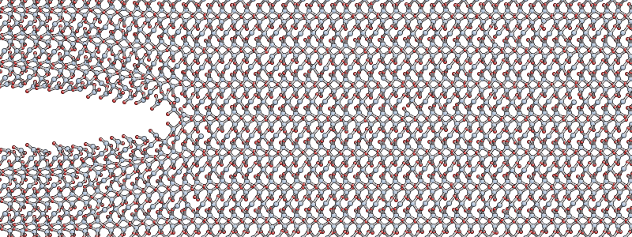
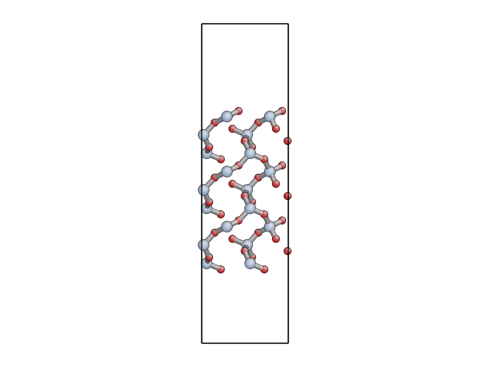

.. currentmodule:: quippy

Molecular Dynamics Simulation of Fracture in Quartz
***************************************************

**Hands-on Tutorial at ADGLASS Workshop, ICTP, Trieste**

James Kermode, 10 May 2011

Setting up your working environment
-----------------------------------

In this tutorial we are going to be using the `QUIP
<http://www.libatoms.org>`_ (short for QUantum mechanics and
Interatomic Potentials) code, which is a molecular dynamics code
written in Fortran 95 and equipped with a Python interface named
`quippy <http://www.jrkermode.co.uk/quippy>`_.

To get started, you should set up your working environment with the
following command::

   $ source ~jkermode/adglass.sh

This sets up a few environment variables and gives you access to the
`QUIP` and `quippy` codes. The `$ADGLASS` environment variable should
now point to a directory containing the input files you'll need.

Starting a fracture simulation
------------------------------

The first task is to get a fracture simulation running. We're going to
be modelling a crack opening on the basal plane (0001), with the crack
front parallel to the [-1,1,0] direction. You can copy the input
structure from $ADGLASS/quartz_crack.xyz. This cell contains a
:math:`150~\AA \times 50 \AA` crack system with around 4000 atoms. The
`y` axis is aligned with the (0001) plane, and the `z` axis with the
[-1,1,0] direction. The system is under uniaxial tension in the `y`
direction with an applied strain of around 23%, and contains a seed crack.

Copy the following input files from `$ADGLASS` to your working directory:

  1. `quartz_crack.xyz` - the input structure, pictured above
  2. `quartz_crack.xml` - contains all parameters for potential and molecular dynamics
  3. `quartz_crack_bulk.xyz` - the primitive unit cell

Start the simulation by running the QUIP `crack` program, which takes
the base name of the input files as its only argument ::

  $ crack quartz_crack > quartz_crack.out &

Note that we're redirecting the output to `quartz_crack.out` and
running `crack` in the background. As well as outputting status
information to `quartz_crack.out`, the simulation will save the MD
trajectory to a file named `quartz_crack_movie_1.xyz`. 

You can monitor the progress of the simulation by opening this file
with `AtomEye` or `VMD`, e.g. to open in `AtomEye`::

   $ A quartz_crack_movie_1.xyz

In AtomEye, you can translate the system within the periodic
boundaries to centre it in the middle of the cell by holding `Shift`
and dragging with your left mouse button, or press `Shift+z`. Zoom in
and out by draggin with the right mouse button. You can use the
`Insert` and `Delete` keys to move forwards and backward through the
trajectory - note the frame number in the title bar of the window. For
more help on `AtomEye` see its `web page <http://mt.seas.upenn.edu/Archive/Graphics/A>`_.

Have a look at the output in `quartz_crack.out`. To see how the
simulation is progressing, you can search this for lines starting with
"D"::

  $ grep "^D " quartz_crack.out

The first number is the time in femtoseconds (the integration timestep
of 0.5 fs is chosen to accurately sample the oscillation period of the
highest frequency phonon mode in the system), and the second and third
are the instantaneous and time-averaged temperatures in Kelvin.

After a few hundred femtoseconds, you should see the crack start to
propagate in a fairly steady way, similar to the snapshot shown below
(as a rough guide you can expect the simulation to progress at a
rate of about 1 picosecond per hour).

.. image:: quartz_running_crack.png
   :align: center

The simulation is run in the `NVT` ensemble: this mens that a
thermostat is needed to regulate the temperature since the system is
relatively small. The temperature will initially rise as the
accelerating crack gives out a lot of energy, but when it reaches its
equilibrium velocity the temperature will start to fall.

Keep your crack simulation running as you proceed with the next parts
of the hands-on session.

Quartz Primitive Unit Cell
--------------------------

While the fracture simulation is running, we will try to predict the
expected behaviour of a crack in quartz according to continuum
elasticity. We'll start by performing some calculations on the quartz
primitive cell.

As well as working with the standard unix command we'll also be using
`ipython`, an interactive Python shell. In the listings below, shell
commands are prefixed by a `$` to identify them; everything else is a
Python command which should be typed into an `ipython` shell.

If you're not familiar with Python don't worry, it's quite easy to
pickup and the syntax is very similar to Fortran. To start `ipython`
and import all the `quippy` routines::

   $ ipython
   ...
   In [1]: from quippy import *

Let's use quippy to setup a math:`\alpha`-quartz unit cell and save it
to an XYZ file::

  aq = alpha_quartz(a=4.84038097073, c=5.3285240037, u=0.464175616171,
    x=0.411742710542, y=0.278727453998, z=0.109736032769)
  aq.write("quartz.xyz")

Here `a` and `c` are the lattice parameters (in :math:`\AA`), `u` is
the internal displacement of the silicon atoms and `x`, `y`, and `z`
the internal displacement of the oxygens. (If something goes wrong you
can copy `quartz.xyz` from `$ADGLASS/quartz.xyz`; the same applies to
the other files mentioned below).

You can visualise this XYZ file with `AtomEye`, `jmol`, `VMD`
etc. You should see something like this:

.. image:: quartz.png
  :width: 600
  :align: center

.. note:: 

  The main advantage of `AtomEye` is that it does a pretty good job of
  understanding periodic boundary conditions. However, it can be a bit
  confusing for small cells like this. Since the quartz primitive cell
  contains only 9 atoms, `AtomEye` doubles the unit cell along the
  short lattice vectors (`a` and `b`) resulting in 36 atoms.

If you want to find out the syntax for a `quippy` function, type its
name following by a question mark, e.g. ::

   alpha_quartz ?

will print out the function signature and list of parameter types, as
well as a brief description of what it does. For more on using `QUIP`
and `quippy`, you could take a look at the online :ref:`tutorial-intro`.

Calculating Elastic Properties
------------------------------

In order to predict the onset and velocity of fracture, we need to
determine the values of the Young's modulus :math:`E`, the Poisson
ratio :math:`\nu`, surface energy density :math:`\gamma` and the
Rayleigh Wave speed :math:`c_R`. These are all properties of the
classical potential which in this case is a short-ranged version of
the TS polarisable potential (see `this paper
<http://jcp.aip.org/resource/1/jcpsa6/v133/i9/p094102_s1>`_ in
*J. Chem. Phys.* for more about this potential).

Apart from :math:`\gamma`, all of these properties can be obtained
from the :math:`6 \times 6` matrix of elastic constants
:math:`C_{ij}`, so we will start by calculating this.

:math:`C` is defined by :math:`\bm\sigma = C\bm\epsilon` where :math:`\bm\sigma` and
:math:`\bm\epsilon` are six component stress and strain vectors following
the Voigt convention:
 
.. math::
  \bm\sigma  = \left( \sigma_{xx}, \sigma_{yy}, \sigma_{zz},
      \sigma_{xz}, \sigma_{yz}, \sigma_{xy} \right)

  \bm\epsilon = \left( \varepsilon_{xx}, \varepsilon_{yy}, \varepsilon_{zz},
      2\,\varepsilon_{xz}, 2\,\varepsilon_{yz}, 2\,\varepsilon_{xy} \right)

The simplest way to calculate :math:`C` with `QUIP` is to use the
command line `quip_eval` program. You will need the file `quartz.xyz` from
above, and an XML file containing the parameters of the classical potential
we'll be using in this tutorial ::
 
  $ cp $ADGLASS/TS_params.xml .
  $ quip_eval init_args="IP ASAP2" at_file=quartz.xyz param_file=TS_params.xml cij

Here `init_args` describes the kind of potential to use, `at_file` is
the file containing the unit cell and `param_file` is the potential
parameters. `cij` tells the `quip_eval` program that we want it to
calculate the elastic constants.

Make a file called `cij.dat` containing the matrix. Once you've done
this, you can load this matrix into your `quippy` session using ::

  C = loadtxt("cij.dat")

**Extension**: For trigonal crystals like :math:`\alpha`-quartz, there
are only 6 independent values in the :math:`C` matrix:

.. math::
   C = \left(
   \begin{array}{cccccc}
   C_{11} & C_{12} & C_{13} & C_{14} & 0 & 0\\
   C_{12} & C_{11} & C_{13} & -C_{14} & 0 & 0 \\
   C_{13} & C_{13} & C_{33} & 0 & 0 & 0 \\
   C_{14} & -C_{14} & 0 & C_{44} & 0 & 0 \\
   0 & 0 & 0 & 0 & C_{44} & C_{14} \\
   0 & 0 & 0 & 0 & C_{14} & C_{66} 
   \end{array}
   \right)

where :math:`C_{66}` is given by :math:`\frac{1}{2}(C_{11} -
C_{12})`. We can exploit this symmetry to get all these values using
only two strain patterns: :math:`\epsilon_{xx}` and
:math:`\epsilon_{yy}+\epsilon_{zz}`.

If you like, you could try using the following `quippy` code to
evaluate :math:`C` taking symmetry into account and see how the
results differ from those obtained with `quip_eval`. ::

   p = Potential('IP ASAP2', param_filename='TS_params.xml')
   C = elastic_constants(p, aq, graphics=False, sym='trigonal_low')

Which components are most different? Why do you think this is? Think
about the effect of internal relaxation: compare with the values of
the :math:`C^0_{ij}` tensor obtained if internal relaxation is not
allowed (use the `c0ij` option to the `quip_eval` program).

Young's Modulus and Poisson Ratio
~~~~~~~~~~~~~~~~~~~~~~~~~~~~~~~~~

To calculate the effective Young's modulus and Poisson ratio for our
quartz fracture simulation, we need to rotate the elastic constant
tensor so that it is aligned with the simulation cell. You can create the
required rotation matrix using::

  R = crack_rotation_matrix(aq, (0,0,0,1), (-1,1,0))
  print R

Next we transform :math:`C` (note that it transforms as a rank-4
tensor since the full relation between stress and strain is
:math:`\sigma_{ij} = c_{ijkl} \epsilon_{kl}`) using this rotation
matrix, and calculate the compliance matrix :math:`S = C^{-1}` ::

  C_eff = transform_elasticity(C, R)
  S_eff = numpy.linalg.inv(C_eff)

Finally we can work out the values of the effective Young's modulus
and Poisson ratio from the components of the effective compliance
matrix::

  E_eff = 1/S[1,1]
  print "Young's modulus", E_eff, "GPa"

  nu_eff = -S[1,2]/S[1,1]
  print "Poisson ratio", nu_eff

**Extension**: if you are curious you can convince yourself of the
validity of these results by rotating the quartz unit cell directly::

  aqr = transform(aq, R)
  aqr.write("quartz_rotated.xyz")

Open `quartz_rotated.xyz` in AtomEye and confirm that it is oriented
so that the (0001) surface is aligned with the `y` axis, in the same
way as `quartz_0001.xyz` (pictured below). Then using `quip_eval` as
above to compute the elastic constant matrix of the rotated cell. How
well does this matrix compare to `C_eff`?

Surface Energy Density
~~~~~~~~~~~~~~~~~~~~~~

The file `$ADGLASS/quartz_0001.xyz` contains a 54 atom unit cell for
the (0001) surface of :math:`\alpha`-quartz (shown below). Use either
the `quip_eval` program or `quippy` to calculate the surface energy density
:math:`\gamma` predicted by our classical potential for this surface.

If you use `quip_eval`, use the `E` command line option to get the program
to calculate the potential energy of the input cell. If you use
`quippy`, you should construct a :class:`Potential` object using the
XML parameters in the file `TS_params.xml` as shown above. You can
then calculate the energy using the :meth:`~Potential.calc()`
function - see the tutorial section on :ref:`moleculardynamics` for
more details.

**Hint**: you can use the expression

.. math::

  \gamma = \frac{E_{surf} - E_{bulk}}{2A}

where :math:`E_{surf}` and :math:`E_{bulk}` are the energies of
surface and bulk configurations containing the same number of atoms,
and :math:`A` is the area of the open surface (with a factor of two
because there are two open surfaces in this unit cell). The unit cell
lattice vectors can be seen in the second line of the XYZ file, or by
printing `aq.lattice` in `quippy`.

**Extension**: what effect does relaxing the atomic positions have on
the surface energy? (use the `relax` argument to the `quip_eval`
program, or the :meth:`~Potential.minim` function in `quippy`). What
happens if you anneal the surface using the `md` program? ::

  $ md pot_init_args="IP ASAP2" params_in_file=TS_params.xml atoms_in_file=quartz_0001.xyz dt=0.5 N_steps=1000

Which surface energy is more relevant for predicting the onset of
fracture, relaxed or unrelaxed?

Energy Release Rate for Static Fracture
~~~~~~~~~~~~~~~~~~~~~~~~~~~~~~~~~~~~~~~

According to continuum elasticity, the strain energy release rate of an
advancing crack is defined by

.. math::
 G = - \frac{\partial U_E}{\partial c}

where :math:`U_E` is the total strain energy and :math:`c` is the crack length.
The well-known Griffith criteria uses an energy-balance argument to
equate the critical value of :math:`G` at which fracture can first occur to
the energy required to create two new surfaces.
 
According to Griffith, we should expect crack propagation to become
favourable for :math:`G > 2\gamma`, where :math:`\gamma` is the
surface energy density.

Calculating `G` for a thin strip
~~~~~~~~~~~~~~~~~~~~~~~~~~~~~~~~

We are using the thin strip geometry illustrated below for our
fracture simulations, with the top and bottom edges fixed.

.. image:: thin-strip.png
   :align: center
   :width: 600

The advantage of this setup is that the energy release rate `G`
does not depend on the crack length, and can be found analytically by
considering the energetics of an advancing crack.
 
The horizontal edges of the strip are given a uniform normal
displacement :math:`\delta`, so the applied strain is
:math:`\epsilon_0 = \delta / h`.  Far ahead of the crack, the strip is
in uniaxial tension: :math:`\epsilon_{yy} \to \epsilon_0` as :math:`x
\to \infty`.
 
The stress far ahead of the crack is given by :math:`\sigma_{0} = E'
\epsilon_{0}`, and therefore the elastic energy per unit length and
per unit thickness far ahead of the crack tip is
 
.. math::
   W_\infty = \frac{1}{2}E'\epsilon_0^2\cdot 2h = \frac{\delta^2 E'}{h}

where :math:`E'` is the effective Young's modulus.
 
Far behind the tip, the energy density is zero. Since no energy
disappears through the clamped edges, if the crack is to advance by
unit distance, a vertical strip of material with energy density
:math:`W_\infty` is effectively replaced by a strip with energy
density zero.
 
The energy supplied to the crack tip is therefore equal to :math:`W_\infty`,
so the energy release rate is simply
 
.. math::
  G = W_\infty = \frac{\delta^2 E'}{h}

In our simulations we will use periodic boundary conditions in the :math:`z`
direction, so we have plane strain loading (:math:`\epsilon_{zz} = 0`),
which means that the effective Young's modulus :math:`E'` is given by
:math:`E/(1-\nu^2)`, where :math:`E` is the Young's modulus in the :math:`y` relevant
direction and :math:`\nu` is the Poisson ratio, so finally we have
 
.. math::
  G = \frac{E \delta^2}{(1- \nu^2)h} = \frac{E \epsilon_0^2 h}{1 - \nu^2}

Use your values for the Young's modulus, Poisson ratio and surface
energy to calculate the value of :math:`G` (in units of J/m\ :sup:`2`)
and strain :math:`\epsilon` at which a sample of :math:`\alpha`-quartz
with a height of 50 :math:`\AA` is expected to fracture according to
the continuum Griffith criterium. How does this compare to the initial
strain we applied to our fracture specimen?

Changing the loading of the fracture system
-------------------------------------------

Once your crack simulation should has run for around a picosecond
(1000 fs) the crack should have reached its terminal velocity so you
can stop the simulation (you can do this nicely creating an empty file
named `stop_run`, or simply by killing the process).

We are going to take the current state of the simulation and rescale
it homogeneously to change the applied load. We will then continue the
simulation starting from the rescaled system. In this way we will be
able to investigate the relationship between the loading `G` and the
equilibrium crack velocity `V`.

You should find a file named `quartz_crack_check.xyz` in your job
directory. This is a checkpoint file which contains a full snapshot
of all the instantaneous positions and velocities of the atoms in the
system. Load this file into `quippy` and rescale it as follows::

  a = Atoms('quartz_crack_check.xyz')
  params = CrackParams('quartz_crack.xml')

  b =crack_rescale_homogeneous_xy(a, params, new_strain)
  b.write('quartz_crack_rescaled.xyz')

Replace `new_strain` with the target strain - we will try to arrange
things so that we cover a wide range of strains across the group. If
you inspect the new file `quartz_crack_rescaled.xyz` you should see
it's identical to the orignal apart from the rescaling in the `x` and
`y` directions (not along `z` since the system is periodic in that
direction). Copy the bulk cell and XML parameters and start a new
crack simulation::

 $ cp quartz_crack_bulk.xyz quartz_crack_rescaled_bulk.xyz
 $ cp quartz_crack.xml quartz_crack_rescaled.xml
 $ crack quartz_crack_rescaled > quartz_crack_rescaled.out &

Wait for the restarted simulation to reach a steady state and then
estimate the crack velocity from looking at the XYZ file (the interval
between frames is 10 fs) or by plotting the crack position as a
function of time by extracting lines starting with `CRACK_TIP` from
the output file.

Energy Release Rate for Dynamic Fracture
----------------------------------------

Freund extended this approach to dynamic fracture by writing the total
energy required to break bonds at the crack surface as the product of
the static energy release rate :math:`G` and a universal velocity-dependent
function which he showed can be approximated as a linear
function of the crack speed :math:`V`
 
.. math::
  2\gamma \sim G \left( 1 - \frac{V}{c_R} \right)

The Rayleigh surface wave speed :math:`c_R` sets the ultimate limit for the
crack propagation speed. The expected velocity as a function of the
loading :math:`G/2\gamma` is then
 
.. math::
  \frac{V}{c_r} = 1 - \frac{2 \gamma}{G}

This is the Freund equation of motion. Calculating the Rayleigh wave
- the speed with which elastic waves travel on a free surface - is
fairly straightforward for isotropic materials. For anisotropic
materials like quartz the calculation is more involved since the speed
will be different for wave propagation in different crystallographic
directions. For our case, the value turns out to be :math:`c_R \sim
9.3` km/s using the elastic constants calculated for the short-range
TS classical potential.

How does your measured value for the crack velocity compare to that
predicted by the Freund equation of motion for the same `G`? 

At the end of the session we will try to combine everybody's results
to produce a plot of :math:`V(G)`.

Extension tasks
---------------

1. Look carefully at the MD trajectory from your fracture simulation
   in `AtomEye`. Do you notice anything about the bond-breaking events
   at the crack tip? How would you calculate the amount of charge
   which ends up on each of the cleaved surfaces?

2. What is the effect of changing the simulation temperature? Trying
   changing the value of `sim_temp` in the XML parameter file to
   something much larger, e.g. 1000 K. Is the fracture qualitatively
   different? What happens if you turn off the thermostat (change
   the `ensemble` setting from `NVT` to `NVE`).

3. It's important to bear in mind that what we've done here is
   necessarily very approximate for a number of reasons:

   * This is a very small system
   * The applied loading is very large
   * The description of bond-breaking provided by classical potential is
     simplistic

   Which of these do you think is most important? How could these
   limitations be overcome in a more complete simulation?
