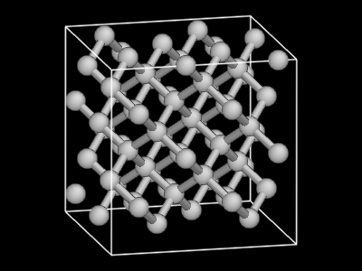

:mod:`quippy.atomeye` -- Interface to AtomEye viewer
====================================================

.. module:: quippy.atomeye
   :platform: Unix
   :synopsis: Interface to AtomEye viewer

.. moduleauthor:: James Kermode <james.kermode@kcl.ac.uk>

This module provides a high-level interface between quippy and the
AtomEye extension module :mod:`quippy._atomeye`. Usually
:class:`Atoms` or :class:`AtomsList` objects will be visualised by
calling their :meth:`~quippy.Atoms.show` method, but if you want to
customise the AtomEye view you'll have to interact with this module
directly.

Usually you'll have only one :class:`AtomEyeView` window open, which
you can access with the :attr:`~quippy.atomeye.view` attribute. For
example, to display a 2 x 2 x 2 supercell of bulk silicon, change the
background colour to black, set the size and save an image you'd do
the following::

   from quippy import *

   at = supercell(diamond(5.43, 14), 2, 2, 2)
   at.show()
   atomeye.view.change_bgcolor((0, 0, 0))
   atomeye.view.resize(400,300)
   atomeye.view.capture('si2x2x2.png')

The module defines the following methods and attributes:

.. function:: show(obj, [property, frame, window_id, arrows])

   Wrapper around :meth:`AtomEyeView.show` which also creates a viewer
   if necessary. If `window_id` is present then a particular window is
   used. Otherwise the default viewer is used, creating it if
   necessary.  The arguments `property`, `frame`, and `arrows` are
   passed on to :meth:`AtomEyeView.show`.

.. attribute:: view

   :class:`AtomEyeView` instance corresponding to the default AtomEye
   viewer window, once it has been created (on startup `view` is set
   to ``None``).

.. attribute:: views

   Dictionary mapping `window_id` to :class:`AtomEyeView` instances. There
   is one entry for each currently open AtomEye view window.

.. attribute:: default_settings

   Dictionary of key/value pairs passed to :meth:`AtomEyeView.update` when
   a new window is created. Change this dictionary to modfiy the properties
   of new windows. The initial value is as follows::

      default_settings = {'n->xtal_mode': 1,
		          'n->suppress_printout': 1,
                          'n->bond_mode': 1,
                          'n->atom_r_ratio': 0.5,
                          'key->BackSpace': 'load_config_backward'
                          }

:class:`AtomEyeView` objects
----------------------------

.. class:: AtomEyeView([obj, window_id, copy, frame, delta, property, arrows])
      
   Class to represent an AtomEye viewer window. Constructing a new
   class opens a new window. Instances will typically be created with
   the :meth:`quippy.Atoms.show` or :meth:`quippy.AtomsList.show`
   methods or with the :func:`show` function defined in this
   module. The argument `copy` can be used to clone a viewer window; all
   other arguments are the same as for the :meth:`show` method.

   In addition to the methods described below, there are wrapper
   methods for most of the `AtomEye 3 commands
   <http://mt.seas.upenn.edu/Archive/Graphics/A3/A3.html#commands>`_.
   The names of these methods match the names of the correpondning
   commands, and the arguments follow the syntax given on the AtomEye
   3 help page.

   .. method:: show(obj, [property, frame, arrows])

      Show `obj`, which should be either an :class:`~quippy.Atoms`
      object or a sequence of :class:`~quippy.Atoms` objects (for
      example an :class:`quippy.AtomsList`).

      `frame` can be used to specify one-based frame index if `obj` is
      a sequence of Atoms objects. The other arguments are as 
      described for :meth:`redraw` below.

   .. method:: redraw([property, arrows])

      Redraw the AtomEye view without changing the atomic
      configuration being viewed. If `property` is given it should be
      either a string corresponding to a valid string, real or integer
      property in `obj` which will be used to colour the atoms, or to
      an array of length `obj.n`.  `arrows` is used to draw vector
      arrows starting from the centre of each atom, for example to
      represent forces or dipole moments. If it is given it should be
      the name of a vector property in `obj`.

   .. attribute:: atoms

      :class:`Atoms` object or sequence being viewed. This will be set
      to ``None`` if this instance was created without an ``obj``
      parameter, which means we're viewing the ``A3`` logo.

   .. attribute:: frame

      Current frame, in range 1 to `len(self.atoms)`.

   .. attribute:: delta

      Frame increment rate when :kbd:`Delete` and :kbd:`Insert` are
      preseed. Equivalent to AtomEye ``n->glob_advance`` setting.

   .. method:: run_command(command)

      Run an arbitrary AtomEye command, given in the string `command`.
      This functionality is also available by calling an instance
      directly, i.e. the following commands are equivalent::
      
	 atomeye.view.run_command('toggle_coordination_coloring')
         atomeye.view('toggle_coordination_coloring')

   .. method:: paint([property, value, fill])

      Facilitate graphical selection of a set of atoms. After running
      :meth:`paint`, each time an atom is right-clicked in the view
      window, the corresponding entry in the ``property`` (default
      ``"selection"``) property will be set to ``value`` (default 1).
      If `property` doesn't exist in :attr:`atoms`, it will be
      created and initialied to `fill` (default 0). Here's an example
      based on the 64 atom silicon cell created above::

	>>> atomeye.view.paint()
	>>> print at.selection.count()
	0
	>>> # right-click on five atoms in AtomEye window
	>>> print at.selection
	[0 0 0 0 0 0 0 0 0 0 0 0 0 0 0 0 0 0 0 0 0 0 0 0 0 0 0 0 0 0 0 0 0 1 1 0 0
	 0 0 1 0 0 0 1 0 0 0 0 0 0 0 0 1 0 0 0 0 0 0 0 0 0 0 0]
	>>> print at.selection.count()
	5

      .. image:: atomeyepaint.png
	 :align: center
   
   .. method:: close()

      Close this AtomEye window.

   .. method:: update(D)

      Update the AtomEye settings with key/value pairs from the dictionary `D`.
      Runs the AtomEye command ``set key value`` for each pair. Valid settings
      are listed on `AtomEye 3 settings help page
      <http://mt.seas.upenn.edu/Archive/Graphics/A3/A3.html#redraw>`_

   .. method:: save(filename)

      Save an AtomEye script to recreate the view shown in this window to `filename`.

   .. method:: load_script(filename)

      Load an AtomEye script from `filename`. 

   .. method:: key(key)

      Equivalent to pressing the keystroke `key`. The syntax for
      keystrokes is described on the `AtomEye 3 commands help page
      <http://mt.seas.upenn.edu/Archive/Graphics/A3/A3.html#commands>`_

   .. method:: capture(filename[, resolution])

      Capture an image of this window and save in the image file
      `filename`.  Format is determined from file extension and should
      be one `eps`, `jpg` or `png`. 

   .. method:: draw_arrows(property[, scale_factor, head_height, head_width, up])

      Draw vector arrows emanating from each atom based on the values
      in the vector property with name `property`. If `scale_factor`
      is not present it is chosen so that the mean arrow length is 1.0
      angstrom, otherwise is should be a multiplicative scale
      factor. `head height` sets the arrow head height, as a fraction
      of arrow length. The default is 0.1. `head width` sets the arrow
      head half-width, as a fraction of arrow length. The default is
      0.05. `up` sets the up vector for arrow heads. Arrow heads are
      drawn in the plane defined by their direction and this
      vector. The default is (0,1,0).
