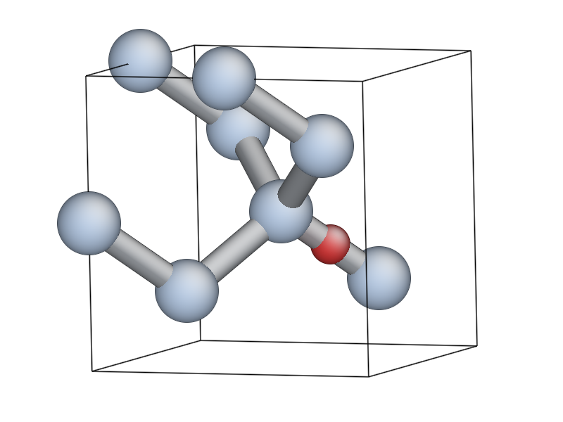
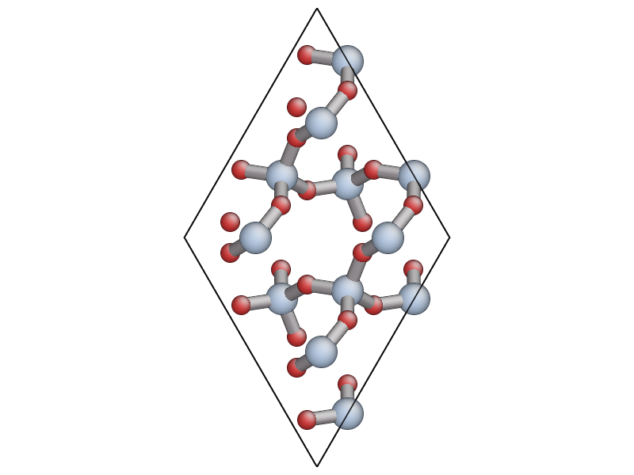
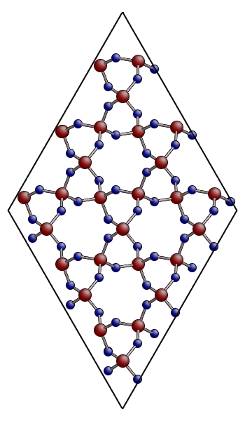
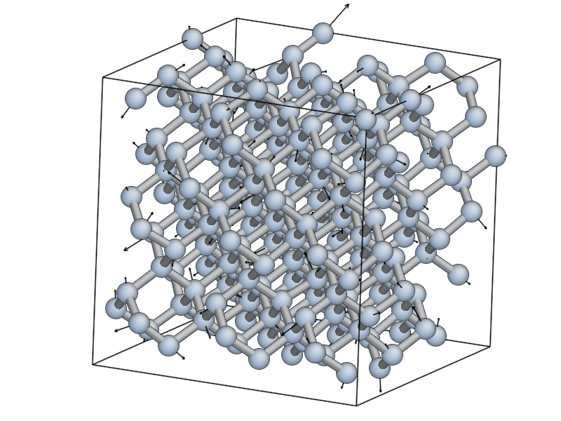
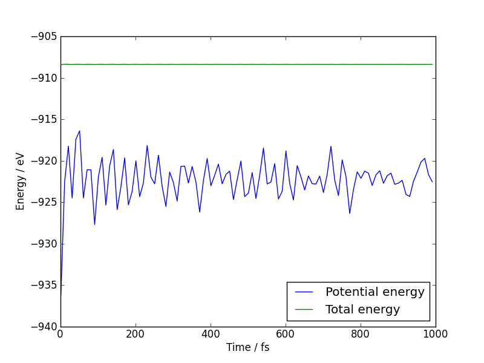
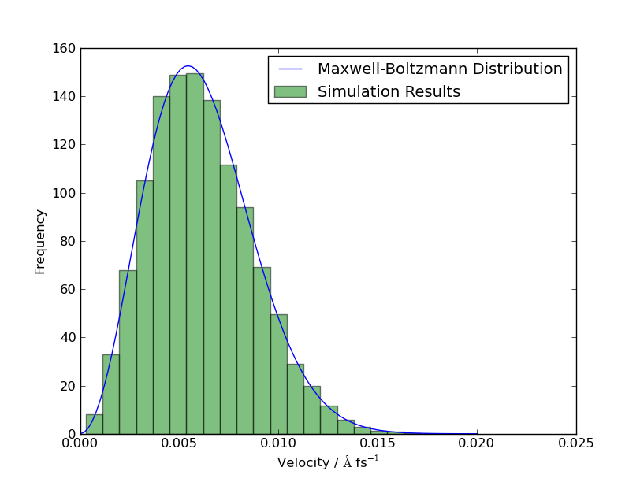

Introduction to ``quippy``
==========================

:Authors: James Kermode
:Date: 28 January 2013

This introduction is adapted from a `talk
<http://www.cecam.org/workshop-4-717.html?presentation_id=9165>`_
given at a CECAM workshop `Validation and Verification in
Electronic-Structure calculations
<http://www.cecam.org/workshop-717.html>`_ in September 2012.

Overview of ``libAtoms`` and ``QUIP``
-------------------------------------

- The `libAtoms <http://www.libatoms.org>`_ package is a software
  library written in Fortran 95 for the purposes of carrying out
  molecular dynamics simulations.

- The ``QUIP`` (**QU**\ antum mechanics and **I**\ nteratomic
  **P**\ otentials) package, built on top of ``libAtoms``, implements a
  wide variety of interatomic potentials and tight binding quantum
  mechanics, and is also able to call external packages.

- Various hybrid combinations are also supported in the style of
  QM/MM, including `Learn on the Fly` scheme (LOTF) [Csanyi2004]_ 

- `quippy <http://www.jrkermode.co.uk/quippy>`_ is a Python interface
  to libAtoms and QUIP.

Potentials implemented in ``QUIP``
~~~~~~~~~~~~~~~~~~~~~~~~~~~~~~~~~~

Classical interatomic potentials:

- BKS (silica)
- Brenner (carbon)
- EAM (fcc)
- Fanourgakis-Xantheas
- Finnis-Sinclair (bcc)
- Flikkema-Bromley
- GAP (general many-body)
- Guggenheim-McGlashan
- Lennard-Jones
- Morse
- Partridge-Schwenke (water monomer)
- Si-MEAM (silicon)
- Stillinger-Weber (carbon, silicon, germanium)
- Stillinger-Weber + Vashishta (silicon/silica interfaces)
- Sutton-Chen
- Tangney-Scandolo (silica, titania etc)
- Tersoff (silicon, carbon)

Plus several tight binding parameterisations (Bowler, DFTB, GSP,
NRL-TB, ...)

External packages:

- ``CASTEP``--- DFT, planewaves, ultrasoft pseudopotentials
- ``CP2K`` --- DFT, mixed Gaussian/planewave basis set, various pseudopotentials.
  Our ``CP2K`` Driver supports QM, MM and QM/MM.
- ``MOLPRO`` --- All electron quantum chemistry code. DFT, CCSD(T), MP2
- ``VASP`` --- DFT, planewaves, PAW or ultrasoft pseudopotentials
- Interface to `OpenKIM <http://www.openkim.org>`_ project
- Relatively easy to add new codes
 
``QUIP`` also has a full interface to the Atomic Simulation
Environment, `ASE <https://wiki.fysik.dtu.dk/ase>`_

- ``ASE`` adds support for several more codes e.g. ``ABINIT``, ``Elk``,
  ``Exciting``, ``GPAW``, ``SIESTA``, ...

- ``ASE`` also works with the `CMR <https://wiki.fysik.dtu.dk/cmr>`_ database system
   

Scripting interfaces
--------------------

Benefits of scripting interfaces
~~~~~~~~~~~~~~~~~~~~~~~~~~~~~~~~

A scripting interface provides access to all the functionality of a
code written in a low level language (e.g. Fortran, C) via a high
level language (e.g. Java, Python, Perl, TCL, ...).

- Can be generated either automatically or manually from 
  the source code of the low level code

Primary benefits of scripting interfaces are:

- Preparation of input files

- Analysis and post processing of results

Scripting intefaces also bring increased flexibility:

- Can be used interactively, or via shell commands/scripts

- Interactive visualisation and structure modification

- Interoperability with other codes:
  Make use of routines from other scientific packages

- Batch processing:
  parameter sweeps, high throughput

- Assemble existing components in new ways:
  easily put internal subroutines to work

- Good for less experienced programmers:
  high level languages generally more fault tolerant

Finally, scripting ingterfaces can bring improvements to the code
being wrapped:

* Simplify top level programs
   - Replace Fortran or C main programs with scripts (computational steering)
   - Reduce need for special purpose keywords and options

* Encourages good software development practices
  - *e.g.* modularity, well defined APIs
    
* Speed up development of new algorithms and routines
   - Prototype in high level language
   - Later reimplement time critical parts in low level language

* Eases creation and maintenance of unit/regression tests

Why Python?
~~~~~~~~~~~

Python has become increasingly popular for scientific computing in
recent years, due to

- Clean, easy-to-learn syntax
- Very high level object-oriented language
- Availability of packages: many fast, robust mathematical and
  scientific tools, principally `numpy <http://www.numpy.org>`_ and
  `scipy <http://www.scipy.org>`_ but now also many more.

But aren't interpreted languages like Python really slow? 

- Providing numerically intensive parts are vectorised, Python code
  can run surprisingly fast
- Mixture of high and low level languages can be ideal to maximise
  overall efficiency of developing *and* running codes

Wrapping Fortran codes in Python
~~~~~~~~~~~~~~~~~~~~~~~~~~~~~~~~

Automatic wrapper generation with ``f2py``
++++++++++++++++++++++++++++++++++++++++++

- [f2py]_, part of `numpy`, allows Fortran routines to be
  called from Python

- ``f2py`` scans Fortran 77/90/95 codes and automatically generates
  Python interfaces

- Portable, compiler independent

- Produces easy-to-use Python extension modules

- Supports all basic Fortran types, multi-dimensional arrays 

- But no support for derived types or overloaded interfaces

Also allows Fortran routines to call back to Python functions

Derived type support via ``f90wrap``
++++++++++++++++++++++++++++++++++++

[f90wrap]_ adds support for Fortran 90 derived types and generic
interfaces to ``f2py``

- Based on Fortran 90 documentation generator ``f90doc`` [Rutt2004]_

- Opaque interface layer wraps derived types 
  using ``transfer()`` [Pletzer2008]_.

- Thin object-oriented layer on top gives wrapped
  code natural (Pythonic) look and feel

- Currently ``f90wrap`` is part of ``quippy``, but to be released in
  future as a standalone utility, or merged into f2py

Overview of ``quippy`` capabilities
-----------------------------------

* ``quippy`` is a aeneral purpose tool for:

  - Manipulating atomic configurations
  - Visualising and analysing results 
  - Performing classical and *ab initio* calculations 

* Other similar tools exist, with different focuses, *e.g.*:

  - `ASE <https://wiki.fysik.dtu.dk/ase>`_ – atomic simulation environment 
  - `MMTK <http://dirac.cnrs-orleans.fr/MMTK>`_ – molecular modelling toolkit
  - `OpenBabel <http://openbabel.org>`_ – toolbox for chemical file format conversion
  - `pizza.py <http://pizza.sandia.gov>`_ – LAMMPS toolkit
  - `PyMOL <http://www.pymol.org>`_ – visualisation suite, optimized for biomolecules
  - `pymatgen <https://github.com/materialsproject/pymatgen>`_ – Materials Project collaboration
  - `MDAnalysis <http://code.google.com/p/mdanalysis>`_ - provides analysis for AMBER, CHARMM, Gromacs

Creating structures
~~~~~~~~~~~~~~~~~~~

Python interactive session::
    
  >>> from qlab import *
  >>> dia = diamond(5.44, 14)
  >>> print dia.n
  8
  >>> print dia.pos.T
  [[ 0.    0.    0.  ]
   [ 1.36  1.36  1.36]
   [ 2.72  2.72  0.  ]
   [ 4.08  4.08  1.36]
   [ 2.72  0.    2.72]
   [ 4.08  1.36  4.08]
   [ 0.    2.72  2.72]
   [ 1.36  4.08  4.08]]
  
  
Interactive visualisation with ``AtomEye``
~~~~~~~~~~~~~~~~~~~~~~~~~~~~~~~~~~~~~~~~~~

``quippy`` include a :mod:`atomeye <plugin>` to the [AtomEye]_ atomic
visualisation programme. To print values, and visualise structure::
    
    >>> dia.pos[1]
    [ 0.  0.  0.]
    >>> view(dia)
    
.. image:: si8-1.png    
   :align: center
   :width: 300px

Modify data::
    
    >>> O_pos = (dia.pos[1]+dia.pos[7])/2.
    >>> dia.add_atom(pos=O_pos, z=8)
    >>> redraw()
    

Manipulating atoms
~~~~~~~~~~~~~~~~~~

Setup :math:`\alpha`-quartz cell::
    
    >>> unit = alpha_quartz(a=4.92,
    ...                     c=5.40)
    >>> aq = supercell(unit, 3, 3, 3)
    >>> view(aq)
    

Custom atom colouring::
    
    >>> aq.add_property("charge", 0.0)
    >>> aq.charge[aq.z==8]  = -1.4
    >>> aq.charge[aq.z==14] =  2.8
    >>> aux_property_coloring("charge")

    
Filtering atoms::
    
    >>> aq.map_into_cell()
    >>> aq2 = aq.select(aq.pos[2,:] > 0)
    >>> view(aq2)

.. image:: quartz-filtered.png
   :align: center
   :width: 300px
    
Configurations can be written out in number of formats, e.g.::
    
    >>> aq2.write('aq.xyz')  # XYZ
    >>> aq2.write('aq.cell') # CASTEP
    >>> aq2.write('aq.cube') # Gaussian
    >>> aq2.write('INCAR')   # VASP
    
Post-processing of results
~~~~~~~~~~~~~~~~~~~~~~~~~~

Reading configurations
++++++++++++++++++++++

Individual snapshots or entire trajectories can be read in, also in a
variety of formats::

  >>> first = Atoms('md.xyz')
  >>> final = Atoms('md.xyz@-1')
  >>> traj = AtomsList('md.xyz')
  >>> view(traj)
  >>> draw_arrows('force')

Plotting with the `matplotlib <http://matplotlib.org>`_ library::

  >>> from pylab import *
  >>> plot(traj.time, traj.energy,
  >>>      label='Potential energy')
  >>> xlabel('Time / fs')
  >>> ylabel('Energy / eV')
  >>> legend(loc='lower right')

.. image:: potentialenergy2.png
   :align: center
   :width: 600px

Post processing calculations
++++++++++++++++++++++++++++

Calculate kinetic energy, and add total energy to the plot::

  >>> ke = array([0.5*sum(at.mass*
  ...             at.velo.norm2()) 
  ...             for at in traj])
  >>> plot(traj.time,
  ...      ke + traj.energy,
  ...      label='Total energy')

Maxwell-Boltzmann distribution of atomic velocities

.. math::

    f(v)\,\mathrm{d}v = 4 \pi \left( \frac{m}{2 \pi k_B T} \right)^{3/2} v^2 \exp \left[ -\frac{mv^2}{2 k_B T} \right] \mathrm{d}v
 
::

  >>> def max_bolt(m,T,v):
  ...    "Maxwell-Boltmann distribution of speeds at temperature T for particles of mass m"
  ...    return 4*pi*(m/(2*pi*BOLTZMANN_K*T))**(3.0/2.0)*(v**2)*exp(-m*v**2/(2*BOLTZMANN_K*T))
  >>> speeds = [at.velo.norm() for at in traj[-50:]]
  >>> all_speeds = hstack(speeds)
  >>> hist(all_speeds, normed=True, bins=20, alpha=0.5)
  >>> v = linspace(0.0, 0.02, 100)
  >>> plot(v, max_bolt(traj[0].mass[1], 500.0, v))

Performing calculations
~~~~~~~~~~~~~~~~~~~~~~~

* As well as preparing structures and post-processing results, 
  ``quippy`` allows calculations to be run

* In ``QUIP`` and ``quippy``, all calculations are performed with a
  Potential object (very similar to the
  :class:`~ase.calculators.interface.Calculator` concept in ``ASE``)

* Types of potential

  - *Internal*: interatomic potential or tight binding
  - *External*: file-based communication with external code or callback-based communication with a Python function
  - Plus flexible combinations of other potentials 

* *Internal* potentials use XML parameter strings
* *External* potentials use template parameter files

Creating a Potential
++++++++++++++++++++

Internal potential::

  >>> sw_pot = Potential('IP SW')

External potential::

  >>> castep = Potential('FilePot',
  ...                    command='./castep-driver.sh')

Driver script can be a shell script, an executable program using
``QUIP`` or a ``quippy`` script. It can even invoke code on a remote
machine.

Higher level functionality
~~~~~~~~~~~~~~~~~~~~~~~~~~

* Any of these codes or potentials can be used for higher level calculations

* Within QUIP

  - Molecular dynamics and QM/MM (any combination of codes)
  - Geometry optimisation with CG, damped MD and FIRE
  - Transition state searches with NEB and string method

* By interoperating with other packages

  - Global minimisation with basin or minima hopping via =ASE=
  - Symmetry analysis via `spglib <http://spglib.sourceforge.net>`_
  - Phonon band structure via `phonopy <http://phonopy.sourceforge.net>`_
  - ...

Interoperability between electronic structure codes
---------------------------------------------------

For verification and validation, we would often like to compare structural
properties predicted by a number of DFT codes

- Let's try this with the :mol:`H_2` molecule for a few codes
- PBE XC-functional
- Basis set parameters have been converged for each code 

Definition of :mol:`H_2` molecule::

    def h2_molecule(a, vacuum=10.0):
	h2 = Atoms(n=2, lattice=np.diag([vacuum, vacuum, vacuum]))
	h2.set_atoms([1,1])
	h2.params['bond_length'] = a
	h2.pos[1,1] = -a/2.0
	h2.pos[1,2] = +a/2.0
	return h2

``CASTEP`` calculation::

  >>> h2 = h2_molecule(0.7)
  >>> castep.calc(h2, energy=True, force=True) 
  >>> print h2.energy
  >>> print h2.force

Alternative invocation methods
~~~~~~~~~~~~~~~~~~~~~~~~~~~~~~

ASE-compatible calculator interface::

  >>> h2.set_calculator(castep)
  >>> e = h2.get_potential_energy()
  >>> f = h2.get_forces()

Most of these tools can also be used without the ``quippy`` Python
interface, using the QUIP ``eval`` tool::

  eval init_args="FilePot command=./castep-driver.sh" at_file=h2.xyz F E

There is also a command line tool ``convert.py`` which can convert
between file formats, e.g. .xyz to/from ``CASTEP`` .cell, ``VASP``
``INCAR``, etc. (plus more :ref:`fileformats`).

Changing parameters
~~~~~~~~~~~~~~~~~~~

The template input files and other options can be changed by passing
extra arguments to the :meth:`~.Potential.calc()` routine, e.g. to do
a geometry optimisation instead of a single point calculation:

  >>> castep.calc(h2, energy=True,
  ...             template='h2',
  ...             task='geometryoptimisation')

- Parameters can be set interactively while testing, but runs can then of
  course be automated with scripts

- As well as energies, forces and stress tensors, our output parsers
  can extract other information such as bond populations

Harmonic fit to data
~~~~~~~~~~~~~~~~~~~~

``numpy`` provides routines that make it easy to fit a parabola to
these data ::

    def fit_and_plot(molecules, code, color):
	energy = getattr(molecules, code+'_energy')
	energy = np.array(energy) - min(energy)
	plot(molecules.bond_length, energy, color+'o', label=code.upper()+' data')

	p = np.polyfit(molecules.bond_length, energy, 2)
	bond_length = -p[1]/(2*p[0])
	spring_constant = 2.0*p[0]
	a = np.linspace(min(molecules.bond_length), max(molecules.bond_length), 100)
	plot(a, np.polyval(p, a), color+'-', label=code.upper()+' fit')
	print '|%-10s|%10.3f|%10.1f|' % (code.upper(), bond_length, spring_constant)

Complete script for download: :download:`hydrogen-bond-length.py`.

  ======== =================== =======================
  Code        Bond length/A     Force constant / eV/A
  ======== =================== =======================
  CASTEP             0.754               36.0  
  CP2K               0.756               35.7  
  GPAW               0.753               35.1  
  MOLPRO             0.752               34.8  
  VASP               0.753               34.1
  ======== =================== =======================

.. image:: h2-molecule-comparison.png
   :align: center
   :width: 600px

Going beyond GGA
~~~~~~~~~~~~~~~~

- The framework is rather general, so we can easily connect to codes
  which go beyond GGA

- e.g. MP2 and CCSD(T) with the ``molpro`` quantum chemistry code

  ================ =================== =======================
  Code                Bond length/A     Force constant / eV/A
  ================ =================== =======================
  MOLPRO, MP2                 0.739               35.2  
  MOLPRO, CCSD(T)             0.745               34.6  
  ================ =================== =======================

.. image:: h2-molecule-comparison-molpro.png
   :align: center
   :width: 600px

Robustness
~~~~~~~~~~

* These tools were initially developed for multiscale QM/MM
  simulations, where typical production runs require ~10\ :sup:`4` DFT
  calculations
* Also used for fitting interatomic potentials to large QM databases
  (up to ~ 10\ :sup:`5` atomic environments)
* Robustness is important!
* ``CASTEP``, ``VASP`` and ``CP2K`` interfaces now particularly robust
  - Convergence checks
  - Fall back on more reliable density mixers
  - Automatic wavefunction reuse when possible
  - ``CP2K`` and ``VASP`` interfaces allow persistent connections (fast!)

Summary and Conclusions
-----------------------

Advantages of ``quippy``:

- General purpose --- arbitrary, extensible data model
- All speed critical code is in Fortran, so it’s fast and
  scales well to large systems (~10\ :sup:`6` atoms)
- Interactive visualisation with ``AtomEye`` plugin
  (which also scales well to large systems)
- Robust interfaces to several DFT codes
- Fully interoperable with ASE for many more

Disadvantages, compared to e.g. ASE:

- Fortran wrapping makes it more complex to use
- Harder to compile/install than a pure Python package

Summary:

- Adding a scripting interfaces to codes gives lots of benefits relevant
  to validation and verification
- Python and ``f2py`` do a good job of wrapping Fortran codes
- Wrapping Fortran 90 codes which make heavy use of derived types is
  also possible with ``f90wrap``
- ``libAtoms``, ``QUIP`` and ``quippy`` provide a uniform interface to a number of
  electronic structure codes
- Freely available from [http://www.libatoms.org] (GPLv2)

References
----------

.. [Csanyi2004] Csányi, G., Albaret, T., Payne, M., & De Vita,
   A. 'Learn on the Fly': A Hybrid Classical and Quantum-Mechanical
   Molecular Dynamics Simulation. Physical Review Letters,
   93(17), 175503. (2004) http://prl.aps.org/abstract/PRL/v93/i17/e175503>

.. [f2py] Peterson, P.F2PY: a tool for connecting Fortran and
   Python programs. International Journal of Computational Science and
   Engineering, 4(4), 296.  (2009) http://dx.doi.org/10.1504/IJCSE.2009.029165

.. [Rutt2004] Ian Rutt, f90doc: automatic documentation generator for Fortran 90 (2004)

.. [Pletzer2008] Pletzer, A et al., Exposing Fortran Derived Types to C and Other Languages,
   *Computing in Science and Engineering*, **10**, 86 (2008).
   http://link.aip.org/link/?CSENFA/10/86/1

.. [f90wrap] James Kermode, Fortran 90 wrapper generation tool (2008-2013),
   http://jrkermode.co.uk/f90wrap

.. [AtomEye] Li, J. AtomEye: an efficient atomistic configuration
   viewer. Modell. Simul. Mater. Sci. Eng. (2003).
   Modified version: http://jrkermode.co.uk/AtomEye

