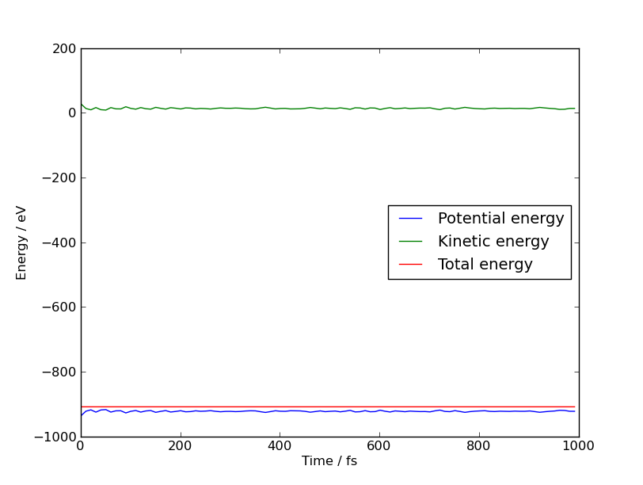
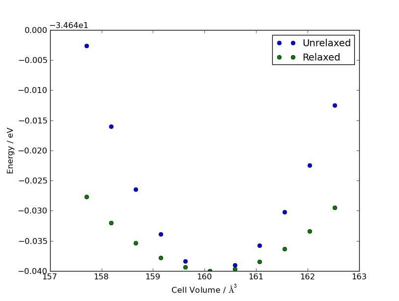
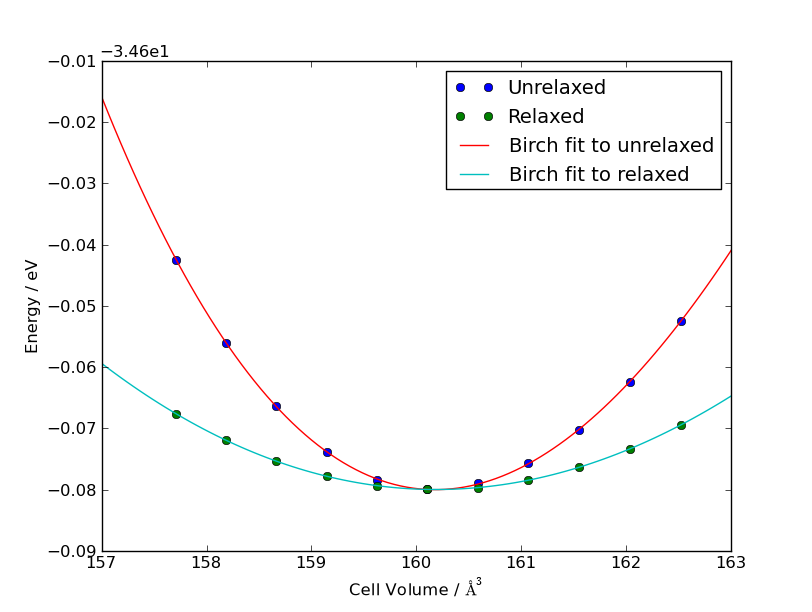

.. HQ XXXXXXXXXXXXXXXXXXXXXXXXXXXXXXXXXXXXXXXXXXXXXXXXXXXXXXXXXXXXXXXXXXXXXXXXXXXX
.. HQ X
.. HQ X   quippy: Python interface to QUIP atomistic simulation library
.. HQ X
.. HQ X   Copyright James Kermode 2010
.. HQ X
.. HQ X   These portions of the source code are released under the GNU General
.. HQ X   Public License, version 2, http://www.gnu.org/copyleft/gpl.html
.. HQ X
.. HQ X   If you would like to license the source code under different terms,
.. HQ X   please contact James Kermode, james.kermode@gmail.com
.. HQ X
.. HQ X   When using this software, please cite the following reference:
.. HQ X
.. HQ X   http://www.jrkermode.co.uk/quippy
.. HQ X
.. HQ XXXXXXXXXXXXXXXXXXXXXXXXXXXXXXXXXXXXXXXXXXXXXXXXXXXXXXXXXXXXXXXXXXXXXXXXXXXX

.. currentmodule:: quippy

.. _tutorial-intro:

Introductory Tutorial
*********************

This tutorial assumes you've successfully installed quippy and that
all the tests pass. If not, see :ref:`installation`. We make use
`matplotlib <http://matplotlib.sourceforge.net>`_, `scipy
<http://www.scipy.org>`_ and the quippy :mod:`atomeye` extension
module in this tutorial, but you can skip other these sections if you
don't have these components installed.

Other tutorials that may be useful:

#. If you're new to Python, you might like to start with the `offical
   Python tutorial <http://docs.python.org/dev/tutorial/index.html>`_. 

#. There's a good `introductory tutorial
   <https://wiki.fysik.dtu.dk/ase/python.html>`_ as part of the ASE
   documentation. 

#. The numpy project also provides an (unfinished) `tutorial
   <http://www.scipy.org/Tentative_NumPy_Tutorial>`_. If you follow
   this tutorial, be aware that quippy's :class:`FortranArray` class
   uses one- rather than zero-based indexing, in order to fit in
   better with Fortran. numpy also has an online `reference manual
   <http://docs.scipy.org/doc/numpy/reference/index.html>`_

#. `Numpy for Matlab Users <http://www.scipy.org/NumPy_for_Matlab_Users>`_
   may be useful if you're familiar with MatLab.

There's a couple of different ways you can use quippy: either by
typing commands interactively in Python (or, better, `ipython
<http://ipython.scipy.org>`_), or by writing a script. It's easier to
play around with things interactively, which is what we'll do in this
tutorial, but when you want to do something more than once it's worth
saving the commands in a script file. Just create a text file with the
extension ``.py``.

Getting Started
---------------

Let's start by firing up Python and importing quippy::

   $ python
   >>> from quippy import *

The ``>>>`` is the Python prompt, at which you type commands. Here
we've asked Python to import all the names defined in quippy.

Now, let's create an :class:`Atoms` object. This is the fundamental
class in quippy, and it represents a collection of atoms which together
make up a crystal or molecule. We'll make an 8-atom silicon unit cell::

   >>> dia = diamond(5.44, 14)

The first argument to :func:`diamond` is the lattice constant in Angstrom,
and the second is the atomic number. Let's poke around a little inside
our new Atoms object. Here are two equivalent ways to determine the
number of atoms::

    >>> print len(dia)
    8
    >>> print dia.n
    8

We can save our new atoms to an XYZ file, and then re-read it by
passing the filename to the :class:`Atoms` constructor. Let's do that,
and check that what we get back is the same as the original::

   >>> dia.write('diamond.xyz')
   >>> dia2 = Atoms('diamond.xyz')
   >>> print dia == dia2
   True
   >>> print dia is dia2
   False

Note that `dia == dia2` evaluates to `True` since `dia2` is an identical
copy of `dia`, but `dia is dia2` is `False` since there are two separate
Atoms objects, residing at different memory locations.

.. warning::
   
   Be aware that the assignment operator (i.e. the = sign) in Python
   does not behave as you may expect from other programming languages:
   assignment always creates *references* not *copies*.

   In Python, variables are *names* for values, and assignment binds a
   name to a value. For example the sequence of commands ::
   
      >>> a = 1
      >>> b = a
      >>> print a
      1
      >>> print b
      1
      >>> print a == b
      True
      >>> print a is b
      True
      
   creates one value (1) with two names (`a` and `b`). The comparison
   operator == checks whether two names corresond to the same *value*,
   wheras the `is` operator checks if they correspond to the same
   address.  The expression `a is b` is equivalent to `id(a) == id(b)`,
   where :func:`id` is a Python built in function which returns a
   unique number identifying a the memory address to which a reference
   points.

   If you forget about this you can get into difficulties when dealding
   with mutable objects such as lists or Atoms objects::

      >>> a = []
      >>> b = a
      >>> print a is b
      True
      >>> a.append(1)
      >>> print a
      [1]
      >>> print b
      [1]

   Here `a` and `b` are two names for the same list, so appending a value
   to `a` modifies `b` as well. If this is not what you want, create a copy:
   for list objects this is done with the slice operator::

      >>> a = []
      >>> b = a[:]
      >>> print a is b
      False
      >>> a.append(1)
      >>> print a
      [1]
      >>> print b
      []

   To make a copy of a more complex object like an array or an :class:`Atoms` instance
   you should use the :meth:`~Atoms.copy` method, e.g. ::

      >>> a = diamond(5.44, 14)
      >>> b = a.copy()
      >>> print a == b
      True
      >>> print a is b
      False

   Instead, use the :meth:`~quippy.farray.FortranArray.copy` method,
   like in the second statement above.

   For more information, consult the `offical Python tutorial`_.
      

Various different file formats are supported, see :ref:`fileformats`.

If you have the optional :mod:`atomeye` module installed, you can visualise
your new Atoms object::

     >>> dia.show()

.. image:: si8.png
   :align: center

An AtomEye window should pop up with a 3D representation of the
silicon crystal. Right clicking on an atom prints information about it::

   frame 0, atom 3 clicked
   Z = 14
   pos = [ 2.72  2.72  0.  ] (norm 3.846661)
   species = Si
    
The positions and atomic numbers of each atom are available in the ``pos``
and ``z`` :attr:`~Atoms.properties`::

    >>> print dia.z
    [14 14 14 14 14 14 14 14]
    >>> print dia.pos
    [[ 0.    0.    0.  ]
     [ 1.36  1.36  1.36]
     [ 2.72  2.72  0.  ]
     [ 4.08  4.08  1.36]
     [ 2.72  0.    2.72]
     [ 4.08  1.36  4.08]
     [ 0.    2.72  2.72]
     [ 1.36  4.08  4.08]]

Atomic properties are stored in arrays (actually, in a special type of array
called a :class:`FortranArray`), so it's easy to access parts of the data.
Array indexing and slicing works in the same way as in Fortran, except that
square brackets are used::

   >>> print dia.pos[1,1]   # x coordinate of atom 1
   0.0
   >>> print dia.pos[:,1]   # position of atom 1
   [ 0.  0.  0.]
   >>> print dia.pos[1]     # alternative syntax for position of atom 1
   [ 0.  0.  0.]
   >>> print dia.pos[1,:]   # all the x coordinates
   [ 0.    1.36  2.72  4.08  2.72  4.08  0.    1.36]
   >>> print dia.z[1:3]        # atomic numbers of atoms 1 to 3 inclusive
   [14 14 14]

You can also do fancier indexing as we'll see below.

Manipulating Atoms
------------------

Let's make a more complex structure to play with, a :func:`supercell`
of 3 x 3 x 3 alpha quartz unit cells::

   >>> unit = alpha_quartz(4.92, 5.40, 0.4697, 0.4135, 0.2669, 0.1191)
   >>> aq = supercell(unit, 3, 3, 3)

.. image:: alphaquartz.png
   :align: center

This cell contains 243 atoms. Let's look at the lattice vectors, which
are stored in a 3 x 3 matrix with ``a = aq.lattice[:,1]``, ``b =
aq.lattice[:,2]`` and ``c = aq.lattice[:,3]``::

   >>> print aq.lattice
   [[  7.38         7.38         0.        ]
    [-12.78253496  12.78253496   0.        ]
    [  0.           0.          16.2       ]]

We can convert from a cartesian representation to cell lengths and
angles to confirm that the cell has trigonal symmetry, using a
function called :func:`get_lattice_params`. To get online help on any
anything from within Python, you type ``help(name)``. In ipython, it's
even easier, just postfix the name with a question mark (or two
question marks for even more information). Here's the help for
:func:`get_lattice_params`::

   >>> help(get_lattice_params)
   Help on function get_lattice_params in module quippy.xyz_netcdf:

   get_lattice_params(lattice)
       Return 6-tuple of cell lengths and angles a,b,c,alpha,beta,gamma

From this we can see that this function takes a 3x3  matrix `lattice`
and returns six numbers: the three cell lengths and three cell
angles. Let's call it for the lattice associated with our new
alpha-quartz Atoms object::

   >>> a, b, c, alpha, beta, gamma =  get_lattice_params(aq.lattice)
   >>> print a, b, c
   14.76 14.76 16.2
   >>> print alpha*180.0/PI, beta*180.0/PI, gamma*180.0/PI
   90.0 90.0 120.0

So we have :math:`a = b \ne c`, and :math:`\alpha = \beta \ne \gamma`,
i.e. trigonal symmetry. Let's try out some of the more advanced indexing
operations. Firstly, logical operations on arrays return arrays, which
can be used for indexing::

   >>> (aq.z == 8).count()      # number of Oxygen atoms
   162
   >>> (aq.z == 14).count()     # number of Silicon atoms
   81
   >>> aq.pos[aq.z == 8]        # positions of the Oxygen atoms
   ...

Secondly, it's also possible to specify a list of indices, and to use
negative numbers to count backwards from the end of an array::

   >>> print aq.pos[:, [1,-1]]   # positions of first and last atoms
   [[ 1.155462   -2.00131889  3.6       ]
    [ 9.544062   -1.7618594   8.35686   ]]

You can also assign to sections of an array using fancy indexing. For
example, the following codes adds a `charge` property to our alpha
quartz object and sets the charge of the Oxygen atoms to -1.4 and that
of the Silicon atoms to +2.8 ::

   aq.add_property('charge', 0.0)
   aq.charge[aq.z == 8]  = -1.4
   aq.charge[aq.z == 14] =  2.8

.. warning::     
   
   In view of the way Python assignment works (see warning above), you
   should be careful not to overwrite array attributes. If you want to
   set all coordinates to zero you should do::

      dia.pos[:] = 0.0

   and never ::

      dia.pos = 0.0

   since the latter overwrites the `dia.pos` attribute, which is a
   reference to the relevant colums in the underlying Fortran array
   within the :attr:`~Atoms.data` Table, with a single floating point
   value (If you do this by accident you can recreate the array
   references with the :meth:`~quippy.oo_fortran.FortranDerivedType._update`
   method). 

   This caveat applies only to atomic properties arrays, since they're
   dynamically generated. It's okay to assign directly to derived type
   scalar attributes such as :attr:`~Atoms.cutoff`. Trying to assign
   to array attributes such as :attr:`~Atoms.lattice` will raise an
   exception.

Here's an example of making a new Atoms object containing only
the atoms with positive y coordinates. We first ensure all atoms
are within the first unit cell using :meth:`~Atoms.map_into_cell`::

   >>> aq.map_into_cell()
   >>> aq2 = aq.select(aq.pos[2,:] > 0)

.. image:: alphaquartz2.png
   :align: center

.. note:: 

   AtomEye has a different idea of the first unit-cell than quippy.
   I've shifted the cell by lattice coordinates of ``(0.5, 0.5, 0.5)``
   to make this image.  With the extended version of AtomEye included
   in quippy, you can do this by pressing :kbd:`Shift+z`.

Using an AtomsList to analyse results
-------------------------------------

One common use of quippy is for post-processing the results of
simulations conducted with QUIP and libAtoms. It can read and write
Atoms objects to and from a variety of file formats, with extended XYZ
and NetCDF being the natively supported formats. Let's see how we
might construct a simple script to load and analyse some simulation data.

The data files used in this section can be found in the
file:`'examples/'` directory within the quippy source tree. The first
example is :file:`si-1000.xyz`, which contains snapshots from a
molecular dynamics simulation of silicon with the Stillinger-Weber
potential, starting from a randomised velocity distribution at a
temperature of 1000K (see :ref:`moleculardynamics` example).

The :class:`AtomsList` class is used to deal with a series of configurations.
We can open the an XYZ file and see how many frames it contains like this::

   >>> al = AtomsList('si-1000.xyz')
   >>> print len(al)
   100

If you have the AtomEye extension, ``al.show()`` can be used to
visualise the entire trajectory at this point: use :kbd:`Insert` and
:kbd:`Delete` to move forwards and backwards. 

An :class:`AtomsList` is essentially nothing more than a list of
:class:`Atoms` objects. You can access the component objects by
indexing, e.g. ``al[i]`` is the ith Atoms object within ``al``.

Let's check the conservation of the total energy in this simulation.
The first frame in the data we've loaded has the following properties
and parameters::

   >>> print al[0].properties.keys()
   ['species', 'pos', 'Z', 'travel', 'mass', 'move_mask', 'damp_mask', 
    'thermostat_region', 'avg_ke', 'velo', 'acc', 'avgpos', 'oldpos', 'force']

   >>> print al[0].params.keys()
   ['energy', 'time']

The ``energy`` is the total potential energy of each configuration,
and ``velo`` and ``mass`` the atomic velocities and masses respectively.
We can get a list of all the energies in a couple of different ways::

  >>> energies = [ at.energy for at in al ]       # Method 1
  >>> print energies
  ...
  >>> print al.energy                             # Method 2
  ...

Method 1 uses a Python feature called `list comprehension
<http://docs.python.org/tutorial/datastructures.html#list-comprehensions>`_
to build a list with one entry for each frame in our
:class:`AtomsList`. The second method works in the same way but saves
typing by automatically constructing the loop for us, returning a list
of energies.

This trick also works for the Atoms property arrays., e.g. ``al.velo``
gives us an array with the first axis corresponding to the frame
within the file (length 100 here), the second to the spatial dimension
(length 3), and the third to the atom number (length 216 here) ::

   >>> print al.velo.shape
   (100, 3, 216)
   >>> print all(al.velo[1] == al[0].velo)
   True

To plot the potential energy as a function of time (assuming
:mod:`matplotlib` is available), run the commands::

   >>> from pylab import *
   >>> from quippy import *
   >>> plot(al.time, al.energy)
   >>> xlabel('Time / fs')
   >>> ylabel('Energy / eV')
   >>> savefig('potentialenergy.png')

The last command is only necessary if you want to save the plot. See the
`matplotlib documentation <http://matplotlib.sourceforge.net/>`_ for a lot more
information about plotting.

.. image:: potentialenergy.png
   :align: center

We can calculate the kinetic energy of each frame with another
list comprehension::

   >>> ke = [.5*sum(at.mass*at.velo.norm2()) for at in al]

Alternatively, we could compute the kinetic energy using array
arithmetic::

   >>> ke = sum(.5*al.mass*sum(al.velo**2,axis=2), axis=2)

Note the partial sums: the inner sum is over the second axis of
``al.velo`` which is the spatial dimension, and the outer sum is over
the second axis of ``.5*al.mass*sum(al.velo**2,axis=1)`` which is the
atom number (here of length 216). Let's add plots of the kinetic and
total energies to our graph::

   >>> plot(al.time, ke)                              # Plot kinetic energy
   >>> plot(al.time, ke + al.energy)                  # Plot total energy

.. note:: 

   When invoked after importing quippy, the :func:`plot` function
   automatically converts arrays from :class:`FortranArray` to the
   standard numpy zero-based form before running the standard
   :func:`pylab.plot` function. This is why we had to import quippy
   again after importing :class:`pylab`. It is recommended that 
   quippy is imported after importing other standard modules of Python. 
   Also note that in earlier versions you might need to run 
   ``from quippy.plot2d import *`` after importing quippy.

Here's the graph we get after adding a legend with. 

   >>> legend(['Potential energy', 'Kinetic energy', 'Total energy'],loc='center right')

We can see that the total energy is fairly well conserved, indicating
that the time-step used for this simulation was appropriate. Let's
compare the distribution of atomic speeds in the second half of this
simulation (to allow some time for equilibriation) with what we'd
expect from the Maxwell-Boltzmann distribution of speeds, given by

.. math::

   f(v)\,\mathrm{d}v = 4 \pi \left( \frac{m}{2 \pi k_B T} \right)^{3/2} v^2 \exp \left[ -\frac{mv^2}{2 k_B T} \right] \mathrm{d}v

The following function implements this distribution::

   def max_bolt(m,T,v):
      "Maxwell-Boltmann distribution of speeds at temperature T for particles of mass m"
      return 4*pi*(m/(2*pi*BOLTZMANN_K*T))**(3.0/2.0)*(v**2)*exp(-m*v**2/(2*BOLTZMANN_K*T))

In this function `v` can be either a scalar or an array of
velocities. The first line of the function after the declaration is a
documentation string (or `docstring`), used for providing online
help. According to the principle of equipartition of energy, we expect
half of the initial kinetic energy to be converted to potential
energy, so that after thermalisation the temperature of our system
should be close to 500K. We can plot the expected distribution at a
temperature of 500K like this::

   >>> vs = linspace(0.0,0.02,100)  # min, max, number of points
   >>> plot(vs, max_bolt(at.mass[1], 500.0, vs))

(If you want to clear the previous plot first, use the :func:`clf`
matplotlib function). To add a histogram of the speeds in the last
frame of our :class:`AtomsList` to the plot, we make use of matplotlibs
:func:`hist` function::

   >>> hist(al[-1].velo.norm(), normed=True, bins=20)

The :meth:`~FortranArray.norm` function returns the norm of each
element in a 3 x `N` matrix as an array of length `N`. The agreement
is not that good as we don't have enough data. Let's average over the
last 50 snapshots to improve the sampling::

   >>> hist(hstack([at.velo.norm() for at in al[-50:]]), normed=True, bins=20, alpha=0.5)

`hstack()
<http://docs.scipy.org/doc/numpy/reference/generated/numpy.hstack.html>`_
is a numpy function which stacks a sequence of arrays horizontally to
form a composite array. The `alpha` parameter to :func:`hist` causes
the bars to be partially transparent. After setting the axis labels
and legends, we get the figure shown below.

   >>> xlabel(r'Velocity / $\AA$/fs')
   >>> ylabel('Frequency')
   >>> legend(['Maxwell-Boltzmann Distribution', 'Simulation Results'])

.. note:: 

   LaTeX mathematical symbols can be used in matplotlib plots by
   enclosing them between dollar signs: ``$...$``. Note how we put an
   ``r`` before the string containing the x-axis label. This causes
   Python to treat it as a `raw string`, meaning that backslash characters
   do not have to be escaped.

.. image:: velocitydistribution.png
   :align: center

.. _moleculardynamics:

Potentials and DynamicalSystems
-------------------------------

Now let's look at how to run simulations entirely using quippy. This
will only be practical for small systems which run quickly, but can be
very useful to get a feel for what's going on. For this example we'll
build up the tools necessary to generate the :file:`si-1000.xyz` file
used above. The code for this example is contained in the script
file:`examples/md.py` in the quippy source tree.

The first step is to define the initial atomic configuration. We'll use
a 3 x 3 x 3 supercell of the 8-atom silicon unit cell::

   >>> s = supercell(diamond(5.44, 14), 3, 3, 3)

Next we need to create a :class:`Potential` object to represent the
interatomic force model to be used for calculating energies and
forces. The :class:`Potential` object is created by with two string
arguments, called `args_str` and `param_str`. The first of these
identifies the type of potential, and the second is an XML string
containing the parameters. QUIP contains a database of parameter files
in the :file:`QUIP_Core/parameters`. We'll use a Stillinger-Weber
interatomic potential (`args_str="IP SW"`) with the original
parameters published in `Phys. Rev. B` **31**, 5262 (1984). Python
triple-quoted strings can be split over multiple lines, so we can
include the XML string easily::

   >>> pot = Potential('IP SW', param_str="""<SW_params n_types="1">
    <comment> Stillinger and Weber, Phys. Rev. B  31 p 5262 (1984)</comment>
    <per_type_data type="1" atomic_num="14" />

    <per_pair_data atnum_i="14" atnum_j="14" AA="7.049556277" BB="0.6022245584"
	  p="4" q="0" a="1.80" sigma="2.0951" eps="2.1675" />

    <per_triplet_data atnum_c="14" atnum_j="14" atnum_k="14"
    lambda="21.0" gamma="1.20" eps="2.1675" />
    </SW_params>
    """)

Alternatively, you can read the XML string from a file::

   >>> pot = Potential('IP SW', param_str=open('sw.xml').read())

or search the QUIP parameter database (located under
:envvar:`QUIP_ROOT`:file:`/QUIP_Core/parameters`)::
  
   >>> pot = Potential('IP SW', param_str=quip_xml_parameters('SW'))

Our new potential object has several methods, the most important being
:meth:`~Potential.calc` which is used whenever we want to calculate
energies, forces or virial stresses. :meth:`~Potential.calc` operates
on an :class:`Atoms` object. We ask for the quantities we are
interested in, which can either be returned in arrays or stored within
the Atoms object. Let's try to calculate the energy of our silicon cell::

    >>> energy = farray(0.0)   # Create a rank-0 array to store energy
    >>> pot.calc(s, energy=energy)  # Do the calculation

In earlier versions, the following error is raised::

    Traceback (most recent call last):
      File "<stdin>", line 1, in <module>
      File "/home/jk2/lib/python2.6/site-packages/quippy/oo_fortran.py", line 438, in <lambda>
        wrapmethod = lambda name: lambda self, *args, **kwargs: self._runroutine(name, *args, **kwargs)
      File "/home/jk2/lib/python2.6/site-packages/quippy/oo_fortran.py", line 316, in _runroutine
       res = fobj(*newargs, **newkwargs)
    RuntimeError: Atoms_N_Neighbours: Atoms structure has no connectivity data. Call calc_connect first.

The :exc:`RuntimeError` exception
gets raised whenever something goes wrong within a Fortran routine. In
this case we need to calculate the atomic connectivity before we can
evaluate the energy. To do this we need to choose a cutoff distance,
which we can do in sensible fashion by adding a "crust" distance to
the cutoff of the potential itself (the crust should be chosen so that
no atom moves further than this distance inbetween recalculations of
the connectivity). ::

    >>> s.set_cutoff(pot.cutoff() + 2.0)    # crust of 2.0 Angstrom
    >>> s.calc_connect()
    >>> pot.calc(s, energy=energy)
    >>> print energy
    -936.325908705

If we now calculate forces for our crystal, we find their all almost
zero by symmetry in the unperturbed bulk configuration::

   >>> pot.calc(s, force=True)
   >>> print s.force.max()
   1.74703475792e-14
   
As an example, let's make a copy of the Atoms object and randomise the
positions a little. ::

   >>> c = s.copy()
   >>> c.pos += numpy.random.uniform(-0.1, 0.1, 3*c.n).reshape(3,c.n)
   >>> c.calc_connect()
   >>> pot.calc(c, force=True)
   
The extended AtomEye plugin can draw arrows to represent these forces::

   >>> c.show(arrows='force')

.. image:: forces.png
   :align: center

To perform a molecular dynamics calculation using our potential, we
need to create a :class:`DynamicalSystem` object from our :class:`Atoms`
object. This stores all the dynamical variables and has methods
to advance the simulation using the Velocity-Verlet algorithm. We'll
construct a DynamicalSystem, randomise the initial velocities to 1000K,
and then zero the total momentum. ::

   >>> ds = DynamicalSystem(s)
   >>> ds.rescale_velo(1000.0)
   >>> ds.zero_momentum()

The molecular dynamics loop would then look something like this::

    n_steps          = 100           # Number of simulation steps
    dt               = 1.0           # Time-step, in fs
    connect_interval = 10            # How frequently to update connectivity    

    ds.atoms.calc_connect() 
    for n in range(n_steps):
       ds.advance_verlet1(dt)
       pot.calc(ds.atoms, force=True, energy=True)
       ds.advance_verlet2(dt, ds.atoms.force)
       ds.print_status(epot=ds.atoms.energy)
       if n % connect_interval == 0:
	  ds.atoms.calc_connect()

:meth:`~DynamicalSystem.advance_verlet1` advances the velocities by
half the time-step `dt` and the positions by the full time-step.  We
then calculate at new forces from our potential at `r(t+dt)`.  Finally
:meth:`~DynamicalSystem.advance_verlet2` advances the velocities by
the second half time-step. :meth:`~DynamicalSystem.print_status`
prints a status line with the current time, temperature, total energy,
etc.

.. note::

   **Advanced Example - Generators**

   DynamicalSystem has a :meth:`~DynamicalSystem.run` method which
   implements an MD loop like the example above as a generator. This
   means it's evaluated lazily, only calculating succesive time-steps
   when necessary.  The following code creates a generator called
   `traj` which yields every tenth frame in the MD simulation. The
   `results` generator loops over `traj`, returning the total energy.

   ::

      traj    = ds.run(pot, dt=1.0, n_steps=1000, save_interval=10)
      results = ( at.energy for at in traj )

   Executing ``results.next()`` grabs one result from the generator
   pipeline. Alternatively, ``list(results)`` forces the entire
   trajectory to run in one go.

   The :meth:`~DynamicalSystem.run` method also has an `out` argument
   which can be used in conjunction with `write_interval` 
   to write frames to a file as the simulation runs, for example
   to write every 100th frame to :file:`traj.xyz`::

      outfile = CInOutput('traj.xyz', OUTPUT)
      traj = ds.run(pot, dt=1.0, n_steps=1000, out=outfile, write_interval=100)
      list(traj) # exhaust the generator
      outfile.close()

   A final example use of the :meth:`~DynamicalSystem.run` generator
   is to attach it to use it to construct an :class:`AtomsList` object
   which can be shown in AtomEye. Then pressing :kbd:`Delete` to load
   the next frame will cause the simulation to advance
   correspondingly.

   ::

      al = AtomsList(ds.run(pot, dt=1.0, n_steps=1000))
      al.show()
   

   See this `presentation
   <http://www.dabeaz.com/generators-uk/index.html>`_ by David Beazley
   for (much!) more about generators.

.. _geomopt:

Structural optimisation
-----------------------

If you want to optimise the positions and/or the lattice of an atomic
configuration, you'll need to use the :meth:`Potential.minim` method.
In this tutorial we'll consider the Stillinger-Weber potential we defined above.
Let's use this to relax the positions and lattice of a cubic Si cell using
conjugate-gradients (``cg``), to a tolerance of :math:`|\mathbf{f}|^2 < 10^{-7}`,
using a maximum of 100 steps.

   >>> at0 = diamond(5.44, 14)
   >>> at0.set_cutoff(pot.cutoff() + 2.0)   #crust of 2.0 Angstrom
   >>> at0.calc_connect()
   >>> pot.minim(at0, 'cg', 1e-7, 100, do_pos=True, do_lat=True)
   Welcome to minim()
   space is 33 dimensional
   Method: Conjugate Gradients
   cg iter = 1 df^2 = .0119620309597580  f = -34.6787373594354591 max(abs(df)) = .0631454167240399
    dcos = .0000000000000000 q = .0000000000000000
   resetting eps to .0012500000000000
   *** Resetting conjugacy
   cg iter = 3 df^2 = .0000000350553860  f = -34.6799999956617953 max(abs(df)) = .0001080977737070
    dcos = -1.0000000000000000 q = 1.0000000000003677
     Linmin: Ea = -34.6799999956617953 a = .0000000000000000
     Linmin done 9 bracket and 5 steps Ex= -34.6799999993383778 x= .2097614050995762
   Converged after step 4
   Goodbye from minim()

:meth:`~Potential.minim` overwrites the original atoms object with
the new positions and lattice coordinates, so we can check the 
lattice properties of the minimised configuration::

   >>> a, b, c, alpha, beta, gamma = get_lattice_params(at0.lattice)
   >>> print (a, b, c)
   (5.4309497787368581, 5.4309497787368581 5.4309497787368581)
   >>> print (alpha*180.0/PI, beta*180.0/PI, gamma*180.0/PI)
   (90.0, 90.0, 90.0)

i.e. we get a cubic lattice constant of 5.4309498 A, which is correct for this potential.

Bulk Modulus Calculations
-------------------------

In this example, we will calculate the bulk modulus of silicon using
the Stillinger-Weber potential. We'll do this by fitting the
`Birch-Murnaghan equation of state
<http://en.wikipedia.org/wiki/Birch-Murnaghan_equation_of_state>`_,
which assumes the bulk modulus is of the form

.. math::

   B = B_0 + B'_0 P

The energy as a function of volume is

.. math::

   E(V) = E_0 + \frac{9V_0B_0}{16}
   \left\{
   \left[\left(\frac{V_0}{V}\right)^\frac{2}{3}-1\right]^3B_0^\prime + 
   \left[\left(\frac{V_0}{V}\right)^\frac{2}{3}-1\right]^2
   \left[6-4\left(\frac{V_0}{V}\right)^\frac{2}{3}\right]\right\}.

Here is a Python function which implements this relation::

  def birch_energy(vo,eo,bo,bop,v):
     t = (vo/v)**.6666666666666667 - 1.0
     e = eo + 1.125*bo*vo*t*t*(1.0+0.5*(bop-4.0)*t)
     return e

We want to calculate the energy for a variety of cell volumes. The
routine below takes an initial configuration `at0` and first 
compresses and then expands it in increments of `eps`. To achieve 
this we exploit the :meth:`~Atoms.set_lattice` method making sure 
that `scale_positions` is true so that all atomic positions are 
scaled appropriately. If `relax` is true we then minimise with 
respect to the internal degrees of freedom (the atom positions). 
Finally, we calculate the energy. ::

   def compress_expand(at0, metapot, eps=1e-3, relax=False):
      for i in frange(-5,5):
         at = at0.copy()
         at.set_lattice((1.0 + eps*i) * at.lattice, scale_positions=True)
         at.calc_connect()
         if relax:
            metapot.minim(at, 'cg', 1e-7, 100, do_pos=True, do_lat=False)
         metapot.calc(at, energy=True)
         at.volume = at.cell_volume()
         yield at

:func:`compress_expand` is a generator: rather than returning a single
result is uses the :keyword:`yield` statement to return a series of
configurations. We can use this as a source for an AtomsList::

   >>> at0 = diamond(5.43, 14)
   >>> configs = AtomsList(compress_expand(at0, pot))
   >>> plot(configs.volume, configs.energy, 'o')
   
We can repeat with internal relaxation turned on::

   >>> relaxed_configs = AtomsList(compress_expand(at0, pot, relax=True))
   >>> plot(relaxed_configs.volume, relaxed_configs.energy, 'o')

Fitting the equation of state requires the :mod:`scipy.optimize`
module, so you need `scipy <http://www.scipy.org>`_ installed to run
this example. We need to define an error function, which will make use
of the :func:`birch_energy` routine defined above. ::

   from scipy.optimize import leastsq

   def errfunc(params, volume, energy):
      return birch_energy(*params, v=volume) - energy

The ``*params`` entry in the argument list tells Python to use the
sequence `params` for the first four arguments to
:func:`birch_energy`; we override the volume specifically.

Here's a function to estimate initial values for the four parameters `eo`, `vo`,
`bo` and `bop` and carry out the least-squares fit::

   def birch_fit(energies, volumes):
      energies = farray(energies)
      volumes  = farray(volumes)

      eo = energies.min()
      vo = volumes[energies.argmin()]
      bo = 30.0
      bop = 1.0
     
      (vo,eo,bo,bop), success = leastsq(errfunc, (vo, eo, bo, bop), args=(volumes, energies))
      print 'Volume vo =', vo, 'A^3'
      print 'Energy eo =', eo, 'eV'
      print 'Bulk modulus bo = ', bo, 'eV/A^3 =', bo*GPA, 'GPa'
      print 'dB/dP (T=0) bop = ', bop

      return (vo, eo, bo, bop)

We can carry out the fit by calling this function::

   >>> vo, eo, bo, bop = birch_fit(configs.energy, configs.volume)
   Volume vo = 160.177976999 A^3
   Energy eo = -34.6800268878 eV
   Bulk modulus bo =  1.78075170982 eV/A^3 = 285.312038947 GPa
   dB/dP (T=0) bop =  19.6902877922

Repeating for the relaxed configurations gives results in better agreement with experiment::

   >>> vo2, eo2, bo2, bop2 = birch_fit(relaxed_configs.energy, relaxed_configs.volume)
   Volume vo = 160.187033408 A^3
   Energy eo = -34.6800000528 eV
   Bulk modulus bo =  0.63282410954 eV/A^3 = 101.39107883 GPa
   dB/dP (T=0) bop =  2.92639511085

We can add plots of the fitted equations to our graph::

   >>> vs = linspace(157, 163, 100)
   >>> plot(vs, birch_energy(vo , eo , bo , bop , vs))
   >>> plot(vs, birch_energy(vo2, eo2, bo2, bop2, vs))

