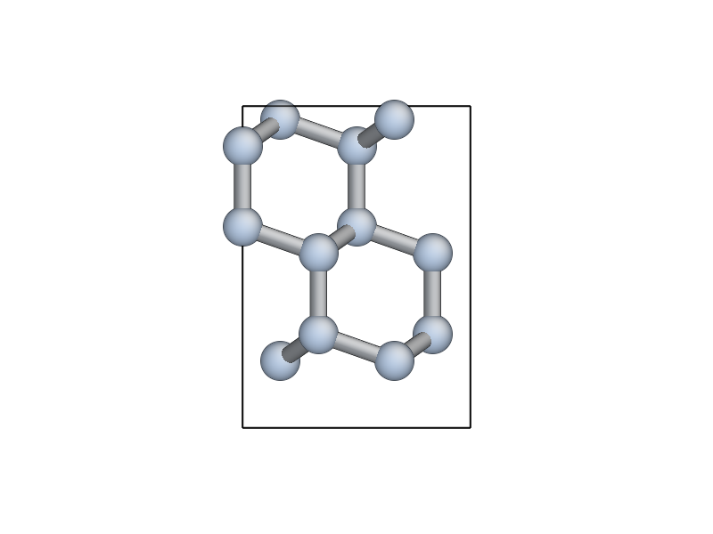
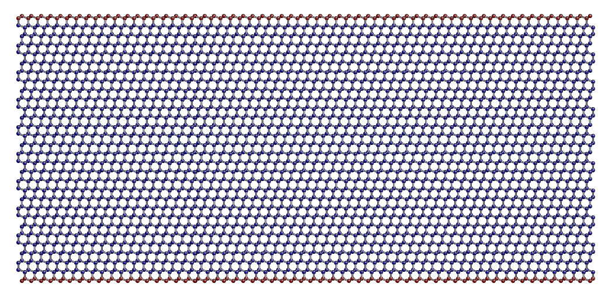

.. _step1:

Step 1: Setup of the Silicon model system
=========================================

The first task in this tutorial is to build the model system we will
use for both the classical and QM/MM simulations. We will use an
approximately 2D model system in the :ref:`thin strip geometry <thin_strip>`

1.1 Building the bulk unit cell (30 minutes)
--------------------------------------------

Import the relevant modules and functions
^^^^^^^^^^^^^^^^^^^^^^^^^^^^^^^^^^^^^^^^^

We start by importing all the functions we will need. Create a new
script named ``make_crack.py`` and add the following lines::

    from ase.lattice import bulk
    from ase.lattice.cubic import Diamond
    from ase.constraints import FixAtoms
    import ase.units as units

    from quippy import set_fortran_indexing
    from quippy.potential import Potential, Minim
    from quippy.elasticity import youngs_modulus, poisson_ratio
    from quippy.io import write

    from quippy.crack import (print_crack_system,
                              G_to_strain,
                              thin_strip_displacement_y,
                              find_crack_tip_stress_field)

Note that some routines come from `ASE` and others from `quippy`. We
will use `ASE` for basic atomic manipulations, and `quippy` to provide
the interatomic potentials plus some special purpose functionality.

.. note::

   For interactive use, it is convenient to import everything from the
   entire `quippy` package with ``from qlab import *`` as described
   in the :ref:`practical` section. We chose not to do that in these scripts to
   make it clear where each function we are using is defined, and to make it easier
   to look them up in the online documentation.

.. _parameters:

Definition of the simulation parameters
^^^^^^^^^^^^^^^^^^^^^^^^^^^^^^^^^^^^^^^

Let's first define the parameters needed to construct our model
system. There are three possible crack systems. For now, we will use
the first (uncommented) one, :math:`(111)[01\bar{1}]`, which
means a crack propagating on the :math:`(111)` cleavage plane (the
lowest surface energy of all silicon surfaces) with the crack front
along the :math:`[01\bar{1}]` direction::

    # System 1. (111)[0-11]
    crack_direction = (-2, 1, 1)      # Miller index of x-axis
    cleavage_plane = (1, 1, 1)        # Miller index of y-axis
    crack_front = (0, 1, -1)          # Miller index of z-axis

    # # System 2. (110)[001]
    # crack_direction = (1,-1,0)
    # cleavage_plane = (1,1,0)
    # crack_front = (0,0,1)

    # # System 3. (110)[1-10]
    # crack_direction = (0,0,-1)
    # cleavage_plane = (1,1,0)
    # crack_front = (1,-1,0)

If you have time later, you can come back to this point and change to
one of the other fracture systems. Next we need various geometric
parameters::

    width = 200.0*units.Ang              # Width of crack slab
    height = 100.0*units.Ang             # Height of crack slab
    vacuum = 100.0*units.Ang             # Amount of vacuum around slab
    crack_seed_length = 40.0*units.Ang   # Length of seed crack
    strain_ramp_length = 30.0*units.Ang  # Distance over which strain is ramped up
    initial_G = 5.0*(units.J/units.m**2) # Initial energy flow to crack tip

Note the explicit unit conversion: some of this is unnecessary as we
are using the `ase.units module
<https://wiki.fysik.dtu.dk/ase/ase/units.html>`_ where ``Ang = eV =
1``. The energy release rate `initial_G` is given in the
widely used units of J/m\ :superscript:`2`.

Next we define some parameters related to the classical interatomic
potential::

    relax_fmax = 0.025*units.eV/units.Ang  # Maximum force criteria

    param_file = 'params.xml'            # XML file containing
                                         # interatomic potential parameters
    mm_init_args = 'IP SW'               # Initialisation arguments
                                         # for the classical potential

And finally the output file::

    output_file = 'crack.xyz'            # File to which structure will be written

You should download the :download:`params.xml` file, which contains
the parameters for the SW potential (and also for DFTB, needed for
:ref:`step3`)

.. _latticeconstant:

Finding the equilibrium lattice constant for Si
^^^^^^^^^^^^^^^^^^^^^^^^^^^^^^^^^^^^^^^^^^^^^^^

To find the Si equilibrium lattice constant `a0` with the SW potential,
let's first build the 8-atom diamond cubic cell for silicon, with an initial
guess at lattice constant of 5.44 A. This can be done using the
:func:`~ase.structure.bulk` function from the :mod:`ase.structure` module::

    si_bulk = ...            # Build the 8-atom diamond cubic cell for Si

The variable `si_bulk` is an :class:`~ase.atoms.Atoms` object.  It
has various attributes and methods that will be introduced as necessary
during this tutorial.

Once you have created your `si_bulk` object, run the ``make_crack.py``
script from within `ipython` with the ``run`` command. Providing you
have imported everything from the :mod:`qlab` module, will then be
able to interactively visualise the Si unit cell with the
:func:`~qlab.view` function from the :mod:`qlab` module, which you
should type in at the `ipython` prompt::

   In [5]: view(si_bulk)

.. image:: si_bulk.png
   :align: center
   :width: 300

This will pop up an AtomEye [Li2003]_ window showing the 8-atom
silicon cell, with the unit cell boundary drawn with a thick black
line. You can rotate the system with the left mouse button, translate
by holding `Control` and tracking, or translate within the periodic
boundaries by holding `Shift` and dragging. Zoom in and out by
dragging with the right mouse button (or scroll wheel, if you have
one). Press `b` to toggle the display of bonds. For more help on
`AtomEye` see its `web page
<http://mt.seas.upenn.edu/Archive/Graphics/A>`_ or the documentation
for the :mod:`qlab` and :mod:`atomeye` modules.

Now, we initialise the Stillinger-Weber (SW) classical interatomic
potential using quippy's :class:`~quippy.potential.Potential` class ::

    mm_pot = Potential('IP SW', param_filename='params.xml')

The equilibrium lattice constant `a0` can now be found by minimising the
cell degrees of freedom with respect to the virial tensor calculated by the
SW potential. First, we need to attach a calculator (i.e. the SW
potential, `mm_pot` we just created) to the `si_bulk` object,
using the method :meth:`~ase.atoms.Atoms.set_calculator`::

    si_bulk. ...             # Attach the SW potential to si_bulk

This means that subsequent requests to calculate energy or forces of
`si_bulk` will be performed using our SW potential.

The minimisation can now be carried out by making a
:class:`~quippy.potential.Minim` class from the `si_bulk` Atoms,
requesting that both atomic positions and cell degrees of freedom
should be relaxed. Then run the minimisation until the maximum force
is below ``fmax=1e-2``, using the :meth:`~quippy.potential.Minim.run`
method ::

    minim = ...                           # Initialise the minimiser from si_bulk
    print('Minimising bulk unit cell')
    minim. ...                            # Run the minimisation

The lattice constant `a0` can be easily obtained from the relaxed
lattice vectors using the :meth:`~ase.atoms.Atoms.cell` attribute of
the `si_bulk` object, which returns a :math:`3 \times 3` matrix
containing the lattice vectors as rows in Cartesian coordinates,
i.e. ``si_bulk.cell[0,0]`` is the `x` coordinate of the first lattice
vector. ::

    a0 = ...                                # Get the lattice constant
    print('Lattice constant %.3f A\n' % a0)

As a check, you should find a value for `a0` of around 5.431 A.

Once you have obtained `a0`, you should replace the `si_bulk` object
with a new bulk cell using this lattice constant, so that the
off-diagonal components of the lattice are exactly zero::

   si_bulk = ...   # Make a new 8-atom bulk cell with correct a0
   si_bulk. ...    # re-attach the SW potential as a calculator

Milestone 1.1
^^^^^^^^^^^^^

At this point your script should look something like :download:`make_crack_1.py`.

1.2 Calculation of elastic and surface properties of silicon (30 minutes)
-------------------------------------------------------------------------

.. _youngs_modulus_and_poisson_ratio:

Calculation of the Young's modulus and the Poisson ratio
^^^^^^^^^^^^^^^^^^^^^^^^^^^^^^^^^^^^^^^^^^^^^^^^^^^^^^^^

Following the discussion :ref:`above <thin_strip>` section, we need to
calculate some elastic properties of our model silicon. To calculate the Young's
modulus `E` along the direction perpendicular to the cleavage plane, and the
Poisson ratio :math:`\nu` in the :math:`xy` plane, we need the :math:`6 \times
6` matrix of the elastic constants :math:`C_{ij}`. This matrix `c` can be
calculated using the :meth:`~quippy.potential.Potential.get_elastic_constants`
method of the `mm_pot` Potential object. ::

    c = mm_pot. ...             # Get the 6x6 C_ij matrix
    print('Elastic constants (GPa):')
    print((c / units.GPa).round(0))
    print('')

Here, the :attr:`~ase.units.GPa` constant from the `ase.units module
<https://wiki.fysik.dtu.dk/ase/ase/units.html>`_ module is used to
convert from pressure units of eV/A\ :superscript:`3` into GPa.

The Young's modulus `E` and the Poisson ratio `\nu` can now be calculated,
given `c`, the `cleavage_plane` and the `crack_direction` (defined in the
:ref:`parameters section <parameters>` above), using the functions
:func:`~quippy.elasticity.youngs_modulus` and
:func:`~quippy.elasticity.poisson_ratio` from the
:mod:`quippy.elasticity` module. ::

    E = ...                                              # Get E
    print('Young\'s modulus %.1f GPa' % (E / units.GPa))
    nu = ...                                             # Get nu
    print('Poisson ratio % .3f\n' % nu)

As a check, for the :math:`(111)[01\bar{1}]` crack system, you
should get a Young's modulus of 142.8 GPa and a Poisson ratio of
0.265.

.. _surface_energy:

Calculation of the surface energy of the cleavage plane
^^^^^^^^^^^^^^^^^^^^^^^^^^^^^^^^^^^^^^^^^^^^^^^^^^^^^^^

To calculate the surface energy per unit area `gamma` of the
`cleavage_plane`, we build a Si slab unit cell aligned with the
requested crystallographic orientation. The orientation of the crack
system can be printed using the following command::

    print_crack_system(crack_direction, cleavage_plane, crack_front)

The new unit slab can be obtained using the
:func:`ase.lattice.cubic.Diamond <lattice.cubic.Diamond>`
from the :mod:`ase.lattice <lattice>` module, which is used as follows::

    unit_slab = Diamond(directions=[crack_direction,
                                    cleavage_plane,
                                    crack_front],
                        size=(1, 1, 1),
                        symbol='Si',
                        pbc=True,
                        latticeconstant=a0)
    print('Unit slab with %d atoms per unit cell:' % len(unit_slab))
    print(unit_slab.cell)
    print('')

You can visualise the new cell with ``view(unit_slab)`` (type this at
the `ipython` prompt after running the script as it is so far, don't
add it to the script file):

.. image:: unit_slab.png
   :align: center
   :width: 400

We now shift the `unit_slab` vertically so that we will open up a
surface along a :math:`(111)` glide plane, cutting vertically aligned
bonds (see e.g. `this image
<http://ej.iop.org/images/0295-5075/72/3/410/Full/img11.gif>`_). This
choice gives the lowest energy surface. We then map the positions back
into the unit cell::

    unit_slab.positions[:, 1] += (unit_slab.positions[1, 1] -
                                  unit_slab.positions[0, 1]) / 2.0
    unit_slab.set_scaled_positions(unit_slab.get_scaled_positions())

The :attr:`~ase.atoms.Atoms.positions` is a `(N,3)` array containing
the Cartesian coordinates of the atoms, and
:meth:`~ase.atoms.Atoms.set_scaled_positions` and
:meth:`~ase.atoms.Atoms.get_scaled_positions` are necessary to ensure
all the atoms are mapped back inside the unit cell before we open
up a surface. This is the result of applying the shift (do another
``view(unit_slab)`` to update your AtomEye viewer).

Note how the top and bottom layers now correspond to :math:`(111)`
glide planes, so that the cell boundary now corresponds to a shuffle
plane as required.

We now make a copy of the `unit_slab` and create a `surface` unit cell
with surfaces parallel to the `cleavage_plane`. We can use the
:meth:`ase.atoms.Atoms.center` method which, besides centring the
atoms in the unit cell, allows some vacuum to be added on both sides
of the slab along a specified axis (use ``axis=0`` for the `x`-axis,
or ``axis=1`` for the `y`-axis, etc.). The amount of vacuum you add is
not critical, but could be taken from the `vacuum` parameter in the
:ref:`parameters section <parameters>` above::

    surface = unit_slab.copy()
    surface. ...               # Add vacuum along y axis

You should get a surface unit cell which looks something like this:

.. image:: surface.png
   :align: center
   :width: 400

Here, the atoms have been coloured by coordination by pressing the `k`
key. The green atoms on the surfaces are three-fold coordinated.

Now that we have both the bulk unit slab and the surface unit cell,
the surface energy `gamma` for the cleavage plane can be calculated
using the SW potential. Once a calculator (e.g. `mm_pot`) is attached
to an :class:`~ase.atoms.Atoms` object, the potential energy of the
atomic system can be calculated with
:meth:`~ase.atoms.Atoms.get_potential_energy`. It is useful to know
that the number of atoms in an Atoms object can be obtained by the
list-method `len` (e.g. `len(si_bulk)` gives the number of atoms in
`si_bulk`), and that the volume of a cell can be calculated with
:meth:`~ase.atoms.Atoms.get_volume`::

    surface. ...           # Attach SW potential to surface atoms
    E_surf = ...           # Get potential energy of surface system
    E_per_atom_bulk = ...  # Get potential energy per atom for bulk slab
    area = ...             # Calculate surface area using volume and cell
    gamma = ...            # Calculate surface energy
    print('Surface energy of %s surface %.4f J/m^2\n' %
          (cleavage_plane, gamma / (units.J / units.m ** 2)))

As a check, you should obtain :math:`\gamma_{(111)}` = 1.36 J/m\
:superscript:`2`. You may want to verify that this result is converged
with respect to the number of layers in the system (note the cutoff
distance of the SW potential, which you can obtain with
``mm_pot.cutoff()``, is about 3.93 A, just beyond the second neighbour
distance).

Milestone 1.2
^^^^^^^^^^^^^

At this point your script should look something like :download:`make_crack_2.py`

1.3 Setup of the crack slab supercell (30 minutes)
--------------------------------------------------

Replicating the unit cell to form a slab supercell
^^^^^^^^^^^^^^^^^^^^^^^^^^^^^^^^^^^^^^^^^^^^^^^^^^

Now, we have all the ingredients needed to build the full crack slab
system and to apply the requested strain field.

We start by building the full slab system. First, we need to find the number
of `unit_slab` cells along `x` and `y` that approximately match `width` and
`height` (see :ref:`parameters section <parameters>`).
Note that the python function :py:func:`int` can be used to
convert a floating point number into an integer, truncating towards zero::

    nx = ...    # Find number of unit_slab cells along x
    ny = ...    # Find number of unit_slab cells along y

To make sure that the slab is centered on a bond along the `y` direction,
the number of units cell in this direction, `ny`,  must be even::

    if ny % 2 == 1:
        ny += 1

The crack supercell is now simply obtained by replicating `unit_slab`
:math:`nx \times ny \times 1` times along the three axes::

    crack_slab = unit_slab * (nx, ny, 1)

As we did before for the `surface` system, `vacuum` has to be introduced along
the `x` and `y` axes (*Hint:* use the :meth:`~ase.atoms.Atoms.center`
method twice) ::

    crack_slab. ...     # Add vacuum along x
    crack_slab. ...     # Add vacuum along y

The `crack_slab` is now centered on the origin in the `xy` plane to
make it simpler to apply strain::

    crack_slab.positions[:, 0] -= crack_slab.positions[:, 0].mean()
    crack_slab.positions[:, 1] -= crack_slab.positions[:, 1].mean()

and its original width and height values are saved, and will later be used to
measure the strain::

    orig_width = (crack_slab.positions[:, 0].max() -
                  crack_slab.positions[:, 0].min())
    orig_height = (crack_slab.positions[:, 1].max() -
                   crack_slab.positions[:, 1].min())

    print(('Made slab with %d atoms, original width and height: %.1f x %.1f A^2' %
           (len(crack_slab), orig_width, orig_height)))

The original `y` coordinates of the top and bottom of the slab and the
original `x` coordinates of the left and right surfaces are also saved::

    top = crack_slab.positions[:, 1].max()
    bottom = crack_slab.positions[:, 1].min()
    left = crack_slab.positions[:, 0].min()
    right = crack_slab.positions[:, 0].max()

At this point, your `crack_slab` should look something like this:

.. image:: crack_slab_1.png
   :align: center
   :width: 600

.. (You might find it useful to press `Shift+z` to centre the AtomEye
.. view on a fractional lattice coordinate of `(.5, .5, .5)` rather
.. than the default of `(0., 0., 0.`).)

.. _crack_fixatoms:

Setting constraints to fix the edge atoms
^^^^^^^^^^^^^^^^^^^^^^^^^^^^^^^^^^^^^^^^^

During the MD simulations, the positions of the top and bottom rows of
atoms will be kept fixed. More precisely, these rows of atoms will
only be moved rigidly when the strain is applied and will not move in
response to forces from the interatomic potential (see the
:ref:`discussion of the thin strip geometry above<thin_strip>`). To do
this, we initialise a `fixed_mask` array that is `True` for each atom
whose position needs to be fixed, and `False` otherwise::

    fixed_mask = ((abs(crack_slab.positions[:, 1] - top) < 1.0) |
                  (abs(crack_slab.positions[:, 1] - bottom) < 1.0))

Note that the ``|`` operator is shorthand for a logical 'or'
operation. After re-running the latest version of your script and
executing ``view(crack_slab)``, you can colour the atoms by
`fixed_mask` using the :func:`~qlab.aux_property_coloring` function ::

    aux_property_coloring(fixed_mask)

which colours the atoms where `fixed_mask` is True in red and those where
it is `False` in blue, like this:

Now we can use the :class:`~constraints.FixAtoms` class to
fix the positions of the atoms according to the mask `fixed_mask`, and
then attach the constraint to `crack_slab` using
:meth:`~ase.atoms.Atoms.set_constraint`::

    const = ...            # Initialise the constraint
    crack_slab. ...        # Attach the constraint to crack_slab
    print('Fixed %d atoms\n' % fixed_mask.sum())

To create the crack seed, we now apply the initial strain ramp. First,
we need to convert the chosen energy release rate `initial_G` into a
strain. This can be done using the :func:`~quippy.crack.G_to_strain`
function which implements the :ref:`thin strip equation described
above <thin_strip_equation>`. The `strain` is then used to displace
the `y` coordinate of the atomic positions according to the strain
ramp produced by the :func:`~quippy.crack.thin_strip_displacement_y`
function. Here, the `crack_seed_length` and the `strain_ramp_length`
parameters should be used. The objective is that atoms to the left of
``left + crack_seed_length`` should be rigidly shifted vertically, and
those to the right of ``left + crack_seed_length +
strain_ramp_length`` should be uniformly strained, with a transition
region in between. ::

    strain = ...                       # Convert G into strain
    crack_slab.positions[:, 1] += ...  # update the atoms positions along y
    print('Applied initial load: strain=%.4f, G=%.2f J/m^2' %
          (strain, initial_G / (units.J / units.m**2)))

This is the resulting crack slab, for the :math:`(111)` case:

.. image:: crack_slab_2.png
   :align: center
   :width: 600

Relaxation of the crack slab
^^^^^^^^^^^^^^^^^^^^^^^^^^^^

To obtain a good starting point for the MD, we need to perform an
approximate geometry optimisation of the slab, keeping the top and
bottom rows of atoms fixed. Once again, our `mm_pot` needs to be
attached to `crack_slab` and the minimiser
:class:`~quippy.potential.Minim` initialised (note that here it does
not make sense to relax the cell since we have vacuum in two
directions). We can then perform the minimisation until the maximum
force is below the `relax_fmax` defined in the :ref:`parameters
section <parameters>`::

    print('Relaxing slab')
    crack_slab. ...       # Attach the calculator to crack_slab
    minim = ...           # Initialise the minimiser
    minim. ...            # Run the minimisation until forces are relax_fmax

Here's what your minimised crack slab should look like:

.. image:: crack_slab_3.png
   :align: center
   :width: 600

Locating the crack tip
^^^^^^^^^^^^^^^^^^^^^^

Before starting the next steps, it is useful to find the initial
position of the crack tip.  This is provided by the
:func:`~quippy.crack.find_crack_tip_stress_field` function::

    crack_pos = find_crack_tip_stress_field(crack_slab, calc=mm_pot)
    print 'Found crack tip at position %s' % crack_pos

This function works by fitting the components of the Irwin crack
stress field to the per-atom stresses calculated by the classical SW
potential, allowing the origin of the analytical stress field to move
during the fit. Then, we simply set this point to be the current crack
position.

Saving the output file
^^^^^^^^^^^^^^^^^^^^^^

Finally, we can save all the calculated materials properties inside the
`crack_slab` :class:`~ase.atoms.Atoms` object, before writing it to disk::

    crack_slab.info['nneightol'] = 1.30 # set nearest neighbour tolerance
    crack_slab.info['LatticeConstant'] = a0
    crack_slab.info['C11'] = c[0, 0]
    crack_slab.info['C12'] = c[0, 1]
    crack_slab.info['C44'] = c[3, 3]
    crack_slab.info['YoungsModulus'] = E
    crack_slab.info['PoissonRatio_yx'] = nu
    crack_slab.info['SurfaceEnergy'] = gamma
    crack_slab.info['OrigWidth'] = orig_width
    crack_slab.info['OrigHeight'] = orig_height
    crack_slab.info['CrackDirection'] = crack_direction
    crack_slab.info['CleavagePlane'] = cleavage_plane
    crack_slab.info['CrackFront'] = crack_front
    crack_slab.info['strain'] = strain
    crack_slab.info['G'] = initial_G
    crack_slab.info['CrackPos'] = crack_pos
    crack_slab.info['is_cracked'] = False

We can save our results, including all the extra properties and
information, in :ref:`extendedxyz` in the `output_file`, whose name is
defined in the :ref:`parameters section <parameters>`::

    print('Writing crack slab to file %s' % output_file)
    write(output_file, crack_slab)

Milestone 1.3
^^^^^^^^^^^^^

At this point your final script should look something like
:ref:`make_crack`, and your XYZ file like :download:`crack.xyz`.

When you are ready, proceed to :ref:`step2`.

