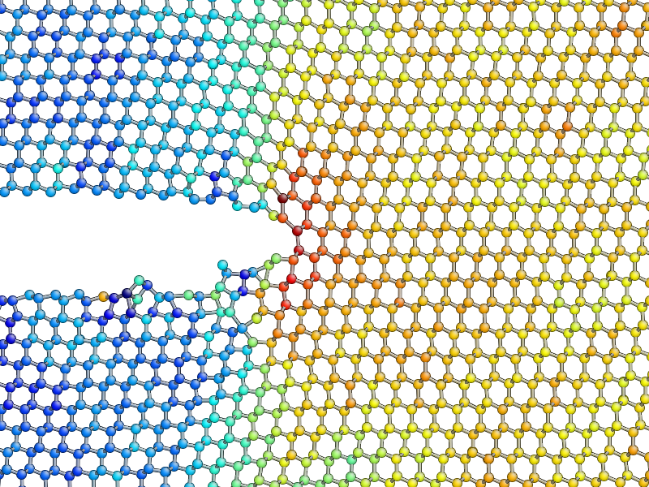
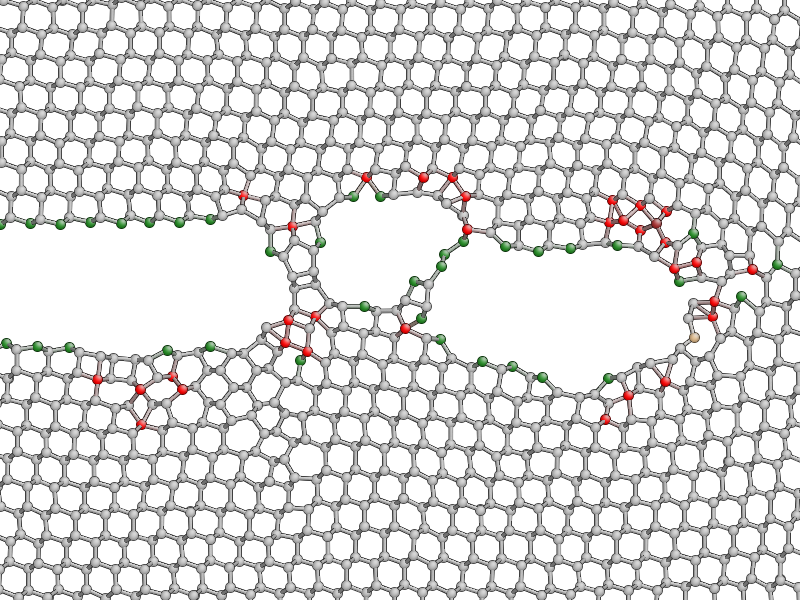
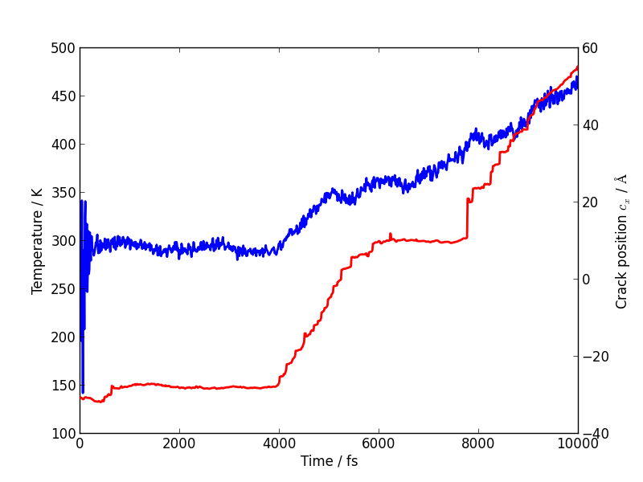

.. _step2:

Step 2: Classical MD simulation of fracture in Si
=================================================

This part of the tutorial requires the initial crack structure ``crack.xyz``
produced in :ref:`step1`. If you had problems completing the first part, you
can :download:`download it here <crack.xyz>` instead. Start by creating a new
empty script, named ``run_crack_classical.py``.

2.1 Initialisation of the atomic system (20 minutes)
----------------------------------------------------

Import the relevant modules
^^^^^^^^^^^^^^^^^^^^^^^^^^^

As before, we import the necessary modules, classes and functions::

    import numpy as np

    from ase.constraints import FixAtoms
    from ase.md.verlet import VelocityVerlet
    from ase.md.velocitydistribution import MaxwellBoltzmannDistribution
    import ase.units as units

    from quippy.atoms import Atoms
    from quippy.potential import Potential
    from quippy.io import AtomsWriter

    from quippy.crack import (get_strain,
                              get_energy_release_rate,
                              ConstantStrainRate,
                              find_crack_tip_stress_field)

Note that the molecular dynamics classes and functions come from
`ASE`, while the :class:`~.Atoms` object, potentials and
crack-specific functionality come from `quippy`.

Definition of the simulation parameters
^^^^^^^^^^^^^^^^^^^^^^^^^^^^^^^^^^^^^^^

.. _parameters2:

Let's define the simulation parameters. The meaning of each parameter is explained
in the comments on the right of each line::

    input_file = 'crack.xyz'         # File from which to read crack slab structure
    sim_T = 300.0*units.kB           # Simulation temperature
    nsteps = 10000                   # Total number of timesteps to run for
    timestep = 1.0*units.fs          # Timestep (NB: time base units are not fs!)
    cutoff_skin = 2.0*units.Ang      # Amount by which potential cutoff is increased
                                     # for neighbour calculations
    tip_move_tol = 10.0              # Distance tip has to move before crack
                                     # is taken to be running
    strain_rate = 1e-5*(1/units.fs)  # Strain rate
    traj_file = 'traj.nc'            # Trajectory output file (NetCDF format)
    print_interval = 10              # Number of time steps between
                                     # writing output frames
    param_file = 'params.xml'        # Filename of XML file containing
                                     # potential parameters
    mm_init_args = 'IP SW'           # Initialisation arguments for
                                     # classical potential

Setup of the atomic structure
^^^^^^^^^^^^^^^^^^^^^^^^^^^^^

As a first step, we need to initialise the
:class:`~quippy.atoms.Atoms` object by loading the atomic structure created
in :ref:`step1` from the `input_file` ``crack.xyz``. Note that the global
`fortran_indexing` setting should be set to `False`. Otherwise `quippy` uses
atom indices in the range :math:`1 \ldots N`, which would not be consistent with
the python indexing used in ASE (:math:`0\ldots N-1`).

It is also necessary to read in the original width and height of the slab and
the original crack position, which were saved in ``crack.xyz`` at the end
of :ref:`Step 1 <step1>`::

    print 'Loading atoms from file %s' % input_file
    atoms = ...                                     # Load atoms from file

    orig_height = atoms.info['OrigHeight']          # Initialise original height
    orig_crack_pos = atoms.info['CrackPos'].copy()  # Initialise original crack position

Note that we make a copy of the ``CrackPos`` entry in the
:attr:`~quippy.atoms.info` dictionary, since otherwise
`orig_crack_pos` would continue to refer to the current crack position
as it is updated during the dynamical simulation.

Setup of the constraints
^^^^^^^^^^^^^^^^^^^^^^^^

Now we can set constraints on the atomic structure which will be
enforced during dynamics. In order to carry out the fracture MD
simulation, we need to fix the positions of the top and bottom atomic
rows (we call this constraint `fix_atoms`).

The `fix_atoms` constraint, which is exactly the same as the constraint used
for :ref:`relaxing the positions of the crack slab <crack_fixatoms>` above. In
order to do this, we need to find the `y` coordinate of the top, bottom atomic
rows. The `x` coordinates of the left and right edges of the slab might also
be useful later on. This can be easily done as before::

    top = ...     # Maximum y coordinate
    bottom = ...  # Minimum y coordinate
    left = ...    # Minimum x coordinate
    right = ...   # Maximum x coordinate

Now it is possible to define the `fixed_mask` array, which is `True`
for each atom whose position needs to be fixed, and `False` otherwise,
exactly as before, and to initialise the `fix_atoms` constraint, in
the same way we did it in `Step 1` (i.e., using the
:class:`~constraints.FixAtoms` class)::

    fixed_mask = ...                             # Define the list of fixed atoms
    fix_atoms = ...                              # Initialise the constraint
    print('Fixed %d atoms\n' % fixed_mask.sum()) # Print the number of fixed atoms

This constraint needs to be attached to our `atoms` object
(see :meth:`~quippy.atoms.Atoms.set_constraint`)::

    atoms. ...  # Attach the constraints to atoms

To increase :math:`\epsilon_{yy}` of all atoms at a constant rate (see
the `strain_rate` and `timestep` :ref:`parameters <parameters2>`), we
use the :class:`~quippy.crack.ConstantStrainRate` class::

    strain_atoms = ConstantStrainRate(orig_height, strain_rate*timestep)

You can look at the documentation for the
:class:`~quippy.crack.ConstantStrainRate` class to see how this works. The
:meth:`~constraints.adjust_positions` routine simply increases the strain of
all atoms. We will attach this to the dynamics in step 2.2 below.

Setup of the potential
^^^^^^^^^^^^^^^^^^^^^^

Before starting the MD simulation, the SW classical potential must be
initialised and attached to the `atoms` object.  As in `Step 1`, we
use quippy's :class:`~quippy.potential.Potential` class, but now we
need to pass the `cutoff_skin` parameter, which is used to decide when
the neighbour list needs to be updated (see the attribute
:attr:`~quippy.potential.Potential.cutoff_skin`). Moreover, we request
the potential to compute per-atom stresses whenever we compute forces
using :meth:`~quippy.potential.Potential.set_default_quantities`, to
save time when locating the crack tip (discussed in more detail
:ref:`below <position_crack_tip>`). The
:meth:`~quippy.atoms.Atoms.set_calculator` method should then be used
to set the calculator to the SW potential::

    mm_pot = ...   # Initialise the SW potential with cutoff_skin
    mm_pot.set_default_quantities(['stresses'])
    atoms. ...     # Set the calculator

Milestone 2.1
^^^^^^^^^^^^^

At this stage your script should look something like :download:`this <run_crack_classical_1.py>`.

2.2 Setup and run the classical MD (20 minutes)
-----------------------------------------------

Setting initial velocities and constructing the dynamics object
^^^^^^^^^^^^^^^^^^^^^^^^^^^^^^^^^^^^^^^^^^^^^^^^^^^^^^^^^^^^^^^

There are still a few things that need to be done before running the
MD fracture simulation. We will follow the standard `ASE molecular
dynamics methodology
<https://wiki.fysik.dtu.dk/ase/tutorials/md/md.html>`_. We will set
the initial temperature of the system to `2*sim_T`: it will then
equilibrate to `sim_T`, by the Virial theorem::

    MaxwellBoltzmannDistribution(atoms, 2.0*sim_T)

A MD simulation in the NVE ensemble, using the Velocity Verlet
algorithm, can be initialised with the ASE
:class:`~md.verlet.VelocityVerlet` class, which requires two
arguments: the atoms and the time step (which should come from the
`timestep` :ref:`parameter <parameters2>`::

    dynamics = ...   # Initialise the dynamics

Printing status information
^^^^^^^^^^^^^^^^^^^^^^^^^^^

Let's also define a function that prints the relevant information at
each time step of the MD simulation. The information can be saved
inside the :attr:`~quippy.atoms.Atoms.info` dictionary, so that it
also gets saved to the trajectory file `traj_file`.

The elapsed simulation time can be obtained with
``dynamics.get_time()`` (note that the time unit in ASE is
:math:`\mathrm{\AA}\sqrt{\mathrm{amu}/\mathrm{eV}}`, not `fs`). You
should use the :meth:`~ase.atoms.Atoms.get_kinetic_energy` method to
calculate the temperature (*Note*: you will need the :attr:`units.kB`
constant, which gives the value of the Boltzmann constant in eV/K),
and the functions :func:`~quippy.crack.get_strain` and
:func:`~quippy.crack.get_energy_release_rate` to return the current
strain energy release rate, respectively. ::

    def printstatus():
        if dynamics.nsteps == 1:
            print """
    State      Time/fs    Temp/K     Strain      G/(J/m^2)  CrackPos/A D(CrackPos)/A
    ---------------------------------------------------------------------------------"""

        log_format = ('%(label)-4s%(time)12.1f%(temperature)12.6f'+
            '%(strain)12.5f%(G)12.4f%(crack_pos_x)12.2f    (%(d_crack_pos_x)+5.2f)')

        atoms.info['label'] = 'D'                # Label for the status line
        atoms.info['time'] = ...                 # Get simulation time
                                                 # and convert to fs
        atoms.info['temperature'] = ...          # Get temperature in K
        atoms.info['strain'] = ...               # Get strain
        atoms.info['G'] = ...                    # Get energy release rate,
                                                 # and convert to J/m^2
        crack_pos = ...                          # Find crack tip as in step 1
        atoms.info['crack_pos_x'] = crack_pos[0]
        atoms.info['d_crack_pos_x'] = crack_pos[0] - orig_crack_pos[0]

        print log_format % atoms.info

This logger can be now attached to the `dynamics`, so that the information is
printed at every time step during the simulations::

    dynamics.attach(printstatus)

Checking if the crack has advanced
^^^^^^^^^^^^^^^^^^^^^^^^^^^^^^^^^^

The same can be done to check during the simulation if the crack has advanced,
and to stop incrementing the strain if it has::

    def check_if_cracked(atoms):
        crack_pos = ...                          # Find crack tip position

        # stop straining if crack has advanced more than tip_move_tol
        if not atoms.info['is_cracked'] and (crack_pos[0] - orig_crack_pos[0]) > tip_move_tol:
            atoms.info['is_cracked'] = True
            del atoms.constraints[atoms.constraints.index(strain_atoms)]

The `check_if_cracked` function can now be attached to the dynamical
system, requesting an interval of 1 step (i.e. every time) and passing the
`atoms` object along to the function as an extra argument::

    dynamics.attach(check_if_cracked, 1, atoms)

We also need to attach the `:meth:`quippy.crack.ConstrainStrainRate.apply_strain` method
of `strain_atoms` to the dynamics::

    dynamics.attach(strain_atoms.apply_strain, 1, atoms)

Saving the trajectory
^^^^^^^^^^^^^^^^^^^^^

Finally, we need to initialise the trajectory file `traj_file` and to
save frames to the trajectory every `traj_interval` time steps. This
is done by creating a trajectory object with the
:func:`~quippy.io.AtomsWriter` function, and then attaching this
trajectory to the `dynamics`::

    trajectory = ...    # Initialise the trajectory
    dynamics. ...       # Attach the trajectory with an interval of
                        # traj_interval, passing atoms as an extra argument

We will save the trajectory in :ref:`netcdf` format. This is a binary
file format that is similar with the :ref:`extendedxyz` format we used
earlier, with the advantage of being more efficient for large files.

Running the dynamics
^^^^^^^^^^^^^^^^^^^^

After all this, a single command will run the MD for `nsteps` (see the `ASE
molecular dynamics methodology
<https://wiki.fysik.dtu.dk/ase/tutorials/md/md.html>`_ for more information)::

    dynamics.run(nsteps)

Milestone 2.2
^^^^^^^^^^^^^

If you have problems you can look at the complete version of the
:ref:`run_crack_classical` script. Leave your classical MD simulation
running and move on to the next section of the tutorial.

The first few lines produced by the ``run_crack_classical.py`` script should
look something like this::

  Loading atoms from file crack.xyz
  Fixed 240 atoms

  State      Time/fs    Temp/K     Strain      G/(J/m^2)  CrackPos/A D(CrackPos)/A
  ---------------------------------------------------------------------------------
  D            1.0  560.097755     0.08427      5.0012      -30.61    (-0.00)
  D            2.0  550.752265     0.08428      5.0024      -30.61    (-0.00)
  D            3.0  535.568949     0.08429      5.0036      -30.61    (-0.00)
  D            4.0  515.074874     0.08430      5.0047      -30.61    (-0.00)
  D            5.0  489.977973     0.08431      5.0059      -30.61    (-0.00)
  D            6.0  461.140488     0.08432      5.0071      -30.61    (-0.00)
  D            7.0  429.546498     0.08433      5.0083      -30.61    (-0.00)
  D            8.0  396.264666     0.08434      5.0095      -30.61    (-0.01)
  D            9.0  362.407525     0.08435      5.0107      -30.61    (-0.01)
  D           10.0  329.088872     0.08436      5.0119      -30.61    (-0.01)

Here we see the current time, temperature, strain, energy release rate `G`, the
`x` coordinate of the crack position, and the change in the crack position since
the beginning of the simulation. In the early stages of the calculation, the
strain and `G` are both increasing, and the temperature is rapidly falling
towards ``sim_T = 300`` as anticipated.

.. _visualisation2:

2.3 Visualisation and Analysis (as time permits)
------------------------------------------------

Start another `ipython` session is a new terminal with plotting
support enabled, using the shell command::

   ipython --pylab

This will allow you to look at the progress of your classical fracture
simulation while it continues to run. All the example code given in
this section should be entered directly at the `ipython` prompt.

The first step is to import everything from `quippy` using the
:mod:`qlab` interactive module, then open your trajectory using the
:func:`~qlab.view` function::

   from qlab import *
   set_fortran_indexing(False)
   view("traj.nc")

As we saw :ref:`earlier <latticeconstant>`, this will open an AtomEye viewer
window containing a visual representation of your crack system (as before
``fortran_indexing=False`` is used to number the atoms starting from zero). You
can use the `Insert` and `Delete` keys to move forwards or backwards through the
trajectory, or `Ctrl+Insert` and `Ctrl+Delete` to jump to the first or last
frame -- note that the focus must be on the AtomEye viewer window when you use
any keyboard shortcuts. The current frame number is shown in the title bar of
the window.

The function :func:`~qlab.gcat` (short for "get current atoms") returns a
reference to the :class:`~.Atoms` object currently being visualised (i.e. to the
current frame from the trajectory file). Similarly, the :func:`~qlab.gcv`
function returns a reference to the entire trajectory currently being viewed as
an :class:`~qlab.AtomsReaderViewer` object.

You can change the frame increment rate by setting
the :attr:`~atomeye.AtomEyeViewer.delta` attribute of the viewer, e.g. to
advance by ten frames at a time::

   set_delta(10)

Or, to jump directly to frame 100::

   set_frame(100)

You can repeat the ``view("traj.nc")``
command as your simulation progresses to reload the file (you can use `Ctrl+R`
in the `ipython` console to search backwards in the session history to save
typing).

.. _stress_analysis:

Stress field analysis
^^^^^^^^^^^^^^^^^^^^^

To compute and display the instantaneous principal per-atom stress
:math:`\sigma_{yy}` as computed by the SW potential for a
configuration near the beginning of your dynamical simulation::

   mm_pot = Potential('IP SW', param_filename='params.xml')
   at = gcat()
   at.set_calculator(mm_pot)
   mm_sigma = at.get_stresses()
   sigma_yy = mm_sigma[:,1,1]
   aux_property_coloring(sigma_yy)

The `mm_sigma` array has shape `(len(atoms), 3, 3)`, i.e. it is
made up of a :math:`3 \times 3` stress tensor :math:`\sigma_{ij}` for
each atom. The `sigma_yy` array is the ``[1, 1]`` component of each of
these arrays, i.e. :math:`\sigma_{yy}`. To read off the value of the
stress on a particular atom, just `right click` on it. As before, this
prints various information in the `ipython` console. The `_show`
property corresponds to the values currently being used to colour the
atoms. You will see that :math:`\sigma_{yy}` is very strongly peaked
near the crack tip. If you prefer to see the values in GPa, you could
do ::

   aux_property_coloring(sigma_yy/units.GPa)

.. image:: sigma_yy.png
   :align: center
   :width: 600

The concept of per-atom stresses is a little arbitrary. The values we
are plotting here were obtained from partitioning the total virial
stress tensor, which is given by

.. math::

   \tau_{ij} = \frac{1}{\Omega} \sum_{k \in \Omega} (-m^{(k)} (u_i^{(k)}-
   \bar{u}_i) (u_j^{(k)}- \bar{u}_j) %\\
    +  \frac{1}{2} \sum_{\ell \in \Omega} ( x_i^{(\ell)} - x_i^{(k)}) f_j^{(k\ell)}
   )

where :math:`k` and :math:`l` are atom indices, :math:`ijk` are Cartesian
indicies, :math:`\Omega` is the cell volume, :math:`m^{(k)}`,
:math:`u^{(k)}`, :math:`x^{(k)}` and :math:`f^{(k)}` are respectively the
mass, velocity, position of atom :math:`k` and :math:`f^{kl}_j` is
the :math:`j`\ th component of the force between atoms :math:`k` and
:math:`l`. The first term is a kinetic contribution which vanishes at
near zero temperature, and it is common to use the second term to
define a per-atom stress tensor.

Note, however, that this requires a definition of the atomic volume. By default
the :meth:`~quippy.potential.Potential.get_stresses` function simply divides the
total cell volume by the number of atoms to get the volume per atom. This is
not a very good approximation for our cell, which contains a lot of empty
vacuum, so the volume per atom comes out much too large, and the stress
components much too small, e.g. the peak stress, which you can print in units of
GPa with::

   print mm_sigma.max()/units.GPa

is around 4 GPa. Values of stress in better agreement with linear
elastic theory can be obtained by assuming all atoms occupy the same
volume as they would in the equilibrium bulk structure::

   mm_pot.set(vol_per_atom=si_bulk.get_volume()/len(si_bulk))
   mm_sigma = at.get_stresses()
   print mm_sigma.max()/units.GPa

gives a value of around 25 GPa. As this is only a simple rescaling,
the unscaled virial stress values are perfectly adequate for locating
the crack tip.

Use values from the `sigma_yy` array to plot the :math:`\sigma_{yy}` virial
stress along the line :math:`y=0` ahead of the crack tip, and verify the stress
obeys the expected :math:`1/\sqrt{r}` divergence near the crack tip, and tends
to a constant value ahead of the crack, due to the thin strip loading. *Hint:*
use a mask to select the relevant atoms, as we did when fixing the edge atoms
above. You can use the matplotlib :func:`~matplotlib.pyplot.plot` function to
produce a plot.

.. _time_avg_stress:

Time-averaged stress field
^^^^^^^^^^^^^^^^^^^^^^^^^^

By now, you should have a few picoseconds of dynamics in your trajectory file.
Reload with ``view("traj.nc")`` to see what is happening. You can jump to the
end with `Ctrl+Delete`, or by typing `last()` into the `ipython` console. Here
is what the instantaneous :math:`\sigma_{yy}` looks like after 5 ps of dynamics:

.. image:: classical-crack-sigma-yy.png
   :align: center
   :width: 600

As you can see, the stress field is rather noisy because of
contributions made by the random thermal motion of atoms. The
:func:`~quippy.crack.find_crack_tip_stress_field` uses an exponential
moving average of the stress field when finding the tip. This average
is stored in the ``avg_sigma`` :attr:`array entry
<~quippy.atoms.Atoms.arrays>` inside the Atoms object, which is saved
with each frame in the trajectory. For techical reasons this is stored
as a reshaped array of shape ``(len(atoms), 9)`` rather than
``(len(atoms), 3, 3)`` array, so you can find the :math:`sigma_{yy}`
components in the 5th column (counting from zero as usual in Python),
i.e. ::

   aux_property_coloring(gcat().arrays['avg_sigma'][:, 4])

You should find that the crack tip is more well defined in the average stress:

.. _coordination:

Geometry and coordination analysis
^^^^^^^^^^^^^^^^^^^^^^^^^^^^^^^^^^

Press `k` to colour the atoms by coordination. This is based on the
:attr:`~.Atoms.nneightol` attribute of the Atoms object, which we set
to a value of 1.3 in the ``make_crack.py`` script. This factor acts as
a multipler for the covalent radii of the atomic species, taken from
the :attr:`quippy.periodictable.ElementCovRad` array. You can check
the maximum Si--Si bond-length this corresponds to with::

   print 1.3*2*ElementCovRad[14]

Note that ``14`` is the atomic number of silicon. After the simulation has run
for a little while, you should be able to see both under-coordinated (green) and
over-coordinated (red) atoms near the crack tip.

Here is a typical snapshot at the end of 10 ps of dynamics. Note the
large number of defects, indicating that the fracture surface is not
atomically smooth as we find it to be in experiments. In your
simulation you may be able to spot signs of energy dissipation
mechanisms, such as dislocation emission from the crack tip.

.. _render_movie:

Rendering a movie of the simulation
^^^^^^^^^^^^^^^^^^^^^^^^^^^^^^^^^^^

If you would like to make a movie of your simulation, you can use
the :func:`~qlab.render_movie` function. Arrange the AtomEye window so that the
crack is on the left hand side of the window at the beginning of the simulation
and near the right hand side at the end, then run the command::

   render_movie('movie.mp4')

This function renders each frame to a ``.jpg`` file, before combining the
snapshots with the `ffmpeg <http://www.ffmpeg.org/>`_ tool to make a movie like
this one:

.. video:: classical-111 720 360

The example movie above makes the ductile nature of the fracture propagation
much clearer. We see local amorphisation, the formation of
strange *sp*\ :superscript:`2` tendrils, and temporary crack arrest. Comparing
again with the :ref:`experimental TEM images <si_tem_images>` makes it clear
that, as a description of fracture in real silicon, the SW potential falls some
way short.

.. _position_crack_tip:

Position of the crack tip
^^^^^^^^^^^^^^^^^^^^^^^^^

The :func:`~quippy.crack.find_crack_tip_stress_field` function works by
fitting per-atom stresses calculated with the SW potential (the
concept of per-atom stresses will be discussed in more detail below)
in the region near the crack tip to the Irwin solution for a singular
crack tip under Mode I loading, which is of the form

.. math::

   \sigma_{ij}(r, \theta) = \frac{K_I}{2\pi r} f_{ij}(\theta)

where :math:`K_I` is the Mode I stress intensity factor, and the
angular dependence is given by the set of universal functions
:math:`f_{ij}(\theta)`.

You can verify this by comparing the position detected by
:func:`~quippy.crack.find_crack_tip_stress_field`,  stored in the
`crack_pos` attribute, with the positions of atoms that visually look
to be near the tip --- `right click` on atoms in the AtomEye
viewer window to print information about them, including their
positions.

Compare the automatically detected crack position (printed as the
`crack_pos_x` parameter when you change frames in the AtomEye viewer,
or available via ``gcat().info['crack_pos_x']``) with what a visual
inspection of the crack system would tell you. Do you think it's
accurate enough to use as the basis for selecting a region around the
crack tip to be treated at the QM level?

.. _plot_G_and_crack_pos_x:

Evolution of energy release rate and crack position
^^^^^^^^^^^^^^^^^^^^^^^^^^^^^^^^^^^^^^^^^^^^^^^^^^^

For :ref:`netcdf` trajectories,
the :attr:`AtomsReaderViewer.reader.netcdf_file` attribute of the current
viewer object :func:`~qlab.gcv` provides direct access to the underlying NetCDF
file using the Python `netCDF4 module
<http://code.google.com/p/netcdf4-python/>`_::

  traj = gcv()
  dataset = traj.reader.netcdf_file

You can list the variables stored in `dataset` with::

  print dataset.variables.keys()

To plot the energy release rate `G` as a function of simulation time,
you could do::

  plot(dataset.variables['time'], dataset.variables['G'])

You should see that the energy release rate increases at a roughly
constant rate before stopping at constant value when the crack starts
to move (the increase is not linear since is is actually the `strain`
that we increment at a constant rate).

The following plot shows the evolution of `G` (blue) and of the
position of the crack (red; stored as `crack_pos_x`). Note that a
second vertical axis can be produced with the
:func:`~matplotlib.pyplot.twinx` function.

.. image:: energy-release-rate-crack-position.png
   :align: center
   :width: 600

In this case the crack actually arrests for a while at around :math:`t
= 6` ps. This is another characteristic feature of non-brittle
fracture, indicating that our simulation is failing to match well
with experiment. According to Griffith's criterion, fracture should
initiate at :math:`2\gamma \sim 2.7` J/m\ :superscript:`2`, whereas we
don't see any motion of the crack tip until :math:`G \sim 11` J/m\
:superscript:`2`. How much of this difference do you think is due to
the high strain rate and small system used here, and how much to the
choice of interatomic potential? How would you check this?

.. _plot_temperature:

Temperature and velocity analysis
^^^^^^^^^^^^^^^^^^^^^^^^^^^^^^^^^

Using the method above, plot the evolution of the temperature during
your simulation. Here is another example plot, with the temperature
shown in blue and the crack position in red.

You will see that lots of heat is produced once the crack starts to
move, indicating that the system is far from equilibrium. This is
another sign that our system is rather small and our strain rate is
rather high. How could this be addressed? Do you think an NVT
simulation would be more realistic? What problems could adding a
thermostat introduce?

If you have time, you could compare how well the atomic velocities
match the expected Maxwell-Boltzmann distribution of atomic
velocities, given by

.. math::

    f(v)\,\mathrm{d}v = 4 \pi \left( \frac{m}{2 \pi k_B T} \right)^{3/2} v^2 \exp \left[ -\frac{mv^2}{2 k_B T} \right] \mathrm{d}v

Here's a Python function which implements this formula::

   def max_bolt(m,T,v):
      "Maxwell-Boltmann distribution of speeds at temperature T for particles of mass m"
      return 4*pi*(m/(2*pi*units.kB*T))**(3.0/2.0)*(v**2)*exp(-m*v**2/(2*units.kB*T))

We can average the atomic speeds in the last 50 frames in our
trajectory and use the speeds data to produce a histogram::

   m = traj[-1].get_masses()[0]      # Mass of a Si atom
   T = traj[-1].info['temperature']  # Temperature at end of simulation
   v = traj.reader.netcdf_file.variables['momenta'][-50:,:,:]/m # Get velocities
   s = sqrt((v**2).sum(axis=2))      # Speeds are magnitude of velocities

   hist(s.reshape(-1), 20, normed=True, alpha=0.5)  # Draw a histogram

   ss = linspace(0., s.max(), 100)  # Compare with Maxwell-Boltzmann distrib
   plot(ss, max_bolt(m,T,ss), lw=2)

.. image:: crack-max-bolt-distrib.png
   :align: center
   :width: 600

.. _arsf:

Atom-resolved strain tensor
^^^^^^^^^^^^^^^^^^^^^^^^^^^

The virial stress expression above is only valid when averaged over
time and space, so this method of calculating per-atom stresses can
lead to unphysical oscillations [Zimmerman2004]_. One alternative is the
atom-resolved strain tensor, which allows the strain, and hence stress,
fields to be evaluated at the atomistic scale facilitating direct
comparisons with elasticity theory results [Moras2010]_.

A definition of the atom-resolved strain tensor can be obtained for
all the four-fold coordinated atoms in the tetrahedral structure (all
other atoms are assigned zero strain) by comparing the atomic
positions with the unstrained crystal. The neighbours of each atom are
used to define a local set of cubic axes, and the deformations along
each of these axes are combined into a matrix :math:`E` describing the
local deformation:

.. math::

  E = \left(\begin{array}{ccc}
  | & | & | \\
  \mathbf{e}_{1} & \mathbf{e}_{2} & \mathbf{e}_{3} \\
  | & | & |
  \end{array}\right)

where, for example :math:`\mathbf{e}_{1}` is the relative deformation
along the first cubic axis.  To compute the local strain of the atom,
we need to separate this deformation into a contribution due to
rotation and one due to strain.  This can be done by finding the polar
decomposition of :math:`E`, by writing :math:`E` in the form :math:`E
= SR` with :math:`R` a pure rotation and :math:`S` a symmetric matrix.

Diagonalising the product :math:`EE^T` allows :math:`R` and :math:`S`
to be calculated. The strain components :math:`\epsilon_{xx}`,
:math:`\epsilon_{yy}`, :math:`\epsilon_{zz}`, :math:`\epsilon_{xy}`,
:math:`\epsilon_{xz}` and :math:`\epsilon_{yz}` can then be calculated
by rotating :math:`S` to align the local cubic axes with the Cartesian
axes:

.. math::

     R^T S R = I + \epsilon = \left(\begin{array}{ccc}
   1 + \epsilon_{xx} & \frac{1}{2}\epsilon_{xy} & \frac{1}{2}\epsilon_{xz} \\
   \frac{1}{2}\epsilon_{xy} & 1 + \epsilon_{yy} & \frac{1}{2}\epsilon_{yz} \\
   \frac{1}{2}\epsilon_{xz} & \frac{1}{2}\epsilon_{yz} & 1 + \epsilon_{zz}
   \end{array}\right).

Finally if we assume linear elasticity applies, the atomistic stress
can be computed simply as :math:`\bm\sigma = C \bm\epsilon` where
:math:`C` is the :math:`6\times6` matrix of elastic constants.

The :class:`~quippy.elasticity.AtomResolvedStressField` class
implements this approach. To use it to calculate the stress in your
`crack_slab` Atoms object, you can use the following code::

   arsf = AtomResolvedStressField(bulk=si_bulk)
   crack_slab.set_calculator(arsf)
   ar_stress = crack_slab.get_stresses()

Colour your atoms by the :math:`\sigma_{yy}` component of the
atom-resolved stress field, and compare with the local virial stress
results. Add the atom resolved :math:`\sigma_{yy}` values along
:math:`y = 0` to your plot. Do you notice any significant differences?
Repeat the minimisation of the crack slab with a lower value of
`relax_fmax` (e.g. :math:`1 \times 10^{-3}` eV/A). Do the stress
components computed using the two methods change much?

.. You can also use the :func:`~quippy.crack.plot_stress_fields` function
.. to plot the atom-resolved and Irwin continuum near-tip stress fields,
.. and the residual error between them after fitting.

When you are ready, proceed to :ref:`step3`.

