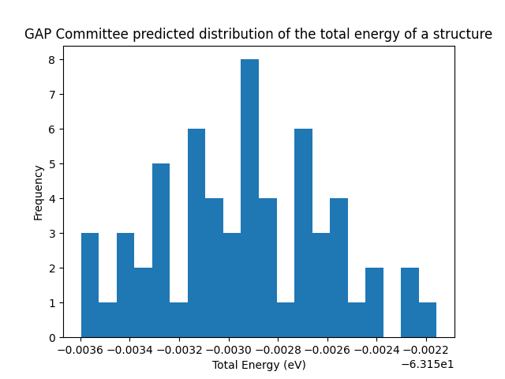

.. currentmodule:: quippy

Committee Modelling using GAP potentials 
***************************************************

Because GAP models are linear with respect to the weights, the full posterior distribution on the coefficients, :math:`c`, is analytic:

.. math::
    c \sim \mathcal{N}(\mu_c, (K_{MN} \Sigma^{-1} K_{NM} + K_{MM})^{-1})

This means that the full posterior can be evaluated and saved during fitting, and that samples from the posterior can be drawn at any time.

Exporting the GAP Posterior Covariance
--------------------------------------

In order to access the posterior covariance matrix, a new GAP model needs to be trained by ``gap_fit`` with the *export_covariance=T* command line option. 
When the model is trained using SCALAPACK, this should create a new file of the form <GAP_NAME>.R.<GAP_LABEL>. 
The matrix :math:`R` defined by the file is a square root of the posterior precision matrix, IE :math:`c \sim \mathcal{N}(\mu_c, (R^T R)^{-1})`.

Drawing committees from the Posterior Covariance
--------------------------------------
The ``quippy.gap_tools`` module contains a thin wrapper class to the GAP XML file, which we can use in order to draw a committee of models.
The ``get_xml_committee`` function can be used to generate a list of committee members in the form of these wrapper classes. 
The committee members can each be saved back down to xml files using the ``<object>.save(fname)`` method, or transformed into ``quippy.potential.Potential`` calculators using the ``<object>.as_potential()`` method.

The ``get_calc_committee`` function works similarly to ``get_xml_committee``, except that it returns the ``Potential`` objects directly. Potential objects created by ``get_calc_committee`` or ``<xml_wrapper_object>.as_potential()`` are given an additional attribute ``potential.xml``, which is a reference to the corresponding xml wrapper.

Each xml wrapper object stored all the information required to generate new committee samples, which means that calling ``<object>.draw_posterior_samples(num_samples)`` will generate a new list of xml wrapper objects corresponding to a new committee.

Code Example
--------------------------------------

The code block generates an xml wrapper committee from a GAP xml file. It then saves down the committee, and generates a list of potentials. Finally, it uses the committee to test the uncertainty in a prediction of total energy.

.. code:: ipython3

    %pylab inline
    from ase.io import read
    from quippy.gap_tools import get_xml_committee
    import numpy as np
    import matplotlib.pyplot as plt

    gap_xml = "Carbon_GAP.xml"
    num_committors = 60

    # Generate committee from given GAP model
    xml_committee = get_xml_committee(gap_xml, num_committors)

    calc_committee = []

    # Save all committee members to XML files
    # Generate a list of quippy Potentials for committee
    for i in range(num_committors):
        xml_committee[i].save(f"GAP_Committee/Committor_{i}.xml")
        calc_committee.append(xml_committee[i].as_potential())

    structure = read("Carbon_Data_Set_Subset.xyz", index="0")

    E_pred = np.zeros((num_committors))

    # Sample total energy on a structure
    for i in range(num_committors):
        structure.calc = calc_committee[i]
        E_pred[i] = structure.get_potential_energy()

    plt.hist(E_pred, bins=20)
    plt.xlabel("Total Energy (eV)")
    plt.ylabel("Frequency")
    plt.title("GAP Committee predicted distribution of the total energy of a structure")
    plt.savefig("GAP_Committee_Test.png")

